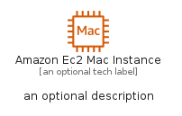
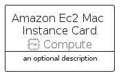
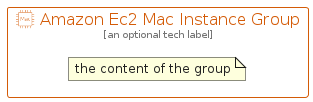

# AmazonEc2MacInstance


```text
aws-q2-2022/Resource/Compute/AmazonEc2MacInstance
```

```text
include('aws-q2-2022/Resource/Compute/AmazonEc2MacInstance')
```


| Illustration | AmazonEc2MacInstance | AmazonEc2MacInstanceCard | AmazonEc2MacInstanceGroup |
| :---: | :---: | :---: | :---: |
|  |  |  |  |


## AmazonEc2MacInstance

### Load remotely
```plantuml
@startuml
' configures the library
!global $LIB_BASE_LOCATION="https://raw.githubusercontent.com/tmorin/plantuml-libs/master/distribution"

' loads the library's bootstrap
!include $LIB_BASE_LOCATION/bootstrap.puml

' loads the package bootstrap
include('aws-q2-2022/bootstrap')

' loads the Item which embeds the element AmazonEc2MacInstance
include('aws-q2-2022/Resource/Compute/AmazonEc2MacInstance')

' renders the element
AmazonEc2MacInstance('AmazonEc2MacInstance', 'Amazon Ec2 Mac Instance', 'an optional tech label', 'an optional description')
@enduml
```

### Load locally
```plantuml
@startuml
' configures the library
!global $INCLUSION_MODE="local"
!global $LIB_BASE_LOCATION="../../.."

' loads the library's bootstrap
!include $LIB_BASE_LOCATION/bootstrap.puml

' loads the package bootstrap
include('aws-q2-2022/bootstrap')

' loads the Item which embeds the element AmazonEc2MacInstance
include('aws-q2-2022/Resource/Compute/AmazonEc2MacInstance')

' renders the element
AmazonEc2MacInstance('AmazonEc2MacInstance', 'Amazon Ec2 Mac Instance', 'an optional tech label', 'an optional description')
@enduml
```

## AmazonEc2MacInstanceCard

### Load remotely
```plantuml
@startuml
' configures the library
!global $LIB_BASE_LOCATION="https://raw.githubusercontent.com/tmorin/plantuml-libs/master/distribution"

' loads the library's bootstrap
!include $LIB_BASE_LOCATION/bootstrap.puml

' loads the package bootstrap
include('aws-q2-2022/bootstrap')

' loads the Item which embeds the element AmazonEc2MacInstanceCard
include('aws-q2-2022/Resource/Compute/AmazonEc2MacInstance')

' renders the element
AmazonEc2MacInstanceCard('AmazonEc2MacInstanceCard', 'Amazon Ec2 Mac Instance Card', 'an optional description')
@enduml
```

### Load locally
```plantuml
@startuml
' configures the library
!global $INCLUSION_MODE="local"
!global $LIB_BASE_LOCATION="../../.."

' loads the library's bootstrap
!include $LIB_BASE_LOCATION/bootstrap.puml

' loads the package bootstrap
include('aws-q2-2022/bootstrap')

' loads the Item which embeds the element AmazonEc2MacInstanceCard
include('aws-q2-2022/Resource/Compute/AmazonEc2MacInstance')

' renders the element
AmazonEc2MacInstanceCard('AmazonEc2MacInstanceCard', 'Amazon Ec2 Mac Instance Card', 'an optional description')
@enduml
```

## AmazonEc2MacInstanceGroup

### Load remotely
```plantuml
@startuml
' configures the library
!global $LIB_BASE_LOCATION="https://raw.githubusercontent.com/tmorin/plantuml-libs/master/distribution"

' loads the library's bootstrap
!include $LIB_BASE_LOCATION/bootstrap.puml

' loads the package bootstrap
include('aws-q2-2022/bootstrap')

' loads the Item which embeds the element AmazonEc2MacInstanceGroup
include('aws-q2-2022/Resource/Compute/AmazonEc2MacInstance')

' renders the element
AmazonEc2MacInstanceGroup('AmazonEc2MacInstanceGroup', 'Amazon Ec2 Mac Instance Group', 'an optional tech label') {
    note as note
        the content of the group
    end note
}
@enduml
```

### Load locally
```plantuml
@startuml
' configures the library
!global $INCLUSION_MODE="local"
!global $LIB_BASE_LOCATION="../../.."

' loads the library's bootstrap
!include $LIB_BASE_LOCATION/bootstrap.puml

' loads the package bootstrap
include('aws-q2-2022/bootstrap')

' loads the Item which embeds the element AmazonEc2MacInstanceGroup
include('aws-q2-2022/Resource/Compute/AmazonEc2MacInstance')

' renders the element
AmazonEc2MacInstanceGroup('AmazonEc2MacInstanceGroup', 'Amazon Ec2 Mac Instance Group', 'an optional tech label') {
    note as note
        the content of the group
    end note
}
@enduml
```

