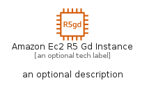
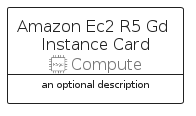
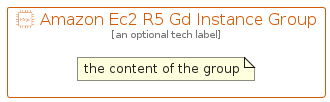

# AmazonEc2R5GdInstance


```text
aws-q2-2022/Resource/Compute/AmazonEc2R5GdInstance
```

```text
include('aws-q2-2022/Resource/Compute/AmazonEc2R5GdInstance')
```


| Illustration | AmazonEc2R5GdInstance | AmazonEc2R5GdInstanceCard | AmazonEc2R5GdInstanceGroup |
| :---: | :---: | :---: | :---: |
|  |  |  |  |


## AmazonEc2R5GdInstance

### Load remotely
```plantuml
@startuml
' configures the library
!global $LIB_BASE_LOCATION="https://raw.githubusercontent.com/tmorin/plantuml-libs/master/distribution"

' loads the library's bootstrap
!include $LIB_BASE_LOCATION/bootstrap.puml

' loads the package bootstrap
include('aws-q2-2022/bootstrap')

' loads the Item which embeds the element AmazonEc2R5GdInstance
include('aws-q2-2022/Resource/Compute/AmazonEc2R5GdInstance')

' renders the element
AmazonEc2R5GdInstance('AmazonEc2R5GdInstance', 'Amazon Ec2 R5 Gd Instance', 'an optional tech label', 'an optional description')
@enduml
```

### Load locally
```plantuml
@startuml
' configures the library
!global $INCLUSION_MODE="local"
!global $LIB_BASE_LOCATION="../../.."

' loads the library's bootstrap
!include $LIB_BASE_LOCATION/bootstrap.puml

' loads the package bootstrap
include('aws-q2-2022/bootstrap')

' loads the Item which embeds the element AmazonEc2R5GdInstance
include('aws-q2-2022/Resource/Compute/AmazonEc2R5GdInstance')

' renders the element
AmazonEc2R5GdInstance('AmazonEc2R5GdInstance', 'Amazon Ec2 R5 Gd Instance', 'an optional tech label', 'an optional description')
@enduml
```

## AmazonEc2R5GdInstanceCard

### Load remotely
```plantuml
@startuml
' configures the library
!global $LIB_BASE_LOCATION="https://raw.githubusercontent.com/tmorin/plantuml-libs/master/distribution"

' loads the library's bootstrap
!include $LIB_BASE_LOCATION/bootstrap.puml

' loads the package bootstrap
include('aws-q2-2022/bootstrap')

' loads the Item which embeds the element AmazonEc2R5GdInstanceCard
include('aws-q2-2022/Resource/Compute/AmazonEc2R5GdInstance')

' renders the element
AmazonEc2R5GdInstanceCard('AmazonEc2R5GdInstanceCard', 'Amazon Ec2 R5 Gd Instance Card', 'an optional description')
@enduml
```

### Load locally
```plantuml
@startuml
' configures the library
!global $INCLUSION_MODE="local"
!global $LIB_BASE_LOCATION="../../.."

' loads the library's bootstrap
!include $LIB_BASE_LOCATION/bootstrap.puml

' loads the package bootstrap
include('aws-q2-2022/bootstrap')

' loads the Item which embeds the element AmazonEc2R5GdInstanceCard
include('aws-q2-2022/Resource/Compute/AmazonEc2R5GdInstance')

' renders the element
AmazonEc2R5GdInstanceCard('AmazonEc2R5GdInstanceCard', 'Amazon Ec2 R5 Gd Instance Card', 'an optional description')
@enduml
```

## AmazonEc2R5GdInstanceGroup

### Load remotely
```plantuml
@startuml
' configures the library
!global $LIB_BASE_LOCATION="https://raw.githubusercontent.com/tmorin/plantuml-libs/master/distribution"

' loads the library's bootstrap
!include $LIB_BASE_LOCATION/bootstrap.puml

' loads the package bootstrap
include('aws-q2-2022/bootstrap')

' loads the Item which embeds the element AmazonEc2R5GdInstanceGroup
include('aws-q2-2022/Resource/Compute/AmazonEc2R5GdInstance')

' renders the element
AmazonEc2R5GdInstanceGroup('AmazonEc2R5GdInstanceGroup', 'Amazon Ec2 R5 Gd Instance Group', 'an optional tech label') {
    note as note
        the content of the group
    end note
}
@enduml
```

### Load locally
```plantuml
@startuml
' configures the library
!global $INCLUSION_MODE="local"
!global $LIB_BASE_LOCATION="../../.."

' loads the library's bootstrap
!include $LIB_BASE_LOCATION/bootstrap.puml

' loads the package bootstrap
include('aws-q2-2022/bootstrap')

' loads the Item which embeds the element AmazonEc2R5GdInstanceGroup
include('aws-q2-2022/Resource/Compute/AmazonEc2R5GdInstance')

' renders the element
AmazonEc2R5GdInstanceGroup('AmazonEc2R5GdInstanceGroup', 'Amazon Ec2 R5 Gd Instance Group', 'an optional tech label') {
    note as note
        the content of the group
    end note
}
@enduml
```

