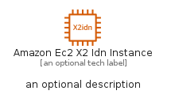
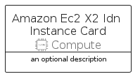
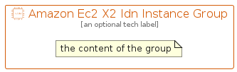

# AmazonEc2X2IdnInstance


```text
aws-q2-2022/Resource/Compute/AmazonEc2X2IdnInstance
```

```text
include('aws-q2-2022/Resource/Compute/AmazonEc2X2IdnInstance')
```


| Illustration | AmazonEc2X2IdnInstance | AmazonEc2X2IdnInstanceCard | AmazonEc2X2IdnInstanceGroup |
| :---: | :---: | :---: | :---: |
|  |  |  |  |


## AmazonEc2X2IdnInstance

### Load remotely
```plantuml
@startuml
' configures the library
!global $LIB_BASE_LOCATION="https://raw.githubusercontent.com/tmorin/plantuml-libs/master/distribution"

' loads the library's bootstrap
!include $LIB_BASE_LOCATION/bootstrap.puml

' loads the package bootstrap
include('aws-q2-2022/bootstrap')

' loads the Item which embeds the element AmazonEc2X2IdnInstance
include('aws-q2-2022/Resource/Compute/AmazonEc2X2IdnInstance')

' renders the element
AmazonEc2X2IdnInstance('AmazonEc2X2IdnInstance', 'Amazon Ec2 X2 Idn Instance', 'an optional tech label', 'an optional description')
@enduml
```

### Load locally
```plantuml
@startuml
' configures the library
!global $INCLUSION_MODE="local"
!global $LIB_BASE_LOCATION="../../.."

' loads the library's bootstrap
!include $LIB_BASE_LOCATION/bootstrap.puml

' loads the package bootstrap
include('aws-q2-2022/bootstrap')

' loads the Item which embeds the element AmazonEc2X2IdnInstance
include('aws-q2-2022/Resource/Compute/AmazonEc2X2IdnInstance')

' renders the element
AmazonEc2X2IdnInstance('AmazonEc2X2IdnInstance', 'Amazon Ec2 X2 Idn Instance', 'an optional tech label', 'an optional description')
@enduml
```

## AmazonEc2X2IdnInstanceCard

### Load remotely
```plantuml
@startuml
' configures the library
!global $LIB_BASE_LOCATION="https://raw.githubusercontent.com/tmorin/plantuml-libs/master/distribution"

' loads the library's bootstrap
!include $LIB_BASE_LOCATION/bootstrap.puml

' loads the package bootstrap
include('aws-q2-2022/bootstrap')

' loads the Item which embeds the element AmazonEc2X2IdnInstanceCard
include('aws-q2-2022/Resource/Compute/AmazonEc2X2IdnInstance')

' renders the element
AmazonEc2X2IdnInstanceCard('AmazonEc2X2IdnInstanceCard', 'Amazon Ec2 X2 Idn Instance Card', 'an optional description')
@enduml
```

### Load locally
```plantuml
@startuml
' configures the library
!global $INCLUSION_MODE="local"
!global $LIB_BASE_LOCATION="../../.."

' loads the library's bootstrap
!include $LIB_BASE_LOCATION/bootstrap.puml

' loads the package bootstrap
include('aws-q2-2022/bootstrap')

' loads the Item which embeds the element AmazonEc2X2IdnInstanceCard
include('aws-q2-2022/Resource/Compute/AmazonEc2X2IdnInstance')

' renders the element
AmazonEc2X2IdnInstanceCard('AmazonEc2X2IdnInstanceCard', 'Amazon Ec2 X2 Idn Instance Card', 'an optional description')
@enduml
```

## AmazonEc2X2IdnInstanceGroup

### Load remotely
```plantuml
@startuml
' configures the library
!global $LIB_BASE_LOCATION="https://raw.githubusercontent.com/tmorin/plantuml-libs/master/distribution"

' loads the library's bootstrap
!include $LIB_BASE_LOCATION/bootstrap.puml

' loads the package bootstrap
include('aws-q2-2022/bootstrap')

' loads the Item which embeds the element AmazonEc2X2IdnInstanceGroup
include('aws-q2-2022/Resource/Compute/AmazonEc2X2IdnInstance')

' renders the element
AmazonEc2X2IdnInstanceGroup('AmazonEc2X2IdnInstanceGroup', 'Amazon Ec2 X2 Idn Instance Group', 'an optional tech label') {
    note as note
        the content of the group
    end note
}
@enduml
```

### Load locally
```plantuml
@startuml
' configures the library
!global $INCLUSION_MODE="local"
!global $LIB_BASE_LOCATION="../../.."

' loads the library's bootstrap
!include $LIB_BASE_LOCATION/bootstrap.puml

' loads the package bootstrap
include('aws-q2-2022/bootstrap')

' loads the Item which embeds the element AmazonEc2X2IdnInstanceGroup
include('aws-q2-2022/Resource/Compute/AmazonEc2X2IdnInstance')

' renders the element
AmazonEc2X2IdnInstanceGroup('AmazonEc2X2IdnInstanceGroup', 'Amazon Ec2 X2 Idn Instance Group', 'an optional tech label') {
    note as note
        the content of the group
    end note
}
@enduml
```

