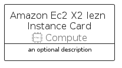
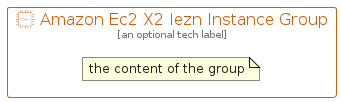

# AmazonEc2X2IeznInstance


```text
aws-q2-2022/Resource/Compute/AmazonEc2X2IeznInstance
```

```text
include('aws-q2-2022/Resource/Compute/AmazonEc2X2IeznInstance')
```


| Illustration | AmazonEc2X2IeznInstance | AmazonEc2X2IeznInstanceCard | AmazonEc2X2IeznInstanceGroup |
| :---: | :---: | :---: | :---: |
|  |  |  |  |


## AmazonEc2X2IeznInstance

### Load remotely
```plantuml
@startuml
' configures the library
!global $LIB_BASE_LOCATION="https://raw.githubusercontent.com/tmorin/plantuml-libs/master/distribution"

' loads the library's bootstrap
!include $LIB_BASE_LOCATION/bootstrap.puml

' loads the package bootstrap
include('aws-q2-2022/bootstrap')

' loads the Item which embeds the element AmazonEc2X2IeznInstance
include('aws-q2-2022/Resource/Compute/AmazonEc2X2IeznInstance')

' renders the element
AmazonEc2X2IeznInstance('AmazonEc2X2IeznInstance', 'Amazon Ec2 X2 Iezn Instance', 'an optional tech label', 'an optional description')
@enduml
```

### Load locally
```plantuml
@startuml
' configures the library
!global $INCLUSION_MODE="local"
!global $LIB_BASE_LOCATION="../../.."

' loads the library's bootstrap
!include $LIB_BASE_LOCATION/bootstrap.puml

' loads the package bootstrap
include('aws-q2-2022/bootstrap')

' loads the Item which embeds the element AmazonEc2X2IeznInstance
include('aws-q2-2022/Resource/Compute/AmazonEc2X2IeznInstance')

' renders the element
AmazonEc2X2IeznInstance('AmazonEc2X2IeznInstance', 'Amazon Ec2 X2 Iezn Instance', 'an optional tech label', 'an optional description')
@enduml
```

## AmazonEc2X2IeznInstanceCard

### Load remotely
```plantuml
@startuml
' configures the library
!global $LIB_BASE_LOCATION="https://raw.githubusercontent.com/tmorin/plantuml-libs/master/distribution"

' loads the library's bootstrap
!include $LIB_BASE_LOCATION/bootstrap.puml

' loads the package bootstrap
include('aws-q2-2022/bootstrap')

' loads the Item which embeds the element AmazonEc2X2IeznInstanceCard
include('aws-q2-2022/Resource/Compute/AmazonEc2X2IeznInstance')

' renders the element
AmazonEc2X2IeznInstanceCard('AmazonEc2X2IeznInstanceCard', 'Amazon Ec2 X2 Iezn Instance Card', 'an optional description')
@enduml
```

### Load locally
```plantuml
@startuml
' configures the library
!global $INCLUSION_MODE="local"
!global $LIB_BASE_LOCATION="../../.."

' loads the library's bootstrap
!include $LIB_BASE_LOCATION/bootstrap.puml

' loads the package bootstrap
include('aws-q2-2022/bootstrap')

' loads the Item which embeds the element AmazonEc2X2IeznInstanceCard
include('aws-q2-2022/Resource/Compute/AmazonEc2X2IeznInstance')

' renders the element
AmazonEc2X2IeznInstanceCard('AmazonEc2X2IeznInstanceCard', 'Amazon Ec2 X2 Iezn Instance Card', 'an optional description')
@enduml
```

## AmazonEc2X2IeznInstanceGroup

### Load remotely
```plantuml
@startuml
' configures the library
!global $LIB_BASE_LOCATION="https://raw.githubusercontent.com/tmorin/plantuml-libs/master/distribution"

' loads the library's bootstrap
!include $LIB_BASE_LOCATION/bootstrap.puml

' loads the package bootstrap
include('aws-q2-2022/bootstrap')

' loads the Item which embeds the element AmazonEc2X2IeznInstanceGroup
include('aws-q2-2022/Resource/Compute/AmazonEc2X2IeznInstance')

' renders the element
AmazonEc2X2IeznInstanceGroup('AmazonEc2X2IeznInstanceGroup', 'Amazon Ec2 X2 Iezn Instance Group', 'an optional tech label') {
    note as note
        the content of the group
    end note
}
@enduml
```

### Load locally
```plantuml
@startuml
' configures the library
!global $INCLUSION_MODE="local"
!global $LIB_BASE_LOCATION="../../.."

' loads the library's bootstrap
!include $LIB_BASE_LOCATION/bootstrap.puml

' loads the package bootstrap
include('aws-q2-2022/bootstrap')

' loads the Item which embeds the element AmazonEc2X2IeznInstanceGroup
include('aws-q2-2022/Resource/Compute/AmazonEc2X2IeznInstance')

' renders the element
AmazonEc2X2IeznInstanceGroup('AmazonEc2X2IeznInstanceGroup', 'Amazon Ec2 X2 Iezn Instance Group', 'an optional tech label') {
    note as note
        the content of the group
    end note
}
@enduml
```

