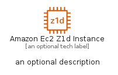
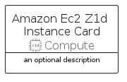
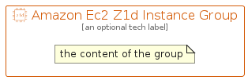

# AmazonEc2Z1DInstance


```text
aws-q2-2022/Resource/Compute/AmazonEc2Z1DInstance
```

```text
include('aws-q2-2022/Resource/Compute/AmazonEc2Z1DInstance')
```


| Illustration | AmazonEc2Z1DInstance | AmazonEc2Z1DInstanceCard | AmazonEc2Z1DInstanceGroup |
| :---: | :---: | :---: | :---: |
|  |  |  |  |


## AmazonEc2Z1DInstance

### Load remotely
```plantuml
@startuml
' configures the library
!global $LIB_BASE_LOCATION="https://raw.githubusercontent.com/tmorin/plantuml-libs/master/distribution"

' loads the library's bootstrap
!include $LIB_BASE_LOCATION/bootstrap.puml

' loads the package bootstrap
include('aws-q2-2022/bootstrap')

' loads the Item which embeds the element AmazonEc2Z1DInstance
include('aws-q2-2022/Resource/Compute/AmazonEc2Z1DInstance')

' renders the element
AmazonEc2Z1DInstance('AmazonEc2Z1dInstance', 'Amazon Ec2 Z1d Instance', 'an optional tech label')
@enduml
```

### Load locally
```plantuml
@startuml
' configures the library
!global $INCLUSION_MODE="local"
!global $LIB_BASE_LOCATION="../../.."

' loads the library's bootstrap
!include $LIB_BASE_LOCATION/bootstrap.puml

' loads the package bootstrap
include('aws-q2-2022/bootstrap')

' loads the Item which embeds the element AmazonEc2Z1DInstance
include('aws-q2-2022/Resource/Compute/AmazonEc2Z1DInstance')

' renders the element
AmazonEc2Z1DInstance('AmazonEc2Z1dInstance', 'Amazon Ec2 Z1d Instance', 'an optional tech label')
@enduml
```

## AmazonEc2Z1DInstanceCard

### Load remotely
```plantuml
@startuml
' configures the library
!global $LIB_BASE_LOCATION="https://raw.githubusercontent.com/tmorin/plantuml-libs/master/distribution"

' loads the library's bootstrap
!include $LIB_BASE_LOCATION/bootstrap.puml

' loads the package bootstrap
include('aws-q2-2022/bootstrap')

' loads the Item which embeds the element AmazonEc2Z1DInstanceCard
include('aws-q2-2022/Resource/Compute/AmazonEc2Z1DInstance')

' renders the element
AmazonEc2Z1DInstanceCard('AmazonEc2Z1dInstanceCard', 'Amazon Ec2 Z1d Instance Card', 'an optional description')
@enduml
```

### Load locally
```plantuml
@startuml
' configures the library
!global $INCLUSION_MODE="local"
!global $LIB_BASE_LOCATION="../../.."

' loads the library's bootstrap
!include $LIB_BASE_LOCATION/bootstrap.puml

' loads the package bootstrap
include('aws-q2-2022/bootstrap')

' loads the Item which embeds the element AmazonEc2Z1DInstanceCard
include('aws-q2-2022/Resource/Compute/AmazonEc2Z1DInstance')

' renders the element
AmazonEc2Z1DInstanceCard('AmazonEc2Z1dInstanceCard', 'Amazon Ec2 Z1d Instance Card', 'an optional description')
@enduml
```

## AmazonEc2Z1DInstanceGroup

### Load remotely
```plantuml
@startuml
' configures the library
!global $LIB_BASE_LOCATION="https://raw.githubusercontent.com/tmorin/plantuml-libs/master/distribution"

' loads the library's bootstrap
!include $LIB_BASE_LOCATION/bootstrap.puml

' loads the package bootstrap
include('aws-q2-2022/bootstrap')

' loads the Item which embeds the element AmazonEc2Z1DInstanceGroup
include('aws-q2-2022/Resource/Compute/AmazonEc2Z1DInstance')

' renders the element
AmazonEc2Z1DInstanceGroup('AmazonEc2Z1dInstanceGroup', 'Amazon Ec2 Z1d Instance Group', 'an optional tech label') {
    note as note
        the content of the group
    end note
}
@enduml
```

### Load locally
```plantuml
@startuml
' configures the library
!global $INCLUSION_MODE="local"
!global $LIB_BASE_LOCATION="../../.."

' loads the library's bootstrap
!include $LIB_BASE_LOCATION/bootstrap.puml

' loads the package bootstrap
include('aws-q2-2022/bootstrap')

' loads the Item which embeds the element AmazonEc2Z1DInstanceGroup
include('aws-q2-2022/Resource/Compute/AmazonEc2Z1DInstance')

' renders the element
AmazonEc2Z1DInstanceGroup('AmazonEc2Z1dInstanceGroup', 'Amazon Ec2 Z1d Instance Group', 'an optional tech label') {
    note as note
        the content of the group
    end note
}
@enduml
```

