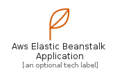
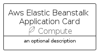

# AwsElasticBeanstalkApplication


```text
aws-q2-2022/Resource/Compute/AwsElasticBeanstalkApplication
```

```text
include('aws-q2-2022/Resource/Compute/AwsElasticBeanstalkApplication')
```


| Illustration | AwsElasticBeanstalkApplication | AwsElasticBeanstalkApplicationCard | AwsElasticBeanstalkApplicationGroup |
| :---: | :---: | :---: | :---: |
|  |  |  |  |


## AwsElasticBeanstalkApplication

### Load remotely
```plantuml
@startuml
' configures the library
!global $LIB_BASE_LOCATION="https://raw.githubusercontent.com/tmorin/plantuml-libs/master/distribution"

' loads the library's bootstrap
!include $LIB_BASE_LOCATION/bootstrap.puml

' loads the package bootstrap
include('aws-q2-2022/bootstrap')

' loads the Item which embeds the element AwsElasticBeanstalkApplication
include('aws-q2-2022/Resource/Compute/AwsElasticBeanstalkApplication')

' renders the element
AwsElasticBeanstalkApplication('AwsElasticBeanstalkApplication', 'Aws Elastic Beanstalk Application', 'an optional tech label', 'an optional description')
@enduml
```

### Load locally
```plantuml
@startuml
' configures the library
!global $INCLUSION_MODE="local"
!global $LIB_BASE_LOCATION="../../.."

' loads the library's bootstrap
!include $LIB_BASE_LOCATION/bootstrap.puml

' loads the package bootstrap
include('aws-q2-2022/bootstrap')

' loads the Item which embeds the element AwsElasticBeanstalkApplication
include('aws-q2-2022/Resource/Compute/AwsElasticBeanstalkApplication')

' renders the element
AwsElasticBeanstalkApplication('AwsElasticBeanstalkApplication', 'Aws Elastic Beanstalk Application', 'an optional tech label', 'an optional description')
@enduml
```

## AwsElasticBeanstalkApplicationCard

### Load remotely
```plantuml
@startuml
' configures the library
!global $LIB_BASE_LOCATION="https://raw.githubusercontent.com/tmorin/plantuml-libs/master/distribution"

' loads the library's bootstrap
!include $LIB_BASE_LOCATION/bootstrap.puml

' loads the package bootstrap
include('aws-q2-2022/bootstrap')

' loads the Item which embeds the element AwsElasticBeanstalkApplicationCard
include('aws-q2-2022/Resource/Compute/AwsElasticBeanstalkApplication')

' renders the element
AwsElasticBeanstalkApplicationCard('AwsElasticBeanstalkApplicationCard', 'Aws Elastic Beanstalk Application Card', 'an optional description')
@enduml
```

### Load locally
```plantuml
@startuml
' configures the library
!global $INCLUSION_MODE="local"
!global $LIB_BASE_LOCATION="../../.."

' loads the library's bootstrap
!include $LIB_BASE_LOCATION/bootstrap.puml

' loads the package bootstrap
include('aws-q2-2022/bootstrap')

' loads the Item which embeds the element AwsElasticBeanstalkApplicationCard
include('aws-q2-2022/Resource/Compute/AwsElasticBeanstalkApplication')

' renders the element
AwsElasticBeanstalkApplicationCard('AwsElasticBeanstalkApplicationCard', 'Aws Elastic Beanstalk Application Card', 'an optional description')
@enduml
```

## AwsElasticBeanstalkApplicationGroup

### Load remotely
```plantuml
@startuml
' configures the library
!global $LIB_BASE_LOCATION="https://raw.githubusercontent.com/tmorin/plantuml-libs/master/distribution"

' loads the library's bootstrap
!include $LIB_BASE_LOCATION/bootstrap.puml

' loads the package bootstrap
include('aws-q2-2022/bootstrap')

' loads the Item which embeds the element AwsElasticBeanstalkApplicationGroup
include('aws-q2-2022/Resource/Compute/AwsElasticBeanstalkApplication')

' renders the element
AwsElasticBeanstalkApplicationGroup('AwsElasticBeanstalkApplicationGroup', 'Aws Elastic Beanstalk Application Group', 'an optional tech label') {
    note as note
        the content of the group
    end note
}
@enduml
```

### Load locally
```plantuml
@startuml
' configures the library
!global $INCLUSION_MODE="local"
!global $LIB_BASE_LOCATION="../../.."

' loads the library's bootstrap
!include $LIB_BASE_LOCATION/bootstrap.puml

' loads the package bootstrap
include('aws-q2-2022/bootstrap')

' loads the Item which embeds the element AwsElasticBeanstalkApplicationGroup
include('aws-q2-2022/Resource/Compute/AwsElasticBeanstalkApplication')

' renders the element
AwsElasticBeanstalkApplicationGroup('AwsElasticBeanstalkApplicationGroup', 'Aws Elastic Beanstalk Application Group', 'an optional tech label') {
    note as note
        the content of the group
    end note
}
@enduml
```

