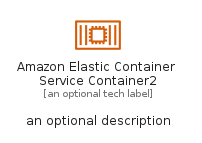
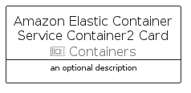

# AmazonElasticContainerServiceContainer2


```text
aws-q2-2022/Resource/Containers/AmazonElasticContainerServiceContainer2
```

```text
include('aws-q2-2022/Resource/Containers/AmazonElasticContainerServiceContainer2')
```


| Illustration | AmazonElasticContainerServiceContainer2 | AmazonElasticContainerServiceContainer2Card | AmazonElasticContainerServiceContainer2Group |
| :---: | :---: | :---: | :---: |
|  |  |  |  |


## AmazonElasticContainerServiceContainer2

### Load remotely
```plantuml
@startuml
' configures the library
!global $LIB_BASE_LOCATION="https://raw.githubusercontent.com/tmorin/plantuml-libs/master/distribution"

' loads the library's bootstrap
!include $LIB_BASE_LOCATION/bootstrap.puml

' loads the package bootstrap
include('aws-q2-2022/bootstrap')

' loads the Item which embeds the element AmazonElasticContainerServiceContainer2
include('aws-q2-2022/Resource/Containers/AmazonElasticContainerServiceContainer2')

' renders the element
AmazonElasticContainerServiceContainer2('AmazonElasticContainerServiceContainer2', 'Amazon Elastic Container Service Container2', 'an optional tech label', 'an optional description')
@enduml
```

### Load locally
```plantuml
@startuml
' configures the library
!global $INCLUSION_MODE="local"
!global $LIB_BASE_LOCATION="../../.."

' loads the library's bootstrap
!include $LIB_BASE_LOCATION/bootstrap.puml

' loads the package bootstrap
include('aws-q2-2022/bootstrap')

' loads the Item which embeds the element AmazonElasticContainerServiceContainer2
include('aws-q2-2022/Resource/Containers/AmazonElasticContainerServiceContainer2')

' renders the element
AmazonElasticContainerServiceContainer2('AmazonElasticContainerServiceContainer2', 'Amazon Elastic Container Service Container2', 'an optional tech label', 'an optional description')
@enduml
```

## AmazonElasticContainerServiceContainer2Card

### Load remotely
```plantuml
@startuml
' configures the library
!global $LIB_BASE_LOCATION="https://raw.githubusercontent.com/tmorin/plantuml-libs/master/distribution"

' loads the library's bootstrap
!include $LIB_BASE_LOCATION/bootstrap.puml

' loads the package bootstrap
include('aws-q2-2022/bootstrap')

' loads the Item which embeds the element AmazonElasticContainerServiceContainer2Card
include('aws-q2-2022/Resource/Containers/AmazonElasticContainerServiceContainer2')

' renders the element
AmazonElasticContainerServiceContainer2Card('AmazonElasticContainerServiceContainer2Card', 'Amazon Elastic Container Service Container2 Card', 'an optional description')
@enduml
```

### Load locally
```plantuml
@startuml
' configures the library
!global $INCLUSION_MODE="local"
!global $LIB_BASE_LOCATION="../../.."

' loads the library's bootstrap
!include $LIB_BASE_LOCATION/bootstrap.puml

' loads the package bootstrap
include('aws-q2-2022/bootstrap')

' loads the Item which embeds the element AmazonElasticContainerServiceContainer2Card
include('aws-q2-2022/Resource/Containers/AmazonElasticContainerServiceContainer2')

' renders the element
AmazonElasticContainerServiceContainer2Card('AmazonElasticContainerServiceContainer2Card', 'Amazon Elastic Container Service Container2 Card', 'an optional description')
@enduml
```

## AmazonElasticContainerServiceContainer2Group

### Load remotely
```plantuml
@startuml
' configures the library
!global $LIB_BASE_LOCATION="https://raw.githubusercontent.com/tmorin/plantuml-libs/master/distribution"

' loads the library's bootstrap
!include $LIB_BASE_LOCATION/bootstrap.puml

' loads the package bootstrap
include('aws-q2-2022/bootstrap')

' loads the Item which embeds the element AmazonElasticContainerServiceContainer2Group
include('aws-q2-2022/Resource/Containers/AmazonElasticContainerServiceContainer2')

' renders the element
AmazonElasticContainerServiceContainer2Group('AmazonElasticContainerServiceContainer2Group', 'Amazon Elastic Container Service Container2 Group', 'an optional tech label') {
    note as note
        the content of the group
    end note
}
@enduml
```

### Load locally
```plantuml
@startuml
' configures the library
!global $INCLUSION_MODE="local"
!global $LIB_BASE_LOCATION="../../.."

' loads the library's bootstrap
!include $LIB_BASE_LOCATION/bootstrap.puml

' loads the package bootstrap
include('aws-q2-2022/bootstrap')

' loads the Item which embeds the element AmazonElasticContainerServiceContainer2Group
include('aws-q2-2022/Resource/Containers/AmazonElasticContainerServiceContainer2')

' renders the element
AmazonElasticContainerServiceContainer2Group('AmazonElasticContainerServiceContainer2Group', 'Amazon Elastic Container Service Container2 Group', 'an optional tech label') {
    note as note
        the content of the group
    end note
}
@enduml
```

