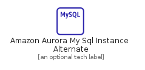
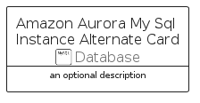

# AmazonAuroraMySqlInstanceAlternate


```text
aws-q2-2022/Resource/Database/AmazonAuroraMySqlInstanceAlternate
```

```text
include('aws-q2-2022/Resource/Database/AmazonAuroraMySqlInstanceAlternate')
```


| Illustration | AmazonAuroraMySqlInstanceAlternate | AmazonAuroraMySqlInstanceAlternateCard | AmazonAuroraMySqlInstanceAlternateGroup |
| :---: | :---: | :---: | :---: |
|  |  |  |  |


## AmazonAuroraMySqlInstanceAlternate

### Load remotely
```plantuml
@startuml
' configures the library
!global $LIB_BASE_LOCATION="https://raw.githubusercontent.com/tmorin/plantuml-libs/master/distribution"

' loads the library's bootstrap
!include $LIB_BASE_LOCATION/bootstrap.puml

' loads the package bootstrap
include('aws-q2-2022/bootstrap')

' loads the Item which embeds the element AmazonAuroraMySqlInstanceAlternate
include('aws-q2-2022/Resource/Database/AmazonAuroraMySqlInstanceAlternate')

' renders the element
AmazonAuroraMySqlInstanceAlternate('AmazonAuroraMySqlInstanceAlternate', 'Amazon Aurora My Sql Instance Alternate', 'an optional tech label')
@enduml
```

### Load locally
```plantuml
@startuml
' configures the library
!global $INCLUSION_MODE="local"
!global $LIB_BASE_LOCATION="../../.."

' loads the library's bootstrap
!include $LIB_BASE_LOCATION/bootstrap.puml

' loads the package bootstrap
include('aws-q2-2022/bootstrap')

' loads the Item which embeds the element AmazonAuroraMySqlInstanceAlternate
include('aws-q2-2022/Resource/Database/AmazonAuroraMySqlInstanceAlternate')

' renders the element
AmazonAuroraMySqlInstanceAlternate('AmazonAuroraMySqlInstanceAlternate', 'Amazon Aurora My Sql Instance Alternate', 'an optional tech label')
@enduml
```

## AmazonAuroraMySqlInstanceAlternateCard

### Load remotely
```plantuml
@startuml
' configures the library
!global $LIB_BASE_LOCATION="https://raw.githubusercontent.com/tmorin/plantuml-libs/master/distribution"

' loads the library's bootstrap
!include $LIB_BASE_LOCATION/bootstrap.puml

' loads the package bootstrap
include('aws-q2-2022/bootstrap')

' loads the Item which embeds the element AmazonAuroraMySqlInstanceAlternateCard
include('aws-q2-2022/Resource/Database/AmazonAuroraMySqlInstanceAlternate')

' renders the element
AmazonAuroraMySqlInstanceAlternateCard('AmazonAuroraMySqlInstanceAlternateCard', 'Amazon Aurora My Sql Instance Alternate Card', 'an optional description')
@enduml
```

### Load locally
```plantuml
@startuml
' configures the library
!global $INCLUSION_MODE="local"
!global $LIB_BASE_LOCATION="../../.."

' loads the library's bootstrap
!include $LIB_BASE_LOCATION/bootstrap.puml

' loads the package bootstrap
include('aws-q2-2022/bootstrap')

' loads the Item which embeds the element AmazonAuroraMySqlInstanceAlternateCard
include('aws-q2-2022/Resource/Database/AmazonAuroraMySqlInstanceAlternate')

' renders the element
AmazonAuroraMySqlInstanceAlternateCard('AmazonAuroraMySqlInstanceAlternateCard', 'Amazon Aurora My Sql Instance Alternate Card', 'an optional description')
@enduml
```

## AmazonAuroraMySqlInstanceAlternateGroup

### Load remotely
```plantuml
@startuml
' configures the library
!global $LIB_BASE_LOCATION="https://raw.githubusercontent.com/tmorin/plantuml-libs/master/distribution"

' loads the library's bootstrap
!include $LIB_BASE_LOCATION/bootstrap.puml

' loads the package bootstrap
include('aws-q2-2022/bootstrap')

' loads the Item which embeds the element AmazonAuroraMySqlInstanceAlternateGroup
include('aws-q2-2022/Resource/Database/AmazonAuroraMySqlInstanceAlternate')

' renders the element
AmazonAuroraMySqlInstanceAlternateGroup('AmazonAuroraMySqlInstanceAlternateGroup', 'Amazon Aurora My Sql Instance Alternate Group', 'an optional tech label') {
    note as note
        the content of the group
    end note
}
@enduml
```

### Load locally
```plantuml
@startuml
' configures the library
!global $INCLUSION_MODE="local"
!global $LIB_BASE_LOCATION="../../.."

' loads the library's bootstrap
!include $LIB_BASE_LOCATION/bootstrap.puml

' loads the package bootstrap
include('aws-q2-2022/bootstrap')

' loads the Item which embeds the element AmazonAuroraMySqlInstanceAlternateGroup
include('aws-q2-2022/Resource/Database/AmazonAuroraMySqlInstanceAlternate')

' renders the element
AmazonAuroraMySqlInstanceAlternateGroup('AmazonAuroraMySqlInstanceAlternateGroup', 'Amazon Aurora My Sql Instance Alternate Group', 'an optional tech label') {
    note as note
        the content of the group
    end note
}
@enduml
```

