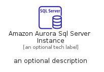
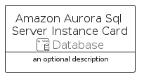

# AmazonAuroraSqlServerInstance


```text
aws-q2-2022/Resource/Database/AmazonAuroraSqlServerInstance
```

```text
include('aws-q2-2022/Resource/Database/AmazonAuroraSqlServerInstance')
```


| Illustration | AmazonAuroraSqlServerInstance | AmazonAuroraSqlServerInstanceCard | AmazonAuroraSqlServerInstanceGroup |
| :---: | :---: | :---: | :---: |
|  |  |  |  |


## AmazonAuroraSqlServerInstance

### Load remotely
```plantuml
@startuml
' configures the library
!global $LIB_BASE_LOCATION="https://raw.githubusercontent.com/tmorin/plantuml-libs/master/distribution"

' loads the library's bootstrap
!include $LIB_BASE_LOCATION/bootstrap.puml

' loads the package bootstrap
include('aws-q2-2022/bootstrap')

' loads the Item which embeds the element AmazonAuroraSqlServerInstance
include('aws-q2-2022/Resource/Database/AmazonAuroraSqlServerInstance')

' renders the element
AmazonAuroraSqlServerInstance('AmazonAuroraSqlServerInstance', 'Amazon Aurora Sql Server Instance', 'an optional tech label', 'an optional description')
@enduml
```

### Load locally
```plantuml
@startuml
' configures the library
!global $INCLUSION_MODE="local"
!global $LIB_BASE_LOCATION="../../.."

' loads the library's bootstrap
!include $LIB_BASE_LOCATION/bootstrap.puml

' loads the package bootstrap
include('aws-q2-2022/bootstrap')

' loads the Item which embeds the element AmazonAuroraSqlServerInstance
include('aws-q2-2022/Resource/Database/AmazonAuroraSqlServerInstance')

' renders the element
AmazonAuroraSqlServerInstance('AmazonAuroraSqlServerInstance', 'Amazon Aurora Sql Server Instance', 'an optional tech label', 'an optional description')
@enduml
```

## AmazonAuroraSqlServerInstanceCard

### Load remotely
```plantuml
@startuml
' configures the library
!global $LIB_BASE_LOCATION="https://raw.githubusercontent.com/tmorin/plantuml-libs/master/distribution"

' loads the library's bootstrap
!include $LIB_BASE_LOCATION/bootstrap.puml

' loads the package bootstrap
include('aws-q2-2022/bootstrap')

' loads the Item which embeds the element AmazonAuroraSqlServerInstanceCard
include('aws-q2-2022/Resource/Database/AmazonAuroraSqlServerInstance')

' renders the element
AmazonAuroraSqlServerInstanceCard('AmazonAuroraSqlServerInstanceCard', 'Amazon Aurora Sql Server Instance Card', 'an optional description')
@enduml
```

### Load locally
```plantuml
@startuml
' configures the library
!global $INCLUSION_MODE="local"
!global $LIB_BASE_LOCATION="../../.."

' loads the library's bootstrap
!include $LIB_BASE_LOCATION/bootstrap.puml

' loads the package bootstrap
include('aws-q2-2022/bootstrap')

' loads the Item which embeds the element AmazonAuroraSqlServerInstanceCard
include('aws-q2-2022/Resource/Database/AmazonAuroraSqlServerInstance')

' renders the element
AmazonAuroraSqlServerInstanceCard('AmazonAuroraSqlServerInstanceCard', 'Amazon Aurora Sql Server Instance Card', 'an optional description')
@enduml
```

## AmazonAuroraSqlServerInstanceGroup

### Load remotely
```plantuml
@startuml
' configures the library
!global $LIB_BASE_LOCATION="https://raw.githubusercontent.com/tmorin/plantuml-libs/master/distribution"

' loads the library's bootstrap
!include $LIB_BASE_LOCATION/bootstrap.puml

' loads the package bootstrap
include('aws-q2-2022/bootstrap')

' loads the Item which embeds the element AmazonAuroraSqlServerInstanceGroup
include('aws-q2-2022/Resource/Database/AmazonAuroraSqlServerInstance')

' renders the element
AmazonAuroraSqlServerInstanceGroup('AmazonAuroraSqlServerInstanceGroup', 'Amazon Aurora Sql Server Instance Group', 'an optional tech label') {
    note as note
        the content of the group
    end note
}
@enduml
```

### Load locally
```plantuml
@startuml
' configures the library
!global $INCLUSION_MODE="local"
!global $LIB_BASE_LOCATION="../../.."

' loads the library's bootstrap
!include $LIB_BASE_LOCATION/bootstrap.puml

' loads the package bootstrap
include('aws-q2-2022/bootstrap')

' loads the Item which embeds the element AmazonAuroraSqlServerInstanceGroup
include('aws-q2-2022/Resource/Database/AmazonAuroraSqlServerInstance')

' renders the element
AmazonAuroraSqlServerInstanceGroup('AmazonAuroraSqlServerInstanceGroup', 'Amazon Aurora Sql Server Instance Group', 'an optional tech label') {
    note as note
        the content of the group
    end note
}
@enduml
```

