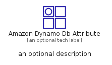
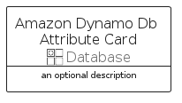
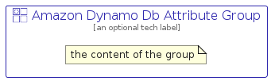

# AmazonDynamoDbAttribute


```text
aws-q2-2022/Resource/Database/AmazonDynamoDbAttribute
```

```text
include('aws-q2-2022/Resource/Database/AmazonDynamoDbAttribute')
```


| Illustration | AmazonDynamoDbAttribute | AmazonDynamoDbAttributeCard | AmazonDynamoDbAttributeGroup |
| :---: | :---: | :---: | :---: |
|  |  |  |  |


## AmazonDynamoDbAttribute

### Load remotely
```plantuml
@startuml
' configures the library
!global $LIB_BASE_LOCATION="https://raw.githubusercontent.com/tmorin/plantuml-libs/master/distribution"

' loads the library's bootstrap
!include $LIB_BASE_LOCATION/bootstrap.puml

' loads the package bootstrap
include('aws-q2-2022/bootstrap')

' loads the Item which embeds the element AmazonDynamoDbAttribute
include('aws-q2-2022/Resource/Database/AmazonDynamoDbAttribute')

' renders the element
AmazonDynamoDbAttribute('AmazonDynamoDbAttribute', 'Amazon Dynamo Db Attribute', 'an optional tech label')
@enduml
```

### Load locally
```plantuml
@startuml
' configures the library
!global $INCLUSION_MODE="local"
!global $LIB_BASE_LOCATION="../../.."

' loads the library's bootstrap
!include $LIB_BASE_LOCATION/bootstrap.puml

' loads the package bootstrap
include('aws-q2-2022/bootstrap')

' loads the Item which embeds the element AmazonDynamoDbAttribute
include('aws-q2-2022/Resource/Database/AmazonDynamoDbAttribute')

' renders the element
AmazonDynamoDbAttribute('AmazonDynamoDbAttribute', 'Amazon Dynamo Db Attribute', 'an optional tech label')
@enduml
```

## AmazonDynamoDbAttributeCard

### Load remotely
```plantuml
@startuml
' configures the library
!global $LIB_BASE_LOCATION="https://raw.githubusercontent.com/tmorin/plantuml-libs/master/distribution"

' loads the library's bootstrap
!include $LIB_BASE_LOCATION/bootstrap.puml

' loads the package bootstrap
include('aws-q2-2022/bootstrap')

' loads the Item which embeds the element AmazonDynamoDbAttributeCard
include('aws-q2-2022/Resource/Database/AmazonDynamoDbAttribute')

' renders the element
AmazonDynamoDbAttributeCard('AmazonDynamoDbAttributeCard', 'Amazon Dynamo Db Attribute Card', 'an optional description')
@enduml
```

### Load locally
```plantuml
@startuml
' configures the library
!global $INCLUSION_MODE="local"
!global $LIB_BASE_LOCATION="../../.."

' loads the library's bootstrap
!include $LIB_BASE_LOCATION/bootstrap.puml

' loads the package bootstrap
include('aws-q2-2022/bootstrap')

' loads the Item which embeds the element AmazonDynamoDbAttributeCard
include('aws-q2-2022/Resource/Database/AmazonDynamoDbAttribute')

' renders the element
AmazonDynamoDbAttributeCard('AmazonDynamoDbAttributeCard', 'Amazon Dynamo Db Attribute Card', 'an optional description')
@enduml
```

## AmazonDynamoDbAttributeGroup

### Load remotely
```plantuml
@startuml
' configures the library
!global $LIB_BASE_LOCATION="https://raw.githubusercontent.com/tmorin/plantuml-libs/master/distribution"

' loads the library's bootstrap
!include $LIB_BASE_LOCATION/bootstrap.puml

' loads the package bootstrap
include('aws-q2-2022/bootstrap')

' loads the Item which embeds the element AmazonDynamoDbAttributeGroup
include('aws-q2-2022/Resource/Database/AmazonDynamoDbAttribute')

' renders the element
AmazonDynamoDbAttributeGroup('AmazonDynamoDbAttributeGroup', 'Amazon Dynamo Db Attribute Group', 'an optional tech label') {
    note as note
        the content of the group
    end note
}
@enduml
```

### Load locally
```plantuml
@startuml
' configures the library
!global $INCLUSION_MODE="local"
!global $LIB_BASE_LOCATION="../../.."

' loads the library's bootstrap
!include $LIB_BASE_LOCATION/bootstrap.puml

' loads the package bootstrap
include('aws-q2-2022/bootstrap')

' loads the Item which embeds the element AmazonDynamoDbAttributeGroup
include('aws-q2-2022/Resource/Database/AmazonDynamoDbAttribute')

' renders the element
AmazonDynamoDbAttributeGroup('AmazonDynamoDbAttributeGroup', 'Amazon Dynamo Db Attribute Group', 'an optional tech label') {
    note as note
        the content of the group
    end note
}
@enduml
```

