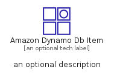
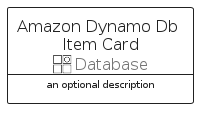
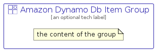

# AmazonDynamoDbItem


```text
aws-q2-2022/Resource/Database/AmazonDynamoDbItem
```

```text
include('aws-q2-2022/Resource/Database/AmazonDynamoDbItem')
```


| Illustration | AmazonDynamoDbItem | AmazonDynamoDbItemCard | AmazonDynamoDbItemGroup |
| :---: | :---: | :---: | :---: |
|  |  |  |  |


## AmazonDynamoDbItem

### Load remotely
```plantuml
@startuml
' configures the library
!global $LIB_BASE_LOCATION="https://raw.githubusercontent.com/tmorin/plantuml-libs/master/distribution"

' loads the library's bootstrap
!include $LIB_BASE_LOCATION/bootstrap.puml

' loads the package bootstrap
include('aws-q2-2022/bootstrap')

' loads the Item which embeds the element AmazonDynamoDbItem
include('aws-q2-2022/Resource/Database/AmazonDynamoDbItem')

' renders the element
AmazonDynamoDbItem('AmazonDynamoDbItem', 'Amazon Dynamo Db Item', 'an optional tech label')
@enduml
```

### Load locally
```plantuml
@startuml
' configures the library
!global $INCLUSION_MODE="local"
!global $LIB_BASE_LOCATION="../../.."

' loads the library's bootstrap
!include $LIB_BASE_LOCATION/bootstrap.puml

' loads the package bootstrap
include('aws-q2-2022/bootstrap')

' loads the Item which embeds the element AmazonDynamoDbItem
include('aws-q2-2022/Resource/Database/AmazonDynamoDbItem')

' renders the element
AmazonDynamoDbItem('AmazonDynamoDbItem', 'Amazon Dynamo Db Item', 'an optional tech label')
@enduml
```

## AmazonDynamoDbItemCard

### Load remotely
```plantuml
@startuml
' configures the library
!global $LIB_BASE_LOCATION="https://raw.githubusercontent.com/tmorin/plantuml-libs/master/distribution"

' loads the library's bootstrap
!include $LIB_BASE_LOCATION/bootstrap.puml

' loads the package bootstrap
include('aws-q2-2022/bootstrap')

' loads the Item which embeds the element AmazonDynamoDbItemCard
include('aws-q2-2022/Resource/Database/AmazonDynamoDbItem')

' renders the element
AmazonDynamoDbItemCard('AmazonDynamoDbItemCard', 'Amazon Dynamo Db Item Card', 'an optional description')
@enduml
```

### Load locally
```plantuml
@startuml
' configures the library
!global $INCLUSION_MODE="local"
!global $LIB_BASE_LOCATION="../../.."

' loads the library's bootstrap
!include $LIB_BASE_LOCATION/bootstrap.puml

' loads the package bootstrap
include('aws-q2-2022/bootstrap')

' loads the Item which embeds the element AmazonDynamoDbItemCard
include('aws-q2-2022/Resource/Database/AmazonDynamoDbItem')

' renders the element
AmazonDynamoDbItemCard('AmazonDynamoDbItemCard', 'Amazon Dynamo Db Item Card', 'an optional description')
@enduml
```

## AmazonDynamoDbItemGroup

### Load remotely
```plantuml
@startuml
' configures the library
!global $LIB_BASE_LOCATION="https://raw.githubusercontent.com/tmorin/plantuml-libs/master/distribution"

' loads the library's bootstrap
!include $LIB_BASE_LOCATION/bootstrap.puml

' loads the package bootstrap
include('aws-q2-2022/bootstrap')

' loads the Item which embeds the element AmazonDynamoDbItemGroup
include('aws-q2-2022/Resource/Database/AmazonDynamoDbItem')

' renders the element
AmazonDynamoDbItemGroup('AmazonDynamoDbItemGroup', 'Amazon Dynamo Db Item Group', 'an optional tech label') {
    note as note
        the content of the group
    end note
}
@enduml
```

### Load locally
```plantuml
@startuml
' configures the library
!global $INCLUSION_MODE="local"
!global $LIB_BASE_LOCATION="../../.."

' loads the library's bootstrap
!include $LIB_BASE_LOCATION/bootstrap.puml

' loads the package bootstrap
include('aws-q2-2022/bootstrap')

' loads the Item which embeds the element AmazonDynamoDbItemGroup
include('aws-q2-2022/Resource/Database/AmazonDynamoDbItem')

' renders the element
AmazonDynamoDbItemGroup('AmazonDynamoDbItemGroup', 'Amazon Dynamo Db Item Group', 'an optional tech label') {
    note as note
        the content of the group
    end note
}
@enduml
```

