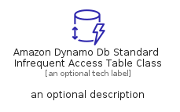
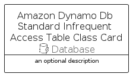

# AmazonDynamoDbStandardInfrequentAccessTableClass


```text
aws-q2-2022/Resource/Database/AmazonDynamoDbStandardInfrequentAccessTableClass
```

```text
include('aws-q2-2022/Resource/Database/AmazonDynamoDbStandardInfrequentAccessTableClass')
```


| Illustration | AmazonDynamoDbStandardInfrequentAccessTableClass | AmazonDynamoDbStandardInfrequentAccessTableClassCard | AmazonDynamoDbStandardInfrequentAccessTableClassGroup |
| :---: | :---: | :---: | :---: |
|  |  |  |  |


## AmazonDynamoDbStandardInfrequentAccessTableClass

### Load remotely
```plantuml
@startuml
' configures the library
!global $LIB_BASE_LOCATION="https://raw.githubusercontent.com/tmorin/plantuml-libs/master/distribution"

' loads the library's bootstrap
!include $LIB_BASE_LOCATION/bootstrap.puml

' loads the package bootstrap
include('aws-q2-2022/bootstrap')

' loads the Item which embeds the element AmazonDynamoDbStandardInfrequentAccessTableClass
include('aws-q2-2022/Resource/Database/AmazonDynamoDbStandardInfrequentAccessTableClass')

' renders the element
AmazonDynamoDbStandardInfrequentAccessTableClass('AmazonDynamoDbStandardInfrequentAccessTableClass', 'Amazon Dynamo Db Standard Infrequent Access Table Class', 'an optional tech label')
@enduml
```

### Load locally
```plantuml
@startuml
' configures the library
!global $INCLUSION_MODE="local"
!global $LIB_BASE_LOCATION="../../.."

' loads the library's bootstrap
!include $LIB_BASE_LOCATION/bootstrap.puml

' loads the package bootstrap
include('aws-q2-2022/bootstrap')

' loads the Item which embeds the element AmazonDynamoDbStandardInfrequentAccessTableClass
include('aws-q2-2022/Resource/Database/AmazonDynamoDbStandardInfrequentAccessTableClass')

' renders the element
AmazonDynamoDbStandardInfrequentAccessTableClass('AmazonDynamoDbStandardInfrequentAccessTableClass', 'Amazon Dynamo Db Standard Infrequent Access Table Class', 'an optional tech label')
@enduml
```

## AmazonDynamoDbStandardInfrequentAccessTableClassCard

### Load remotely
```plantuml
@startuml
' configures the library
!global $LIB_BASE_LOCATION="https://raw.githubusercontent.com/tmorin/plantuml-libs/master/distribution"

' loads the library's bootstrap
!include $LIB_BASE_LOCATION/bootstrap.puml

' loads the package bootstrap
include('aws-q2-2022/bootstrap')

' loads the Item which embeds the element AmazonDynamoDbStandardInfrequentAccessTableClassCard
include('aws-q2-2022/Resource/Database/AmazonDynamoDbStandardInfrequentAccessTableClass')

' renders the element
AmazonDynamoDbStandardInfrequentAccessTableClassCard('AmazonDynamoDbStandardInfrequentAccessTableClassCard', 'Amazon Dynamo Db Standard Infrequent Access Table Class Card', 'an optional description')
@enduml
```

### Load locally
```plantuml
@startuml
' configures the library
!global $INCLUSION_MODE="local"
!global $LIB_BASE_LOCATION="../../.."

' loads the library's bootstrap
!include $LIB_BASE_LOCATION/bootstrap.puml

' loads the package bootstrap
include('aws-q2-2022/bootstrap')

' loads the Item which embeds the element AmazonDynamoDbStandardInfrequentAccessTableClassCard
include('aws-q2-2022/Resource/Database/AmazonDynamoDbStandardInfrequentAccessTableClass')

' renders the element
AmazonDynamoDbStandardInfrequentAccessTableClassCard('AmazonDynamoDbStandardInfrequentAccessTableClassCard', 'Amazon Dynamo Db Standard Infrequent Access Table Class Card', 'an optional description')
@enduml
```

## AmazonDynamoDbStandardInfrequentAccessTableClassGroup

### Load remotely
```plantuml
@startuml
' configures the library
!global $LIB_BASE_LOCATION="https://raw.githubusercontent.com/tmorin/plantuml-libs/master/distribution"

' loads the library's bootstrap
!include $LIB_BASE_LOCATION/bootstrap.puml

' loads the package bootstrap
include('aws-q2-2022/bootstrap')

' loads the Item which embeds the element AmazonDynamoDbStandardInfrequentAccessTableClassGroup
include('aws-q2-2022/Resource/Database/AmazonDynamoDbStandardInfrequentAccessTableClass')

' renders the element
AmazonDynamoDbStandardInfrequentAccessTableClassGroup('AmazonDynamoDbStandardInfrequentAccessTableClassGroup', 'Amazon Dynamo Db Standard Infrequent Access Table Class Group', 'an optional tech label') {
    note as note
        the content of the group
    end note
}
@enduml
```

### Load locally
```plantuml
@startuml
' configures the library
!global $INCLUSION_MODE="local"
!global $LIB_BASE_LOCATION="../../.."

' loads the library's bootstrap
!include $LIB_BASE_LOCATION/bootstrap.puml

' loads the package bootstrap
include('aws-q2-2022/bootstrap')

' loads the Item which embeds the element AmazonDynamoDbStandardInfrequentAccessTableClassGroup
include('aws-q2-2022/Resource/Database/AmazonDynamoDbStandardInfrequentAccessTableClass')

' renders the element
AmazonDynamoDbStandardInfrequentAccessTableClassGroup('AmazonDynamoDbStandardInfrequentAccessTableClassGroup', 'Amazon Dynamo Db Standard Infrequent Access Table Class Group', 'an optional tech label') {
    note as note
        the content of the group
    end note
}
@enduml
```

