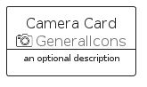
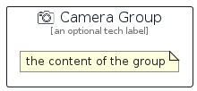

# Camera


```text
aws-q2-2022/Resource/GeneralIcons/Camera
```

```text
include('aws-q2-2022/Resource/GeneralIcons/Camera')
```


| Illustration | Camera | CameraCard | CameraGroup |
| :---: | :---: | :---: | :---: |
|  |  |  |  |


## Camera

### Load remotely
```plantuml
@startuml
' configures the library
!global $LIB_BASE_LOCATION="https://raw.githubusercontent.com/tmorin/plantuml-libs/master/distribution"

' loads the library's bootstrap
!include $LIB_BASE_LOCATION/bootstrap.puml

' loads the package bootstrap
include('aws-q2-2022/bootstrap')

' loads the Item which embeds the element Camera
include('aws-q2-2022/Resource/GeneralIcons/Camera')

' renders the element
Camera('Camera', 'Camera', 'an optional tech label', 'an optional description')
@enduml
```

### Load locally
```plantuml
@startuml
' configures the library
!global $INCLUSION_MODE="local"
!global $LIB_BASE_LOCATION="../../.."

' loads the library's bootstrap
!include $LIB_BASE_LOCATION/bootstrap.puml

' loads the package bootstrap
include('aws-q2-2022/bootstrap')

' loads the Item which embeds the element Camera
include('aws-q2-2022/Resource/GeneralIcons/Camera')

' renders the element
Camera('Camera', 'Camera', 'an optional tech label', 'an optional description')
@enduml
```

## CameraCard

### Load remotely
```plantuml
@startuml
' configures the library
!global $LIB_BASE_LOCATION="https://raw.githubusercontent.com/tmorin/plantuml-libs/master/distribution"

' loads the library's bootstrap
!include $LIB_BASE_LOCATION/bootstrap.puml

' loads the package bootstrap
include('aws-q2-2022/bootstrap')

' loads the Item which embeds the element CameraCard
include('aws-q2-2022/Resource/GeneralIcons/Camera')

' renders the element
CameraCard('CameraCard', 'Camera Card', 'an optional description')
@enduml
```

### Load locally
```plantuml
@startuml
' configures the library
!global $INCLUSION_MODE="local"
!global $LIB_BASE_LOCATION="../../.."

' loads the library's bootstrap
!include $LIB_BASE_LOCATION/bootstrap.puml

' loads the package bootstrap
include('aws-q2-2022/bootstrap')

' loads the Item which embeds the element CameraCard
include('aws-q2-2022/Resource/GeneralIcons/Camera')

' renders the element
CameraCard('CameraCard', 'Camera Card', 'an optional description')
@enduml
```

## CameraGroup

### Load remotely
```plantuml
@startuml
' configures the library
!global $LIB_BASE_LOCATION="https://raw.githubusercontent.com/tmorin/plantuml-libs/master/distribution"

' loads the library's bootstrap
!include $LIB_BASE_LOCATION/bootstrap.puml

' loads the package bootstrap
include('aws-q2-2022/bootstrap')

' loads the Item which embeds the element CameraGroup
include('aws-q2-2022/Resource/GeneralIcons/Camera')

' renders the element
CameraGroup('CameraGroup', 'Camera Group', 'an optional tech label') {
    note as note
        the content of the group
    end note
}
@enduml
```

### Load locally
```plantuml
@startuml
' configures the library
!global $INCLUSION_MODE="local"
!global $LIB_BASE_LOCATION="../../.."

' loads the library's bootstrap
!include $LIB_BASE_LOCATION/bootstrap.puml

' loads the package bootstrap
include('aws-q2-2022/bootstrap')

' loads the Item which embeds the element CameraGroup
include('aws-q2-2022/Resource/GeneralIcons/Camera')

' renders the element
CameraGroup('CameraGroup', 'Camera Group', 'an optional tech label') {
    note as note
        the content of the group
    end note
}
@enduml
```

