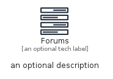
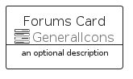
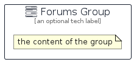

# Forums


```text
aws-q2-2022/Resource/GeneralIcons/Forums
```

```text
include('aws-q2-2022/Resource/GeneralIcons/Forums')
```


| Illustration | Forums | ForumsCard | ForumsGroup |
| :---: | :---: | :---: | :---: |
|  |  |  |  |


## Forums

### Load remotely
```plantuml
@startuml
' configures the library
!global $LIB_BASE_LOCATION="https://raw.githubusercontent.com/tmorin/plantuml-libs/master/distribution"

' loads the library's bootstrap
!include $LIB_BASE_LOCATION/bootstrap.puml

' loads the package bootstrap
include('aws-q2-2022/bootstrap')

' loads the Item which embeds the element Forums
include('aws-q2-2022/Resource/GeneralIcons/Forums')

' renders the element
Forums('Forums', 'Forums', 'an optional tech label')
@enduml
```

### Load locally
```plantuml
@startuml
' configures the library
!global $INCLUSION_MODE="local"
!global $LIB_BASE_LOCATION="../../.."

' loads the library's bootstrap
!include $LIB_BASE_LOCATION/bootstrap.puml

' loads the package bootstrap
include('aws-q2-2022/bootstrap')

' loads the Item which embeds the element Forums
include('aws-q2-2022/Resource/GeneralIcons/Forums')

' renders the element
Forums('Forums', 'Forums', 'an optional tech label')
@enduml
```

## ForumsCard

### Load remotely
```plantuml
@startuml
' configures the library
!global $LIB_BASE_LOCATION="https://raw.githubusercontent.com/tmorin/plantuml-libs/master/distribution"

' loads the library's bootstrap
!include $LIB_BASE_LOCATION/bootstrap.puml

' loads the package bootstrap
include('aws-q2-2022/bootstrap')

' loads the Item which embeds the element ForumsCard
include('aws-q2-2022/Resource/GeneralIcons/Forums')

' renders the element
ForumsCard('ForumsCard', 'Forums Card', 'an optional description')
@enduml
```

### Load locally
```plantuml
@startuml
' configures the library
!global $INCLUSION_MODE="local"
!global $LIB_BASE_LOCATION="../../.."

' loads the library's bootstrap
!include $LIB_BASE_LOCATION/bootstrap.puml

' loads the package bootstrap
include('aws-q2-2022/bootstrap')

' loads the Item which embeds the element ForumsCard
include('aws-q2-2022/Resource/GeneralIcons/Forums')

' renders the element
ForumsCard('ForumsCard', 'Forums Card', 'an optional description')
@enduml
```

## ForumsGroup

### Load remotely
```plantuml
@startuml
' configures the library
!global $LIB_BASE_LOCATION="https://raw.githubusercontent.com/tmorin/plantuml-libs/master/distribution"

' loads the library's bootstrap
!include $LIB_BASE_LOCATION/bootstrap.puml

' loads the package bootstrap
include('aws-q2-2022/bootstrap')

' loads the Item which embeds the element ForumsGroup
include('aws-q2-2022/Resource/GeneralIcons/Forums')

' renders the element
ForumsGroup('ForumsGroup', 'Forums Group', 'an optional tech label') {
    note as note
        the content of the group
    end note
}
@enduml
```

### Load locally
```plantuml
@startuml
' configures the library
!global $INCLUSION_MODE="local"
!global $LIB_BASE_LOCATION="../../.."

' loads the library's bootstrap
!include $LIB_BASE_LOCATION/bootstrap.puml

' loads the package bootstrap
include('aws-q2-2022/bootstrap')

' loads the Item which embeds the element ForumsGroup
include('aws-q2-2022/Resource/GeneralIcons/Forums')

' renders the element
ForumsGroup('ForumsGroup', 'Forums Group', 'an optional tech label') {
    note as note
        the content of the group
    end note
}
@enduml
```

