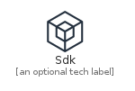
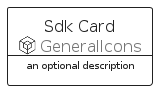
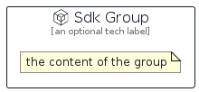

# Sdk


```text
aws-q2-2022/Resource/GeneralIcons/Sdk
```

```text
include('aws-q2-2022/Resource/GeneralIcons/Sdk')
```


| Illustration | Sdk | SdkCard | SdkGroup |
| :---: | :---: | :---: | :---: |
|  |  |  |  |


## Sdk

### Load remotely
```plantuml
@startuml
' configures the library
!global $LIB_BASE_LOCATION="https://raw.githubusercontent.com/tmorin/plantuml-libs/master/distribution"

' loads the library's bootstrap
!include $LIB_BASE_LOCATION/bootstrap.puml

' loads the package bootstrap
include('aws-q2-2022/bootstrap')

' loads the Item which embeds the element Sdk
include('aws-q2-2022/Resource/GeneralIcons/Sdk')

' renders the element
Sdk('Sdk', 'Sdk', 'an optional tech label')
@enduml
```

### Load locally
```plantuml
@startuml
' configures the library
!global $INCLUSION_MODE="local"
!global $LIB_BASE_LOCATION="../../.."

' loads the library's bootstrap
!include $LIB_BASE_LOCATION/bootstrap.puml

' loads the package bootstrap
include('aws-q2-2022/bootstrap')

' loads the Item which embeds the element Sdk
include('aws-q2-2022/Resource/GeneralIcons/Sdk')

' renders the element
Sdk('Sdk', 'Sdk', 'an optional tech label')
@enduml
```

## SdkCard

### Load remotely
```plantuml
@startuml
' configures the library
!global $LIB_BASE_LOCATION="https://raw.githubusercontent.com/tmorin/plantuml-libs/master/distribution"

' loads the library's bootstrap
!include $LIB_BASE_LOCATION/bootstrap.puml

' loads the package bootstrap
include('aws-q2-2022/bootstrap')

' loads the Item which embeds the element SdkCard
include('aws-q2-2022/Resource/GeneralIcons/Sdk')

' renders the element
SdkCard('SdkCard', 'Sdk Card', 'an optional description')
@enduml
```

### Load locally
```plantuml
@startuml
' configures the library
!global $INCLUSION_MODE="local"
!global $LIB_BASE_LOCATION="../../.."

' loads the library's bootstrap
!include $LIB_BASE_LOCATION/bootstrap.puml

' loads the package bootstrap
include('aws-q2-2022/bootstrap')

' loads the Item which embeds the element SdkCard
include('aws-q2-2022/Resource/GeneralIcons/Sdk')

' renders the element
SdkCard('SdkCard', 'Sdk Card', 'an optional description')
@enduml
```

## SdkGroup

### Load remotely
```plantuml
@startuml
' configures the library
!global $LIB_BASE_LOCATION="https://raw.githubusercontent.com/tmorin/plantuml-libs/master/distribution"

' loads the library's bootstrap
!include $LIB_BASE_LOCATION/bootstrap.puml

' loads the package bootstrap
include('aws-q2-2022/bootstrap')

' loads the Item which embeds the element SdkGroup
include('aws-q2-2022/Resource/GeneralIcons/Sdk')

' renders the element
SdkGroup('SdkGroup', 'Sdk Group', 'an optional tech label') {
    note as note
        the content of the group
    end note
}
@enduml
```

### Load locally
```plantuml
@startuml
' configures the library
!global $INCLUSION_MODE="local"
!global $LIB_BASE_LOCATION="../../.."

' loads the library's bootstrap
!include $LIB_BASE_LOCATION/bootstrap.puml

' loads the package bootstrap
include('aws-q2-2022/bootstrap')

' loads the Item which embeds the element SdkGroup
include('aws-q2-2022/Resource/GeneralIcons/Sdk')

' renders the element
SdkGroup('SdkGroup', 'Sdk Group', 'an optional tech label') {
    note as note
        the content of the group
    end note
}
@enduml
```

