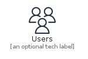
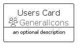
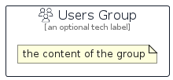

# Users


```text
aws-q2-2022/Resource/GeneralIcons/Users
```

```text
include('aws-q2-2022/Resource/GeneralIcons/Users')
```


| Illustration | Users | UsersCard | UsersGroup |
| :---: | :---: | :---: | :---: |
|  |  |  |  |


## Users

### Load remotely
```plantuml
@startuml
' configures the library
!global $LIB_BASE_LOCATION="https://raw.githubusercontent.com/tmorin/plantuml-libs/master/distribution"

' loads the library's bootstrap
!include $LIB_BASE_LOCATION/bootstrap.puml

' loads the package bootstrap
include('aws-q2-2022/bootstrap')

' loads the Item which embeds the element Users
include('aws-q2-2022/Resource/GeneralIcons/Users')

' renders the element
Users('Users', 'Users', 'an optional tech label')
@enduml
```

### Load locally
```plantuml
@startuml
' configures the library
!global $INCLUSION_MODE="local"
!global $LIB_BASE_LOCATION="../../.."

' loads the library's bootstrap
!include $LIB_BASE_LOCATION/bootstrap.puml

' loads the package bootstrap
include('aws-q2-2022/bootstrap')

' loads the Item which embeds the element Users
include('aws-q2-2022/Resource/GeneralIcons/Users')

' renders the element
Users('Users', 'Users', 'an optional tech label')
@enduml
```

## UsersCard

### Load remotely
```plantuml
@startuml
' configures the library
!global $LIB_BASE_LOCATION="https://raw.githubusercontent.com/tmorin/plantuml-libs/master/distribution"

' loads the library's bootstrap
!include $LIB_BASE_LOCATION/bootstrap.puml

' loads the package bootstrap
include('aws-q2-2022/bootstrap')

' loads the Item which embeds the element UsersCard
include('aws-q2-2022/Resource/GeneralIcons/Users')

' renders the element
UsersCard('UsersCard', 'Users Card', 'an optional description')
@enduml
```

### Load locally
```plantuml
@startuml
' configures the library
!global $INCLUSION_MODE="local"
!global $LIB_BASE_LOCATION="../../.."

' loads the library's bootstrap
!include $LIB_BASE_LOCATION/bootstrap.puml

' loads the package bootstrap
include('aws-q2-2022/bootstrap')

' loads the Item which embeds the element UsersCard
include('aws-q2-2022/Resource/GeneralIcons/Users')

' renders the element
UsersCard('UsersCard', 'Users Card', 'an optional description')
@enduml
```

## UsersGroup

### Load remotely
```plantuml
@startuml
' configures the library
!global $LIB_BASE_LOCATION="https://raw.githubusercontent.com/tmorin/plantuml-libs/master/distribution"

' loads the library's bootstrap
!include $LIB_BASE_LOCATION/bootstrap.puml

' loads the package bootstrap
include('aws-q2-2022/bootstrap')

' loads the Item which embeds the element UsersGroup
include('aws-q2-2022/Resource/GeneralIcons/Users')

' renders the element
UsersGroup('UsersGroup', 'Users Group', 'an optional tech label') {
    note as note
        the content of the group
    end note
}
@enduml
```

### Load locally
```plantuml
@startuml
' configures the library
!global $INCLUSION_MODE="local"
!global $LIB_BASE_LOCATION="../../.."

' loads the library's bootstrap
!include $LIB_BASE_LOCATION/bootstrap.puml

' loads the package bootstrap
include('aws-q2-2022/bootstrap')

' loads the Item which embeds the element UsersGroup
include('aws-q2-2022/Resource/GeneralIcons/Users')

' renders the element
UsersGroup('UsersGroup', 'Users Group', 'an optional tech label') {
    note as note
        the content of the group
    end note
}
@enduml
```

