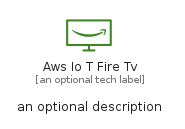
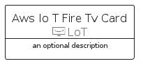
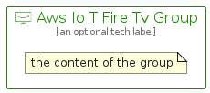

# AwsIoTFireTv


```text
aws-q2-2022/Resource/LoT/AwsIoTFireTv
```

```text
include('aws-q2-2022/Resource/LoT/AwsIoTFireTv')
```


| Illustration | AwsIoTFireTv | AwsIoTFireTvCard | AwsIoTFireTvGroup |
| :---: | :---: | :---: | :---: |
|  |  |  |  |


## AwsIoTFireTv

### Load remotely
```plantuml
@startuml
' configures the library
!global $LIB_BASE_LOCATION="https://raw.githubusercontent.com/tmorin/plantuml-libs/master/distribution"

' loads the library's bootstrap
!include $LIB_BASE_LOCATION/bootstrap.puml

' loads the package bootstrap
include('aws-q2-2022/bootstrap')

' loads the Item which embeds the element AwsIoTFireTv
include('aws-q2-2022/Resource/LoT/AwsIoTFireTv')

' renders the element
AwsIoTFireTv('AwsIoTFireTv', 'Aws Io T Fire Tv', 'an optional tech label', 'an optional description')
@enduml
```

### Load locally
```plantuml
@startuml
' configures the library
!global $INCLUSION_MODE="local"
!global $LIB_BASE_LOCATION="../../.."

' loads the library's bootstrap
!include $LIB_BASE_LOCATION/bootstrap.puml

' loads the package bootstrap
include('aws-q2-2022/bootstrap')

' loads the Item which embeds the element AwsIoTFireTv
include('aws-q2-2022/Resource/LoT/AwsIoTFireTv')

' renders the element
AwsIoTFireTv('AwsIoTFireTv', 'Aws Io T Fire Tv', 'an optional tech label', 'an optional description')
@enduml
```

## AwsIoTFireTvCard

### Load remotely
```plantuml
@startuml
' configures the library
!global $LIB_BASE_LOCATION="https://raw.githubusercontent.com/tmorin/plantuml-libs/master/distribution"

' loads the library's bootstrap
!include $LIB_BASE_LOCATION/bootstrap.puml

' loads the package bootstrap
include('aws-q2-2022/bootstrap')

' loads the Item which embeds the element AwsIoTFireTvCard
include('aws-q2-2022/Resource/LoT/AwsIoTFireTv')

' renders the element
AwsIoTFireTvCard('AwsIoTFireTvCard', 'Aws Io T Fire Tv Card', 'an optional description')
@enduml
```

### Load locally
```plantuml
@startuml
' configures the library
!global $INCLUSION_MODE="local"
!global $LIB_BASE_LOCATION="../../.."

' loads the library's bootstrap
!include $LIB_BASE_LOCATION/bootstrap.puml

' loads the package bootstrap
include('aws-q2-2022/bootstrap')

' loads the Item which embeds the element AwsIoTFireTvCard
include('aws-q2-2022/Resource/LoT/AwsIoTFireTv')

' renders the element
AwsIoTFireTvCard('AwsIoTFireTvCard', 'Aws Io T Fire Tv Card', 'an optional description')
@enduml
```

## AwsIoTFireTvGroup

### Load remotely
```plantuml
@startuml
' configures the library
!global $LIB_BASE_LOCATION="https://raw.githubusercontent.com/tmorin/plantuml-libs/master/distribution"

' loads the library's bootstrap
!include $LIB_BASE_LOCATION/bootstrap.puml

' loads the package bootstrap
include('aws-q2-2022/bootstrap')

' loads the Item which embeds the element AwsIoTFireTvGroup
include('aws-q2-2022/Resource/LoT/AwsIoTFireTv')

' renders the element
AwsIoTFireTvGroup('AwsIoTFireTvGroup', 'Aws Io T Fire Tv Group', 'an optional tech label') {
    note as note
        the content of the group
    end note
}
@enduml
```

### Load locally
```plantuml
@startuml
' configures the library
!global $INCLUSION_MODE="local"
!global $LIB_BASE_LOCATION="../../.."

' loads the library's bootstrap
!include $LIB_BASE_LOCATION/bootstrap.puml

' loads the package bootstrap
include('aws-q2-2022/bootstrap')

' loads the Item which embeds the element AwsIoTFireTvGroup
include('aws-q2-2022/Resource/LoT/AwsIoTFireTv')

' renders the element
AwsIoTFireTvGroup('AwsIoTFireTvGroup', 'Aws Io T Fire Tv Group', 'an optional tech label') {
    note as note
        the content of the group
    end note
}
@enduml
```

