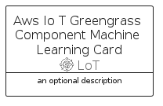

# AwsIoTGreengrassComponentMachineLearning


```text
aws-q2-2022/Resource/LoT/AwsIoTGreengrassComponentMachineLearning
```

```text
include('aws-q2-2022/Resource/LoT/AwsIoTGreengrassComponentMachineLearning')
```


| Illustration | AwsIoTGreengrassComponentMachineLearning | AwsIoTGreengrassComponentMachineLearningCard | AwsIoTGreengrassComponentMachineLearningGroup |
| :---: | :---: | :---: | :---: |
|  |  |  |  |


## AwsIoTGreengrassComponentMachineLearning

### Load remotely
```plantuml
@startuml
' configures the library
!global $LIB_BASE_LOCATION="https://raw.githubusercontent.com/tmorin/plantuml-libs/master/distribution"

' loads the library's bootstrap
!include $LIB_BASE_LOCATION/bootstrap.puml

' loads the package bootstrap
include('aws-q2-2022/bootstrap')

' loads the Item which embeds the element AwsIoTGreengrassComponentMachineLearning
include('aws-q2-2022/Resource/LoT/AwsIoTGreengrassComponentMachineLearning')

' renders the element
AwsIoTGreengrassComponentMachineLearning('AwsIoTGreengrassComponentMachineLearning', 'Aws Io T Greengrass Component Machine Learning', 'an optional tech label')
@enduml
```

### Load locally
```plantuml
@startuml
' configures the library
!global $INCLUSION_MODE="local"
!global $LIB_BASE_LOCATION="../../.."

' loads the library's bootstrap
!include $LIB_BASE_LOCATION/bootstrap.puml

' loads the package bootstrap
include('aws-q2-2022/bootstrap')

' loads the Item which embeds the element AwsIoTGreengrassComponentMachineLearning
include('aws-q2-2022/Resource/LoT/AwsIoTGreengrassComponentMachineLearning')

' renders the element
AwsIoTGreengrassComponentMachineLearning('AwsIoTGreengrassComponentMachineLearning', 'Aws Io T Greengrass Component Machine Learning', 'an optional tech label')
@enduml
```

## AwsIoTGreengrassComponentMachineLearningCard

### Load remotely
```plantuml
@startuml
' configures the library
!global $LIB_BASE_LOCATION="https://raw.githubusercontent.com/tmorin/plantuml-libs/master/distribution"

' loads the library's bootstrap
!include $LIB_BASE_LOCATION/bootstrap.puml

' loads the package bootstrap
include('aws-q2-2022/bootstrap')

' loads the Item which embeds the element AwsIoTGreengrassComponentMachineLearningCard
include('aws-q2-2022/Resource/LoT/AwsIoTGreengrassComponentMachineLearning')

' renders the element
AwsIoTGreengrassComponentMachineLearningCard('AwsIoTGreengrassComponentMachineLearningCard', 'Aws Io T Greengrass Component Machine Learning Card', 'an optional description')
@enduml
```

### Load locally
```plantuml
@startuml
' configures the library
!global $INCLUSION_MODE="local"
!global $LIB_BASE_LOCATION="../../.."

' loads the library's bootstrap
!include $LIB_BASE_LOCATION/bootstrap.puml

' loads the package bootstrap
include('aws-q2-2022/bootstrap')

' loads the Item which embeds the element AwsIoTGreengrassComponentMachineLearningCard
include('aws-q2-2022/Resource/LoT/AwsIoTGreengrassComponentMachineLearning')

' renders the element
AwsIoTGreengrassComponentMachineLearningCard('AwsIoTGreengrassComponentMachineLearningCard', 'Aws Io T Greengrass Component Machine Learning Card', 'an optional description')
@enduml
```

## AwsIoTGreengrassComponentMachineLearningGroup

### Load remotely
```plantuml
@startuml
' configures the library
!global $LIB_BASE_LOCATION="https://raw.githubusercontent.com/tmorin/plantuml-libs/master/distribution"

' loads the library's bootstrap
!include $LIB_BASE_LOCATION/bootstrap.puml

' loads the package bootstrap
include('aws-q2-2022/bootstrap')

' loads the Item which embeds the element AwsIoTGreengrassComponentMachineLearningGroup
include('aws-q2-2022/Resource/LoT/AwsIoTGreengrassComponentMachineLearning')

' renders the element
AwsIoTGreengrassComponentMachineLearningGroup('AwsIoTGreengrassComponentMachineLearningGroup', 'Aws Io T Greengrass Component Machine Learning Group', 'an optional tech label') {
    note as note
        the content of the group
    end note
}
@enduml
```

### Load locally
```plantuml
@startuml
' configures the library
!global $INCLUSION_MODE="local"
!global $LIB_BASE_LOCATION="../../.."

' loads the library's bootstrap
!include $LIB_BASE_LOCATION/bootstrap.puml

' loads the package bootstrap
include('aws-q2-2022/bootstrap')

' loads the Item which embeds the element AwsIoTGreengrassComponentMachineLearningGroup
include('aws-q2-2022/Resource/LoT/AwsIoTGreengrassComponentMachineLearning')

' renders the element
AwsIoTGreengrassComponentMachineLearningGroup('AwsIoTGreengrassComponentMachineLearningGroup', 'Aws Io T Greengrass Component Machine Learning Group', 'an optional tech label') {
    note as note
        the content of the group
    end note
}
@enduml
```

