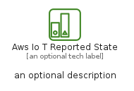
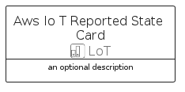
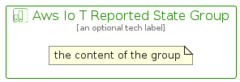

# AwsIoTReportedState


```text
aws-q2-2022/Resource/LoT/AwsIoTReportedState
```

```text
include('aws-q2-2022/Resource/LoT/AwsIoTReportedState')
```


| Illustration | AwsIoTReportedState | AwsIoTReportedStateCard | AwsIoTReportedStateGroup |
| :---: | :---: | :---: | :---: |
|  |  |  |  |


## AwsIoTReportedState

### Load remotely
```plantuml
@startuml
' configures the library
!global $LIB_BASE_LOCATION="https://raw.githubusercontent.com/tmorin/plantuml-libs/master/distribution"

' loads the library's bootstrap
!include $LIB_BASE_LOCATION/bootstrap.puml

' loads the package bootstrap
include('aws-q2-2022/bootstrap')

' loads the Item which embeds the element AwsIoTReportedState
include('aws-q2-2022/Resource/LoT/AwsIoTReportedState')

' renders the element
AwsIoTReportedState('AwsIoTReportedState', 'Aws Io T Reported State', 'an optional tech label')
@enduml
```

### Load locally
```plantuml
@startuml
' configures the library
!global $INCLUSION_MODE="local"
!global $LIB_BASE_LOCATION="../../.."

' loads the library's bootstrap
!include $LIB_BASE_LOCATION/bootstrap.puml

' loads the package bootstrap
include('aws-q2-2022/bootstrap')

' loads the Item which embeds the element AwsIoTReportedState
include('aws-q2-2022/Resource/LoT/AwsIoTReportedState')

' renders the element
AwsIoTReportedState('AwsIoTReportedState', 'Aws Io T Reported State', 'an optional tech label')
@enduml
```

## AwsIoTReportedStateCard

### Load remotely
```plantuml
@startuml
' configures the library
!global $LIB_BASE_LOCATION="https://raw.githubusercontent.com/tmorin/plantuml-libs/master/distribution"

' loads the library's bootstrap
!include $LIB_BASE_LOCATION/bootstrap.puml

' loads the package bootstrap
include('aws-q2-2022/bootstrap')

' loads the Item which embeds the element AwsIoTReportedStateCard
include('aws-q2-2022/Resource/LoT/AwsIoTReportedState')

' renders the element
AwsIoTReportedStateCard('AwsIoTReportedStateCard', 'Aws Io T Reported State Card', 'an optional description')
@enduml
```

### Load locally
```plantuml
@startuml
' configures the library
!global $INCLUSION_MODE="local"
!global $LIB_BASE_LOCATION="../../.."

' loads the library's bootstrap
!include $LIB_BASE_LOCATION/bootstrap.puml

' loads the package bootstrap
include('aws-q2-2022/bootstrap')

' loads the Item which embeds the element AwsIoTReportedStateCard
include('aws-q2-2022/Resource/LoT/AwsIoTReportedState')

' renders the element
AwsIoTReportedStateCard('AwsIoTReportedStateCard', 'Aws Io T Reported State Card', 'an optional description')
@enduml
```

## AwsIoTReportedStateGroup

### Load remotely
```plantuml
@startuml
' configures the library
!global $LIB_BASE_LOCATION="https://raw.githubusercontent.com/tmorin/plantuml-libs/master/distribution"

' loads the library's bootstrap
!include $LIB_BASE_LOCATION/bootstrap.puml

' loads the package bootstrap
include('aws-q2-2022/bootstrap')

' loads the Item which embeds the element AwsIoTReportedStateGroup
include('aws-q2-2022/Resource/LoT/AwsIoTReportedState')

' renders the element
AwsIoTReportedStateGroup('AwsIoTReportedStateGroup', 'Aws Io T Reported State Group', 'an optional tech label') {
    note as note
        the content of the group
    end note
}
@enduml
```

### Load locally
```plantuml
@startuml
' configures the library
!global $INCLUSION_MODE="local"
!global $LIB_BASE_LOCATION="../../.."

' loads the library's bootstrap
!include $LIB_BASE_LOCATION/bootstrap.puml

' loads the package bootstrap
include('aws-q2-2022/bootstrap')

' loads the Item which embeds the element AwsIoTReportedStateGroup
include('aws-q2-2022/Resource/LoT/AwsIoTReportedState')

' renders the element
AwsIoTReportedStateGroup('AwsIoTReportedStateGroup', 'Aws Io T Reported State Group', 'an optional tech label') {
    note as note
        the content of the group
    end note
}
@enduml
```

