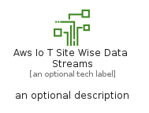
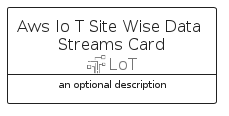
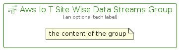

# AwsIoTSiteWiseDataStreams


```text
aws-q2-2022/Resource/LoT/AwsIoTSiteWiseDataStreams
```

```text
include('aws-q2-2022/Resource/LoT/AwsIoTSiteWiseDataStreams')
```


| Illustration | AwsIoTSiteWiseDataStreams | AwsIoTSiteWiseDataStreamsCard | AwsIoTSiteWiseDataStreamsGroup |
| :---: | :---: | :---: | :---: |
|  |  |  |  |


## AwsIoTSiteWiseDataStreams

### Load remotely
```plantuml
@startuml
' configures the library
!global $LIB_BASE_LOCATION="https://raw.githubusercontent.com/tmorin/plantuml-libs/master/distribution"

' loads the library's bootstrap
!include $LIB_BASE_LOCATION/bootstrap.puml

' loads the package bootstrap
include('aws-q2-2022/bootstrap')

' loads the Item which embeds the element AwsIoTSiteWiseDataStreams
include('aws-q2-2022/Resource/LoT/AwsIoTSiteWiseDataStreams')

' renders the element
AwsIoTSiteWiseDataStreams('AwsIoTSiteWiseDataStreams', 'Aws Io T Site Wise Data Streams', 'an optional tech label', 'an optional description')
@enduml
```

### Load locally
```plantuml
@startuml
' configures the library
!global $INCLUSION_MODE="local"
!global $LIB_BASE_LOCATION="../../.."

' loads the library's bootstrap
!include $LIB_BASE_LOCATION/bootstrap.puml

' loads the package bootstrap
include('aws-q2-2022/bootstrap')

' loads the Item which embeds the element AwsIoTSiteWiseDataStreams
include('aws-q2-2022/Resource/LoT/AwsIoTSiteWiseDataStreams')

' renders the element
AwsIoTSiteWiseDataStreams('AwsIoTSiteWiseDataStreams', 'Aws Io T Site Wise Data Streams', 'an optional tech label', 'an optional description')
@enduml
```

## AwsIoTSiteWiseDataStreamsCard

### Load remotely
```plantuml
@startuml
' configures the library
!global $LIB_BASE_LOCATION="https://raw.githubusercontent.com/tmorin/plantuml-libs/master/distribution"

' loads the library's bootstrap
!include $LIB_BASE_LOCATION/bootstrap.puml

' loads the package bootstrap
include('aws-q2-2022/bootstrap')

' loads the Item which embeds the element AwsIoTSiteWiseDataStreamsCard
include('aws-q2-2022/Resource/LoT/AwsIoTSiteWiseDataStreams')

' renders the element
AwsIoTSiteWiseDataStreamsCard('AwsIoTSiteWiseDataStreamsCard', 'Aws Io T Site Wise Data Streams Card', 'an optional description')
@enduml
```

### Load locally
```plantuml
@startuml
' configures the library
!global $INCLUSION_MODE="local"
!global $LIB_BASE_LOCATION="../../.."

' loads the library's bootstrap
!include $LIB_BASE_LOCATION/bootstrap.puml

' loads the package bootstrap
include('aws-q2-2022/bootstrap')

' loads the Item which embeds the element AwsIoTSiteWiseDataStreamsCard
include('aws-q2-2022/Resource/LoT/AwsIoTSiteWiseDataStreams')

' renders the element
AwsIoTSiteWiseDataStreamsCard('AwsIoTSiteWiseDataStreamsCard', 'Aws Io T Site Wise Data Streams Card', 'an optional description')
@enduml
```

## AwsIoTSiteWiseDataStreamsGroup

### Load remotely
```plantuml
@startuml
' configures the library
!global $LIB_BASE_LOCATION="https://raw.githubusercontent.com/tmorin/plantuml-libs/master/distribution"

' loads the library's bootstrap
!include $LIB_BASE_LOCATION/bootstrap.puml

' loads the package bootstrap
include('aws-q2-2022/bootstrap')

' loads the Item which embeds the element AwsIoTSiteWiseDataStreamsGroup
include('aws-q2-2022/Resource/LoT/AwsIoTSiteWiseDataStreams')

' renders the element
AwsIoTSiteWiseDataStreamsGroup('AwsIoTSiteWiseDataStreamsGroup', 'Aws Io T Site Wise Data Streams Group', 'an optional tech label') {
    note as note
        the content of the group
    end note
}
@enduml
```

### Load locally
```plantuml
@startuml
' configures the library
!global $INCLUSION_MODE="local"
!global $LIB_BASE_LOCATION="../../.."

' loads the library's bootstrap
!include $LIB_BASE_LOCATION/bootstrap.puml

' loads the package bootstrap
include('aws-q2-2022/bootstrap')

' loads the Item which embeds the element AwsIoTSiteWiseDataStreamsGroup
include('aws-q2-2022/Resource/LoT/AwsIoTSiteWiseDataStreams')

' renders the element
AwsIoTSiteWiseDataStreamsGroup('AwsIoTSiteWiseDataStreamsGroup', 'Aws Io T Site Wise Data Streams Group', 'an optional tech label') {
    note as note
        the content of the group
    end note
}
@enduml
```

