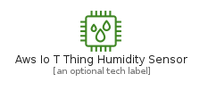
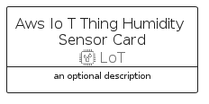
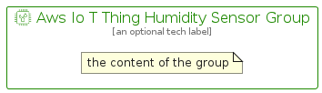

# AwsIoTThingHumiditySensor


```text
aws-q2-2022/Resource/LoT/AwsIoTThingHumiditySensor
```

```text
include('aws-q2-2022/Resource/LoT/AwsIoTThingHumiditySensor')
```


| Illustration | AwsIoTThingHumiditySensor | AwsIoTThingHumiditySensorCard | AwsIoTThingHumiditySensorGroup |
| :---: | :---: | :---: | :---: |
|  |  |  |  |


## AwsIoTThingHumiditySensor

### Load remotely
```plantuml
@startuml
' configures the library
!global $LIB_BASE_LOCATION="https://raw.githubusercontent.com/tmorin/plantuml-libs/master/distribution"

' loads the library's bootstrap
!include $LIB_BASE_LOCATION/bootstrap.puml

' loads the package bootstrap
include('aws-q2-2022/bootstrap')

' loads the Item which embeds the element AwsIoTThingHumiditySensor
include('aws-q2-2022/Resource/LoT/AwsIoTThingHumiditySensor')

' renders the element
AwsIoTThingHumiditySensor('AwsIoTThingHumiditySensor', 'Aws Io T Thing Humidity Sensor', 'an optional tech label', 'an optional description')
@enduml
```

### Load locally
```plantuml
@startuml
' configures the library
!global $INCLUSION_MODE="local"
!global $LIB_BASE_LOCATION="../../.."

' loads the library's bootstrap
!include $LIB_BASE_LOCATION/bootstrap.puml

' loads the package bootstrap
include('aws-q2-2022/bootstrap')

' loads the Item which embeds the element AwsIoTThingHumiditySensor
include('aws-q2-2022/Resource/LoT/AwsIoTThingHumiditySensor')

' renders the element
AwsIoTThingHumiditySensor('AwsIoTThingHumiditySensor', 'Aws Io T Thing Humidity Sensor', 'an optional tech label', 'an optional description')
@enduml
```

## AwsIoTThingHumiditySensorCard

### Load remotely
```plantuml
@startuml
' configures the library
!global $LIB_BASE_LOCATION="https://raw.githubusercontent.com/tmorin/plantuml-libs/master/distribution"

' loads the library's bootstrap
!include $LIB_BASE_LOCATION/bootstrap.puml

' loads the package bootstrap
include('aws-q2-2022/bootstrap')

' loads the Item which embeds the element AwsIoTThingHumiditySensorCard
include('aws-q2-2022/Resource/LoT/AwsIoTThingHumiditySensor')

' renders the element
AwsIoTThingHumiditySensorCard('AwsIoTThingHumiditySensorCard', 'Aws Io T Thing Humidity Sensor Card', 'an optional description')
@enduml
```

### Load locally
```plantuml
@startuml
' configures the library
!global $INCLUSION_MODE="local"
!global $LIB_BASE_LOCATION="../../.."

' loads the library's bootstrap
!include $LIB_BASE_LOCATION/bootstrap.puml

' loads the package bootstrap
include('aws-q2-2022/bootstrap')

' loads the Item which embeds the element AwsIoTThingHumiditySensorCard
include('aws-q2-2022/Resource/LoT/AwsIoTThingHumiditySensor')

' renders the element
AwsIoTThingHumiditySensorCard('AwsIoTThingHumiditySensorCard', 'Aws Io T Thing Humidity Sensor Card', 'an optional description')
@enduml
```

## AwsIoTThingHumiditySensorGroup

### Load remotely
```plantuml
@startuml
' configures the library
!global $LIB_BASE_LOCATION="https://raw.githubusercontent.com/tmorin/plantuml-libs/master/distribution"

' loads the library's bootstrap
!include $LIB_BASE_LOCATION/bootstrap.puml

' loads the package bootstrap
include('aws-q2-2022/bootstrap')

' loads the Item which embeds the element AwsIoTThingHumiditySensorGroup
include('aws-q2-2022/Resource/LoT/AwsIoTThingHumiditySensor')

' renders the element
AwsIoTThingHumiditySensorGroup('AwsIoTThingHumiditySensorGroup', 'Aws Io T Thing Humidity Sensor Group', 'an optional tech label') {
    note as note
        the content of the group
    end note
}
@enduml
```

### Load locally
```plantuml
@startuml
' configures the library
!global $INCLUSION_MODE="local"
!global $LIB_BASE_LOCATION="../../.."

' loads the library's bootstrap
!include $LIB_BASE_LOCATION/bootstrap.puml

' loads the package bootstrap
include('aws-q2-2022/bootstrap')

' loads the Item which embeds the element AwsIoTThingHumiditySensorGroup
include('aws-q2-2022/Resource/LoT/AwsIoTThingHumiditySensor')

' renders the element
AwsIoTThingHumiditySensorGroup('AwsIoTThingHumiditySensorGroup', 'Aws Io T Thing Humidity Sensor Group', 'an optional tech label') {
    note as note
        the content of the group
    end note
}
@enduml
```

