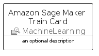
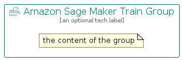

# AmazonSageMakerTrain


```text
aws-q2-2022/Resource/MachineLearning/AmazonSageMakerTrain
```

```text
include('aws-q2-2022/Resource/MachineLearning/AmazonSageMakerTrain')
```


| Illustration | AmazonSageMakerTrain | AmazonSageMakerTrainCard | AmazonSageMakerTrainGroup |
| :---: | :---: | :---: | :---: |
|  |  |  |  |


## AmazonSageMakerTrain

### Load remotely
```plantuml
@startuml
' configures the library
!global $LIB_BASE_LOCATION="https://raw.githubusercontent.com/tmorin/plantuml-libs/master/distribution"

' loads the library's bootstrap
!include $LIB_BASE_LOCATION/bootstrap.puml

' loads the package bootstrap
include('aws-q2-2022/bootstrap')

' loads the Item which embeds the element AmazonSageMakerTrain
include('aws-q2-2022/Resource/MachineLearning/AmazonSageMakerTrain')

' renders the element
AmazonSageMakerTrain('AmazonSageMakerTrain', 'Amazon Sage Maker Train', 'an optional tech label')
@enduml
```

### Load locally
```plantuml
@startuml
' configures the library
!global $INCLUSION_MODE="local"
!global $LIB_BASE_LOCATION="../../.."

' loads the library's bootstrap
!include $LIB_BASE_LOCATION/bootstrap.puml

' loads the package bootstrap
include('aws-q2-2022/bootstrap')

' loads the Item which embeds the element AmazonSageMakerTrain
include('aws-q2-2022/Resource/MachineLearning/AmazonSageMakerTrain')

' renders the element
AmazonSageMakerTrain('AmazonSageMakerTrain', 'Amazon Sage Maker Train', 'an optional tech label')
@enduml
```

## AmazonSageMakerTrainCard

### Load remotely
```plantuml
@startuml
' configures the library
!global $LIB_BASE_LOCATION="https://raw.githubusercontent.com/tmorin/plantuml-libs/master/distribution"

' loads the library's bootstrap
!include $LIB_BASE_LOCATION/bootstrap.puml

' loads the package bootstrap
include('aws-q2-2022/bootstrap')

' loads the Item which embeds the element AmazonSageMakerTrainCard
include('aws-q2-2022/Resource/MachineLearning/AmazonSageMakerTrain')

' renders the element
AmazonSageMakerTrainCard('AmazonSageMakerTrainCard', 'Amazon Sage Maker Train Card', 'an optional description')
@enduml
```

### Load locally
```plantuml
@startuml
' configures the library
!global $INCLUSION_MODE="local"
!global $LIB_BASE_LOCATION="../../.."

' loads the library's bootstrap
!include $LIB_BASE_LOCATION/bootstrap.puml

' loads the package bootstrap
include('aws-q2-2022/bootstrap')

' loads the Item which embeds the element AmazonSageMakerTrainCard
include('aws-q2-2022/Resource/MachineLearning/AmazonSageMakerTrain')

' renders the element
AmazonSageMakerTrainCard('AmazonSageMakerTrainCard', 'Amazon Sage Maker Train Card', 'an optional description')
@enduml
```

## AmazonSageMakerTrainGroup

### Load remotely
```plantuml
@startuml
' configures the library
!global $LIB_BASE_LOCATION="https://raw.githubusercontent.com/tmorin/plantuml-libs/master/distribution"

' loads the library's bootstrap
!include $LIB_BASE_LOCATION/bootstrap.puml

' loads the package bootstrap
include('aws-q2-2022/bootstrap')

' loads the Item which embeds the element AmazonSageMakerTrainGroup
include('aws-q2-2022/Resource/MachineLearning/AmazonSageMakerTrain')

' renders the element
AmazonSageMakerTrainGroup('AmazonSageMakerTrainGroup', 'Amazon Sage Maker Train Group', 'an optional tech label') {
    note as note
        the content of the group
    end note
}
@enduml
```

### Load locally
```plantuml
@startuml
' configures the library
!global $INCLUSION_MODE="local"
!global $LIB_BASE_LOCATION="../../.."

' loads the library's bootstrap
!include $LIB_BASE_LOCATION/bootstrap.puml

' loads the package bootstrap
include('aws-q2-2022/bootstrap')

' loads the Item which embeds the element AmazonSageMakerTrainGroup
include('aws-q2-2022/Resource/MachineLearning/AmazonSageMakerTrain')

' renders the element
AmazonSageMakerTrainGroup('AmazonSageMakerTrainGroup', 'Amazon Sage Maker Train Group', 'an optional tech label') {
    note as note
        the content of the group
    end note
}
@enduml
```

