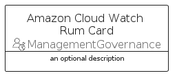
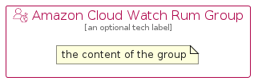

# AmazonCloudWatchRum


```text
aws-q2-2022/Resource/ManagementGovernance/AmazonCloudWatchRum
```

```text
include('aws-q2-2022/Resource/ManagementGovernance/AmazonCloudWatchRum')
```


| Illustration | AmazonCloudWatchRum | AmazonCloudWatchRumCard | AmazonCloudWatchRumGroup |
| :---: | :---: | :---: | :---: |
|  |  |  |  |


## AmazonCloudWatchRum

### Load remotely
```plantuml
@startuml
' configures the library
!global $LIB_BASE_LOCATION="https://raw.githubusercontent.com/tmorin/plantuml-libs/master/distribution"

' loads the library's bootstrap
!include $LIB_BASE_LOCATION/bootstrap.puml

' loads the package bootstrap
include('aws-q2-2022/bootstrap')

' loads the Item which embeds the element AmazonCloudWatchRum
include('aws-q2-2022/Resource/ManagementGovernance/AmazonCloudWatchRum')

' renders the element
AmazonCloudWatchRum('AmazonCloudWatchRum', 'Amazon Cloud Watch Rum', 'an optional tech label', 'an optional description')
@enduml
```

### Load locally
```plantuml
@startuml
' configures the library
!global $INCLUSION_MODE="local"
!global $LIB_BASE_LOCATION="../../.."

' loads the library's bootstrap
!include $LIB_BASE_LOCATION/bootstrap.puml

' loads the package bootstrap
include('aws-q2-2022/bootstrap')

' loads the Item which embeds the element AmazonCloudWatchRum
include('aws-q2-2022/Resource/ManagementGovernance/AmazonCloudWatchRum')

' renders the element
AmazonCloudWatchRum('AmazonCloudWatchRum', 'Amazon Cloud Watch Rum', 'an optional tech label', 'an optional description')
@enduml
```

## AmazonCloudWatchRumCard

### Load remotely
```plantuml
@startuml
' configures the library
!global $LIB_BASE_LOCATION="https://raw.githubusercontent.com/tmorin/plantuml-libs/master/distribution"

' loads the library's bootstrap
!include $LIB_BASE_LOCATION/bootstrap.puml

' loads the package bootstrap
include('aws-q2-2022/bootstrap')

' loads the Item which embeds the element AmazonCloudWatchRumCard
include('aws-q2-2022/Resource/ManagementGovernance/AmazonCloudWatchRum')

' renders the element
AmazonCloudWatchRumCard('AmazonCloudWatchRumCard', 'Amazon Cloud Watch Rum Card', 'an optional description')
@enduml
```

### Load locally
```plantuml
@startuml
' configures the library
!global $INCLUSION_MODE="local"
!global $LIB_BASE_LOCATION="../../.."

' loads the library's bootstrap
!include $LIB_BASE_LOCATION/bootstrap.puml

' loads the package bootstrap
include('aws-q2-2022/bootstrap')

' loads the Item which embeds the element AmazonCloudWatchRumCard
include('aws-q2-2022/Resource/ManagementGovernance/AmazonCloudWatchRum')

' renders the element
AmazonCloudWatchRumCard('AmazonCloudWatchRumCard', 'Amazon Cloud Watch Rum Card', 'an optional description')
@enduml
```

## AmazonCloudWatchRumGroup

### Load remotely
```plantuml
@startuml
' configures the library
!global $LIB_BASE_LOCATION="https://raw.githubusercontent.com/tmorin/plantuml-libs/master/distribution"

' loads the library's bootstrap
!include $LIB_BASE_LOCATION/bootstrap.puml

' loads the package bootstrap
include('aws-q2-2022/bootstrap')

' loads the Item which embeds the element AmazonCloudWatchRumGroup
include('aws-q2-2022/Resource/ManagementGovernance/AmazonCloudWatchRum')

' renders the element
AmazonCloudWatchRumGroup('AmazonCloudWatchRumGroup', 'Amazon Cloud Watch Rum Group', 'an optional tech label') {
    note as note
        the content of the group
    end note
}
@enduml
```

### Load locally
```plantuml
@startuml
' configures the library
!global $INCLUSION_MODE="local"
!global $LIB_BASE_LOCATION="../../.."

' loads the library's bootstrap
!include $LIB_BASE_LOCATION/bootstrap.puml

' loads the package bootstrap
include('aws-q2-2022/bootstrap')

' loads the Item which embeds the element AmazonCloudWatchRumGroup
include('aws-q2-2022/Resource/ManagementGovernance/AmazonCloudWatchRum')

' renders the element
AmazonCloudWatchRumGroup('AmazonCloudWatchRumGroup', 'Amazon Cloud Watch Rum Group', 'an optional tech label') {
    note as note
        the content of the group
    end note
}
@enduml
```

