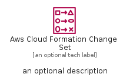
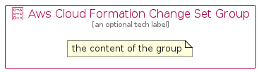

# AwsCloudFormationChangeSet


```text
aws-q2-2022/Resource/ManagementGovernance/AwsCloudFormationChangeSet
```

```text
include('aws-q2-2022/Resource/ManagementGovernance/AwsCloudFormationChangeSet')
```


| Illustration | AwsCloudFormationChangeSet | AwsCloudFormationChangeSetCard | AwsCloudFormationChangeSetGroup |
| :---: | :---: | :---: | :---: |
|  |  |  |  |


## AwsCloudFormationChangeSet

### Load remotely
```plantuml
@startuml
' configures the library
!global $LIB_BASE_LOCATION="https://raw.githubusercontent.com/tmorin/plantuml-libs/master/distribution"

' loads the library's bootstrap
!include $LIB_BASE_LOCATION/bootstrap.puml

' loads the package bootstrap
include('aws-q2-2022/bootstrap')

' loads the Item which embeds the element AwsCloudFormationChangeSet
include('aws-q2-2022/Resource/ManagementGovernance/AwsCloudFormationChangeSet')

' renders the element
AwsCloudFormationChangeSet('AwsCloudFormationChangeSet', 'Aws Cloud Formation Change Set', 'an optional tech label', 'an optional description')
@enduml
```

### Load locally
```plantuml
@startuml
' configures the library
!global $INCLUSION_MODE="local"
!global $LIB_BASE_LOCATION="../../.."

' loads the library's bootstrap
!include $LIB_BASE_LOCATION/bootstrap.puml

' loads the package bootstrap
include('aws-q2-2022/bootstrap')

' loads the Item which embeds the element AwsCloudFormationChangeSet
include('aws-q2-2022/Resource/ManagementGovernance/AwsCloudFormationChangeSet')

' renders the element
AwsCloudFormationChangeSet('AwsCloudFormationChangeSet', 'Aws Cloud Formation Change Set', 'an optional tech label', 'an optional description')
@enduml
```

## AwsCloudFormationChangeSetCard

### Load remotely
```plantuml
@startuml
' configures the library
!global $LIB_BASE_LOCATION="https://raw.githubusercontent.com/tmorin/plantuml-libs/master/distribution"

' loads the library's bootstrap
!include $LIB_BASE_LOCATION/bootstrap.puml

' loads the package bootstrap
include('aws-q2-2022/bootstrap')

' loads the Item which embeds the element AwsCloudFormationChangeSetCard
include('aws-q2-2022/Resource/ManagementGovernance/AwsCloudFormationChangeSet')

' renders the element
AwsCloudFormationChangeSetCard('AwsCloudFormationChangeSetCard', 'Aws Cloud Formation Change Set Card', 'an optional description')
@enduml
```

### Load locally
```plantuml
@startuml
' configures the library
!global $INCLUSION_MODE="local"
!global $LIB_BASE_LOCATION="../../.."

' loads the library's bootstrap
!include $LIB_BASE_LOCATION/bootstrap.puml

' loads the package bootstrap
include('aws-q2-2022/bootstrap')

' loads the Item which embeds the element AwsCloudFormationChangeSetCard
include('aws-q2-2022/Resource/ManagementGovernance/AwsCloudFormationChangeSet')

' renders the element
AwsCloudFormationChangeSetCard('AwsCloudFormationChangeSetCard', 'Aws Cloud Formation Change Set Card', 'an optional description')
@enduml
```

## AwsCloudFormationChangeSetGroup

### Load remotely
```plantuml
@startuml
' configures the library
!global $LIB_BASE_LOCATION="https://raw.githubusercontent.com/tmorin/plantuml-libs/master/distribution"

' loads the library's bootstrap
!include $LIB_BASE_LOCATION/bootstrap.puml

' loads the package bootstrap
include('aws-q2-2022/bootstrap')

' loads the Item which embeds the element AwsCloudFormationChangeSetGroup
include('aws-q2-2022/Resource/ManagementGovernance/AwsCloudFormationChangeSet')

' renders the element
AwsCloudFormationChangeSetGroup('AwsCloudFormationChangeSetGroup', 'Aws Cloud Formation Change Set Group', 'an optional tech label') {
    note as note
        the content of the group
    end note
}
@enduml
```

### Load locally
```plantuml
@startuml
' configures the library
!global $INCLUSION_MODE="local"
!global $LIB_BASE_LOCATION="../../.."

' loads the library's bootstrap
!include $LIB_BASE_LOCATION/bootstrap.puml

' loads the package bootstrap
include('aws-q2-2022/bootstrap')

' loads the Item which embeds the element AwsCloudFormationChangeSetGroup
include('aws-q2-2022/Resource/ManagementGovernance/AwsCloudFormationChangeSet')

' renders the element
AwsCloudFormationChangeSetGroup('AwsCloudFormationChangeSetGroup', 'Aws Cloud Formation Change Set Group', 'an optional tech label') {
    note as note
        the content of the group
    end note
}
@enduml
```

