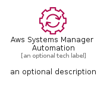
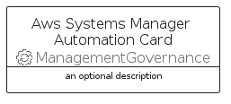
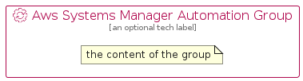

# AwsSystemsManagerAutomation


```text
aws-q2-2022/Resource/ManagementGovernance/AwsSystemsManagerAutomation
```

```text
include('aws-q2-2022/Resource/ManagementGovernance/AwsSystemsManagerAutomation')
```


| Illustration | AwsSystemsManagerAutomation | AwsSystemsManagerAutomationCard | AwsSystemsManagerAutomationGroup |
| :---: | :---: | :---: | :---: |
|  |  |  |  |


## AwsSystemsManagerAutomation

### Load remotely
```plantuml
@startuml
' configures the library
!global $LIB_BASE_LOCATION="https://raw.githubusercontent.com/tmorin/plantuml-libs/master/distribution"

' loads the library's bootstrap
!include $LIB_BASE_LOCATION/bootstrap.puml

' loads the package bootstrap
include('aws-q2-2022/bootstrap')

' loads the Item which embeds the element AwsSystemsManagerAutomation
include('aws-q2-2022/Resource/ManagementGovernance/AwsSystemsManagerAutomation')

' renders the element
AwsSystemsManagerAutomation('AwsSystemsManagerAutomation', 'Aws Systems Manager Automation', 'an optional tech label')
@enduml
```

### Load locally
```plantuml
@startuml
' configures the library
!global $INCLUSION_MODE="local"
!global $LIB_BASE_LOCATION="../../.."

' loads the library's bootstrap
!include $LIB_BASE_LOCATION/bootstrap.puml

' loads the package bootstrap
include('aws-q2-2022/bootstrap')

' loads the Item which embeds the element AwsSystemsManagerAutomation
include('aws-q2-2022/Resource/ManagementGovernance/AwsSystemsManagerAutomation')

' renders the element
AwsSystemsManagerAutomation('AwsSystemsManagerAutomation', 'Aws Systems Manager Automation', 'an optional tech label')
@enduml
```

## AwsSystemsManagerAutomationCard

### Load remotely
```plantuml
@startuml
' configures the library
!global $LIB_BASE_LOCATION="https://raw.githubusercontent.com/tmorin/plantuml-libs/master/distribution"

' loads the library's bootstrap
!include $LIB_BASE_LOCATION/bootstrap.puml

' loads the package bootstrap
include('aws-q2-2022/bootstrap')

' loads the Item which embeds the element AwsSystemsManagerAutomationCard
include('aws-q2-2022/Resource/ManagementGovernance/AwsSystemsManagerAutomation')

' renders the element
AwsSystemsManagerAutomationCard('AwsSystemsManagerAutomationCard', 'Aws Systems Manager Automation Card', 'an optional description')
@enduml
```

### Load locally
```plantuml
@startuml
' configures the library
!global $INCLUSION_MODE="local"
!global $LIB_BASE_LOCATION="../../.."

' loads the library's bootstrap
!include $LIB_BASE_LOCATION/bootstrap.puml

' loads the package bootstrap
include('aws-q2-2022/bootstrap')

' loads the Item which embeds the element AwsSystemsManagerAutomationCard
include('aws-q2-2022/Resource/ManagementGovernance/AwsSystemsManagerAutomation')

' renders the element
AwsSystemsManagerAutomationCard('AwsSystemsManagerAutomationCard', 'Aws Systems Manager Automation Card', 'an optional description')
@enduml
```

## AwsSystemsManagerAutomationGroup

### Load remotely
```plantuml
@startuml
' configures the library
!global $LIB_BASE_LOCATION="https://raw.githubusercontent.com/tmorin/plantuml-libs/master/distribution"

' loads the library's bootstrap
!include $LIB_BASE_LOCATION/bootstrap.puml

' loads the package bootstrap
include('aws-q2-2022/bootstrap')

' loads the Item which embeds the element AwsSystemsManagerAutomationGroup
include('aws-q2-2022/Resource/ManagementGovernance/AwsSystemsManagerAutomation')

' renders the element
AwsSystemsManagerAutomationGroup('AwsSystemsManagerAutomationGroup', 'Aws Systems Manager Automation Group', 'an optional tech label') {
    note as note
        the content of the group
    end note
}
@enduml
```

### Load locally
```plantuml
@startuml
' configures the library
!global $INCLUSION_MODE="local"
!global $LIB_BASE_LOCATION="../../.."

' loads the library's bootstrap
!include $LIB_BASE_LOCATION/bootstrap.puml

' loads the package bootstrap
include('aws-q2-2022/bootstrap')

' loads the Item which embeds the element AwsSystemsManagerAutomationGroup
include('aws-q2-2022/Resource/ManagementGovernance/AwsSystemsManagerAutomation')

' renders the element
AwsSystemsManagerAutomationGroup('AwsSystemsManagerAutomationGroup', 'Aws Systems Manager Automation Group', 'an optional tech label') {
    note as note
        the content of the group
    end note
}
@enduml
```

