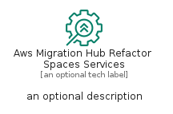
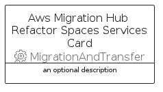

# AwsMigrationHubRefactorSpacesServices


```text
aws-q2-2022/Resource/MigrationAndTransfer/AwsMigrationHubRefactorSpacesServices
```

```text
include('aws-q2-2022/Resource/MigrationAndTransfer/AwsMigrationHubRefactorSpacesServices')
```


| Illustration | AwsMigrationHubRefactorSpacesServices | AwsMigrationHubRefactorSpacesServicesCard | AwsMigrationHubRefactorSpacesServicesGroup |
| :---: | :---: | :---: | :---: |
|  |  |  |  |


## AwsMigrationHubRefactorSpacesServices

### Load remotely
```plantuml
@startuml
' configures the library
!global $LIB_BASE_LOCATION="https://raw.githubusercontent.com/tmorin/plantuml-libs/master/distribution"

' loads the library's bootstrap
!include $LIB_BASE_LOCATION/bootstrap.puml

' loads the package bootstrap
include('aws-q2-2022/bootstrap')

' loads the Item which embeds the element AwsMigrationHubRefactorSpacesServices
include('aws-q2-2022/Resource/MigrationAndTransfer/AwsMigrationHubRefactorSpacesServices')

' renders the element
AwsMigrationHubRefactorSpacesServices('AwsMigrationHubRefactorSpacesServices', 'Aws Migration Hub Refactor Spaces Services', 'an optional tech label')
@enduml
```

### Load locally
```plantuml
@startuml
' configures the library
!global $INCLUSION_MODE="local"
!global $LIB_BASE_LOCATION="../../.."

' loads the library's bootstrap
!include $LIB_BASE_LOCATION/bootstrap.puml

' loads the package bootstrap
include('aws-q2-2022/bootstrap')

' loads the Item which embeds the element AwsMigrationHubRefactorSpacesServices
include('aws-q2-2022/Resource/MigrationAndTransfer/AwsMigrationHubRefactorSpacesServices')

' renders the element
AwsMigrationHubRefactorSpacesServices('AwsMigrationHubRefactorSpacesServices', 'Aws Migration Hub Refactor Spaces Services', 'an optional tech label')
@enduml
```

## AwsMigrationHubRefactorSpacesServicesCard

### Load remotely
```plantuml
@startuml
' configures the library
!global $LIB_BASE_LOCATION="https://raw.githubusercontent.com/tmorin/plantuml-libs/master/distribution"

' loads the library's bootstrap
!include $LIB_BASE_LOCATION/bootstrap.puml

' loads the package bootstrap
include('aws-q2-2022/bootstrap')

' loads the Item which embeds the element AwsMigrationHubRefactorSpacesServicesCard
include('aws-q2-2022/Resource/MigrationAndTransfer/AwsMigrationHubRefactorSpacesServices')

' renders the element
AwsMigrationHubRefactorSpacesServicesCard('AwsMigrationHubRefactorSpacesServicesCard', 'Aws Migration Hub Refactor Spaces Services Card', 'an optional description')
@enduml
```

### Load locally
```plantuml
@startuml
' configures the library
!global $INCLUSION_MODE="local"
!global $LIB_BASE_LOCATION="../../.."

' loads the library's bootstrap
!include $LIB_BASE_LOCATION/bootstrap.puml

' loads the package bootstrap
include('aws-q2-2022/bootstrap')

' loads the Item which embeds the element AwsMigrationHubRefactorSpacesServicesCard
include('aws-q2-2022/Resource/MigrationAndTransfer/AwsMigrationHubRefactorSpacesServices')

' renders the element
AwsMigrationHubRefactorSpacesServicesCard('AwsMigrationHubRefactorSpacesServicesCard', 'Aws Migration Hub Refactor Spaces Services Card', 'an optional description')
@enduml
```

## AwsMigrationHubRefactorSpacesServicesGroup

### Load remotely
```plantuml
@startuml
' configures the library
!global $LIB_BASE_LOCATION="https://raw.githubusercontent.com/tmorin/plantuml-libs/master/distribution"

' loads the library's bootstrap
!include $LIB_BASE_LOCATION/bootstrap.puml

' loads the package bootstrap
include('aws-q2-2022/bootstrap')

' loads the Item which embeds the element AwsMigrationHubRefactorSpacesServicesGroup
include('aws-q2-2022/Resource/MigrationAndTransfer/AwsMigrationHubRefactorSpacesServices')

' renders the element
AwsMigrationHubRefactorSpacesServicesGroup('AwsMigrationHubRefactorSpacesServicesGroup', 'Aws Migration Hub Refactor Spaces Services Group', 'an optional tech label') {
    note as note
        the content of the group
    end note
}
@enduml
```

### Load locally
```plantuml
@startuml
' configures the library
!global $INCLUSION_MODE="local"
!global $LIB_BASE_LOCATION="../../.."

' loads the library's bootstrap
!include $LIB_BASE_LOCATION/bootstrap.puml

' loads the package bootstrap
include('aws-q2-2022/bootstrap')

' loads the Item which embeds the element AwsMigrationHubRefactorSpacesServicesGroup
include('aws-q2-2022/Resource/MigrationAndTransfer/AwsMigrationHubRefactorSpacesServices')

' renders the element
AwsMigrationHubRefactorSpacesServicesGroup('AwsMigrationHubRefactorSpacesServicesGroup', 'Aws Migration Hub Refactor Spaces Services Group', 'an optional tech label') {
    note as note
        the content of the group
    end note
}
@enduml
```

