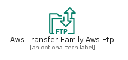
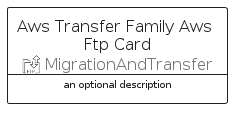
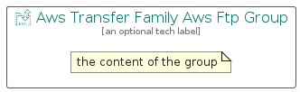

# AwsTransferFamilyAwsFtp


```text
aws-q2-2022/Resource/MigrationAndTransfer/AwsTransferFamilyAwsFtp
```

```text
include('aws-q2-2022/Resource/MigrationAndTransfer/AwsTransferFamilyAwsFtp')
```


| Illustration | AwsTransferFamilyAwsFtp | AwsTransferFamilyAwsFtpCard | AwsTransferFamilyAwsFtpGroup |
| :---: | :---: | :---: | :---: |
|  |  |  |  |


## AwsTransferFamilyAwsFtp

### Load remotely
```plantuml
@startuml
' configures the library
!global $LIB_BASE_LOCATION="https://raw.githubusercontent.com/tmorin/plantuml-libs/master/distribution"

' loads the library's bootstrap
!include $LIB_BASE_LOCATION/bootstrap.puml

' loads the package bootstrap
include('aws-q2-2022/bootstrap')

' loads the Item which embeds the element AwsTransferFamilyAwsFtp
include('aws-q2-2022/Resource/MigrationAndTransfer/AwsTransferFamilyAwsFtp')

' renders the element
AwsTransferFamilyAwsFtp('AwsTransferFamilyAwsFtp', 'Aws Transfer Family Aws Ftp', 'an optional tech label', 'an optional description')
@enduml
```

### Load locally
```plantuml
@startuml
' configures the library
!global $INCLUSION_MODE="local"
!global $LIB_BASE_LOCATION="../../.."

' loads the library's bootstrap
!include $LIB_BASE_LOCATION/bootstrap.puml

' loads the package bootstrap
include('aws-q2-2022/bootstrap')

' loads the Item which embeds the element AwsTransferFamilyAwsFtp
include('aws-q2-2022/Resource/MigrationAndTransfer/AwsTransferFamilyAwsFtp')

' renders the element
AwsTransferFamilyAwsFtp('AwsTransferFamilyAwsFtp', 'Aws Transfer Family Aws Ftp', 'an optional tech label', 'an optional description')
@enduml
```

## AwsTransferFamilyAwsFtpCard

### Load remotely
```plantuml
@startuml
' configures the library
!global $LIB_BASE_LOCATION="https://raw.githubusercontent.com/tmorin/plantuml-libs/master/distribution"

' loads the library's bootstrap
!include $LIB_BASE_LOCATION/bootstrap.puml

' loads the package bootstrap
include('aws-q2-2022/bootstrap')

' loads the Item which embeds the element AwsTransferFamilyAwsFtpCard
include('aws-q2-2022/Resource/MigrationAndTransfer/AwsTransferFamilyAwsFtp')

' renders the element
AwsTransferFamilyAwsFtpCard('AwsTransferFamilyAwsFtpCard', 'Aws Transfer Family Aws Ftp Card', 'an optional description')
@enduml
```

### Load locally
```plantuml
@startuml
' configures the library
!global $INCLUSION_MODE="local"
!global $LIB_BASE_LOCATION="../../.."

' loads the library's bootstrap
!include $LIB_BASE_LOCATION/bootstrap.puml

' loads the package bootstrap
include('aws-q2-2022/bootstrap')

' loads the Item which embeds the element AwsTransferFamilyAwsFtpCard
include('aws-q2-2022/Resource/MigrationAndTransfer/AwsTransferFamilyAwsFtp')

' renders the element
AwsTransferFamilyAwsFtpCard('AwsTransferFamilyAwsFtpCard', 'Aws Transfer Family Aws Ftp Card', 'an optional description')
@enduml
```

## AwsTransferFamilyAwsFtpGroup

### Load remotely
```plantuml
@startuml
' configures the library
!global $LIB_BASE_LOCATION="https://raw.githubusercontent.com/tmorin/plantuml-libs/master/distribution"

' loads the library's bootstrap
!include $LIB_BASE_LOCATION/bootstrap.puml

' loads the package bootstrap
include('aws-q2-2022/bootstrap')

' loads the Item which embeds the element AwsTransferFamilyAwsFtpGroup
include('aws-q2-2022/Resource/MigrationAndTransfer/AwsTransferFamilyAwsFtp')

' renders the element
AwsTransferFamilyAwsFtpGroup('AwsTransferFamilyAwsFtpGroup', 'Aws Transfer Family Aws Ftp Group', 'an optional tech label') {
    note as note
        the content of the group
    end note
}
@enduml
```

### Load locally
```plantuml
@startuml
' configures the library
!global $INCLUSION_MODE="local"
!global $LIB_BASE_LOCATION="../../.."

' loads the library's bootstrap
!include $LIB_BASE_LOCATION/bootstrap.puml

' loads the package bootstrap
include('aws-q2-2022/bootstrap')

' loads the Item which embeds the element AwsTransferFamilyAwsFtpGroup
include('aws-q2-2022/Resource/MigrationAndTransfer/AwsTransferFamilyAwsFtp')

' renders the element
AwsTransferFamilyAwsFtpGroup('AwsTransferFamilyAwsFtpGroup', 'Aws Transfer Family Aws Ftp Group', 'an optional tech label') {
    note as note
        the content of the group
    end note
}
@enduml
```

