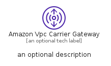
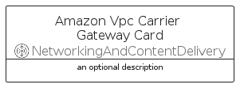
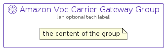

# AmazonVpcCarrierGateway


```text
aws-q2-2022/Resource/NetworkingAndContentDelivery/AmazonVpcCarrierGateway
```

```text
include('aws-q2-2022/Resource/NetworkingAndContentDelivery/AmazonVpcCarrierGateway')
```


| Illustration | AmazonVpcCarrierGateway | AmazonVpcCarrierGatewayCard | AmazonVpcCarrierGatewayGroup |
| :---: | :---: | :---: | :---: |
|  |  |  |  |


## AmazonVpcCarrierGateway

### Load remotely
```plantuml
@startuml
' configures the library
!global $LIB_BASE_LOCATION="https://raw.githubusercontent.com/tmorin/plantuml-libs/master/distribution"

' loads the library's bootstrap
!include $LIB_BASE_LOCATION/bootstrap.puml

' loads the package bootstrap
include('aws-q2-2022/bootstrap')

' loads the Item which embeds the element AmazonVpcCarrierGateway
include('aws-q2-2022/Resource/NetworkingAndContentDelivery/AmazonVpcCarrierGateway')

' renders the element
AmazonVpcCarrierGateway('AmazonVpcCarrierGateway', 'Amazon Vpc Carrier Gateway', 'an optional tech label')
@enduml
```

### Load locally
```plantuml
@startuml
' configures the library
!global $INCLUSION_MODE="local"
!global $LIB_BASE_LOCATION="../../.."

' loads the library's bootstrap
!include $LIB_BASE_LOCATION/bootstrap.puml

' loads the package bootstrap
include('aws-q2-2022/bootstrap')

' loads the Item which embeds the element AmazonVpcCarrierGateway
include('aws-q2-2022/Resource/NetworkingAndContentDelivery/AmazonVpcCarrierGateway')

' renders the element
AmazonVpcCarrierGateway('AmazonVpcCarrierGateway', 'Amazon Vpc Carrier Gateway', 'an optional tech label')
@enduml
```

## AmazonVpcCarrierGatewayCard

### Load remotely
```plantuml
@startuml
' configures the library
!global $LIB_BASE_LOCATION="https://raw.githubusercontent.com/tmorin/plantuml-libs/master/distribution"

' loads the library's bootstrap
!include $LIB_BASE_LOCATION/bootstrap.puml

' loads the package bootstrap
include('aws-q2-2022/bootstrap')

' loads the Item which embeds the element AmazonVpcCarrierGatewayCard
include('aws-q2-2022/Resource/NetworkingAndContentDelivery/AmazonVpcCarrierGateway')

' renders the element
AmazonVpcCarrierGatewayCard('AmazonVpcCarrierGatewayCard', 'Amazon Vpc Carrier Gateway Card', 'an optional description')
@enduml
```

### Load locally
```plantuml
@startuml
' configures the library
!global $INCLUSION_MODE="local"
!global $LIB_BASE_LOCATION="../../.."

' loads the library's bootstrap
!include $LIB_BASE_LOCATION/bootstrap.puml

' loads the package bootstrap
include('aws-q2-2022/bootstrap')

' loads the Item which embeds the element AmazonVpcCarrierGatewayCard
include('aws-q2-2022/Resource/NetworkingAndContentDelivery/AmazonVpcCarrierGateway')

' renders the element
AmazonVpcCarrierGatewayCard('AmazonVpcCarrierGatewayCard', 'Amazon Vpc Carrier Gateway Card', 'an optional description')
@enduml
```

## AmazonVpcCarrierGatewayGroup

### Load remotely
```plantuml
@startuml
' configures the library
!global $LIB_BASE_LOCATION="https://raw.githubusercontent.com/tmorin/plantuml-libs/master/distribution"

' loads the library's bootstrap
!include $LIB_BASE_LOCATION/bootstrap.puml

' loads the package bootstrap
include('aws-q2-2022/bootstrap')

' loads the Item which embeds the element AmazonVpcCarrierGatewayGroup
include('aws-q2-2022/Resource/NetworkingAndContentDelivery/AmazonVpcCarrierGateway')

' renders the element
AmazonVpcCarrierGatewayGroup('AmazonVpcCarrierGatewayGroup', 'Amazon Vpc Carrier Gateway Group', 'an optional tech label') {
    note as note
        the content of the group
    end note
}
@enduml
```

### Load locally
```plantuml
@startuml
' configures the library
!global $INCLUSION_MODE="local"
!global $LIB_BASE_LOCATION="../../.."

' loads the library's bootstrap
!include $LIB_BASE_LOCATION/bootstrap.puml

' loads the package bootstrap
include('aws-q2-2022/bootstrap')

' loads the Item which embeds the element AmazonVpcCarrierGatewayGroup
include('aws-q2-2022/Resource/NetworkingAndContentDelivery/AmazonVpcCarrierGateway')

' renders the element
AmazonVpcCarrierGatewayGroup('AmazonVpcCarrierGatewayGroup', 'Amazon Vpc Carrier Gateway Group', 'an optional tech label') {
    note as note
        the content of the group
    end note
}
@enduml
```

