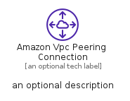
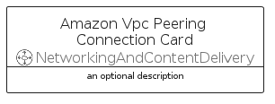
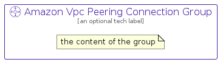

# AmazonVpcPeeringConnection


```text
aws-q2-2022/Resource/NetworkingAndContentDelivery/AmazonVpcPeeringConnection
```

```text
include('aws-q2-2022/Resource/NetworkingAndContentDelivery/AmazonVpcPeeringConnection')
```


| Illustration | AmazonVpcPeeringConnection | AmazonVpcPeeringConnectionCard | AmazonVpcPeeringConnectionGroup |
| :---: | :---: | :---: | :---: |
|  |  |  |  |


## AmazonVpcPeeringConnection

### Load remotely
```plantuml
@startuml
' configures the library
!global $LIB_BASE_LOCATION="https://raw.githubusercontent.com/tmorin/plantuml-libs/master/distribution"

' loads the library's bootstrap
!include $LIB_BASE_LOCATION/bootstrap.puml

' loads the package bootstrap
include('aws-q2-2022/bootstrap')

' loads the Item which embeds the element AmazonVpcPeeringConnection
include('aws-q2-2022/Resource/NetworkingAndContentDelivery/AmazonVpcPeeringConnection')

' renders the element
AmazonVpcPeeringConnection('AmazonVpcPeeringConnection', 'Amazon Vpc Peering Connection', 'an optional tech label')
@enduml
```

### Load locally
```plantuml
@startuml
' configures the library
!global $INCLUSION_MODE="local"
!global $LIB_BASE_LOCATION="../../.."

' loads the library's bootstrap
!include $LIB_BASE_LOCATION/bootstrap.puml

' loads the package bootstrap
include('aws-q2-2022/bootstrap')

' loads the Item which embeds the element AmazonVpcPeeringConnection
include('aws-q2-2022/Resource/NetworkingAndContentDelivery/AmazonVpcPeeringConnection')

' renders the element
AmazonVpcPeeringConnection('AmazonVpcPeeringConnection', 'Amazon Vpc Peering Connection', 'an optional tech label')
@enduml
```

## AmazonVpcPeeringConnectionCard

### Load remotely
```plantuml
@startuml
' configures the library
!global $LIB_BASE_LOCATION="https://raw.githubusercontent.com/tmorin/plantuml-libs/master/distribution"

' loads the library's bootstrap
!include $LIB_BASE_LOCATION/bootstrap.puml

' loads the package bootstrap
include('aws-q2-2022/bootstrap')

' loads the Item which embeds the element AmazonVpcPeeringConnectionCard
include('aws-q2-2022/Resource/NetworkingAndContentDelivery/AmazonVpcPeeringConnection')

' renders the element
AmazonVpcPeeringConnectionCard('AmazonVpcPeeringConnectionCard', 'Amazon Vpc Peering Connection Card', 'an optional description')
@enduml
```

### Load locally
```plantuml
@startuml
' configures the library
!global $INCLUSION_MODE="local"
!global $LIB_BASE_LOCATION="../../.."

' loads the library's bootstrap
!include $LIB_BASE_LOCATION/bootstrap.puml

' loads the package bootstrap
include('aws-q2-2022/bootstrap')

' loads the Item which embeds the element AmazonVpcPeeringConnectionCard
include('aws-q2-2022/Resource/NetworkingAndContentDelivery/AmazonVpcPeeringConnection')

' renders the element
AmazonVpcPeeringConnectionCard('AmazonVpcPeeringConnectionCard', 'Amazon Vpc Peering Connection Card', 'an optional description')
@enduml
```

## AmazonVpcPeeringConnectionGroup

### Load remotely
```plantuml
@startuml
' configures the library
!global $LIB_BASE_LOCATION="https://raw.githubusercontent.com/tmorin/plantuml-libs/master/distribution"

' loads the library's bootstrap
!include $LIB_BASE_LOCATION/bootstrap.puml

' loads the package bootstrap
include('aws-q2-2022/bootstrap')

' loads the Item which embeds the element AmazonVpcPeeringConnectionGroup
include('aws-q2-2022/Resource/NetworkingAndContentDelivery/AmazonVpcPeeringConnection')

' renders the element
AmazonVpcPeeringConnectionGroup('AmazonVpcPeeringConnectionGroup', 'Amazon Vpc Peering Connection Group', 'an optional tech label') {
    note as note
        the content of the group
    end note
}
@enduml
```

### Load locally
```plantuml
@startuml
' configures the library
!global $INCLUSION_MODE="local"
!global $LIB_BASE_LOCATION="../../.."

' loads the library's bootstrap
!include $LIB_BASE_LOCATION/bootstrap.puml

' loads the package bootstrap
include('aws-q2-2022/bootstrap')

' loads the Item which embeds the element AmazonVpcPeeringConnectionGroup
include('aws-q2-2022/Resource/NetworkingAndContentDelivery/AmazonVpcPeeringConnection')

' renders the element
AmazonVpcPeeringConnectionGroup('AmazonVpcPeeringConnectionGroup', 'Amazon Vpc Peering Connection Group', 'an optional tech label') {
    note as note
        the content of the group
    end note
}
@enduml
```

