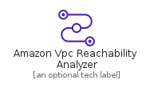
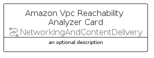

# AmazonVpcReachabilityAnalyzer


```text
aws-q2-2022/Resource/NetworkingAndContentDelivery/AmazonVpcReachabilityAnalyzer
```

```text
include('aws-q2-2022/Resource/NetworkingAndContentDelivery/AmazonVpcReachabilityAnalyzer')
```


| Illustration | AmazonVpcReachabilityAnalyzer | AmazonVpcReachabilityAnalyzerCard | AmazonVpcReachabilityAnalyzerGroup |
| :---: | :---: | :---: | :---: |
|  |  |  |  |


## AmazonVpcReachabilityAnalyzer

### Load remotely
```plantuml
@startuml
' configures the library
!global $LIB_BASE_LOCATION="https://raw.githubusercontent.com/tmorin/plantuml-libs/master/distribution"

' loads the library's bootstrap
!include $LIB_BASE_LOCATION/bootstrap.puml

' loads the package bootstrap
include('aws-q2-2022/bootstrap')

' loads the Item which embeds the element AmazonVpcReachabilityAnalyzer
include('aws-q2-2022/Resource/NetworkingAndContentDelivery/AmazonVpcReachabilityAnalyzer')

' renders the element
AmazonVpcReachabilityAnalyzer('AmazonVpcReachabilityAnalyzer', 'Amazon Vpc Reachability Analyzer', 'an optional tech label', 'an optional description')
@enduml
```

### Load locally
```plantuml
@startuml
' configures the library
!global $INCLUSION_MODE="local"
!global $LIB_BASE_LOCATION="../../.."

' loads the library's bootstrap
!include $LIB_BASE_LOCATION/bootstrap.puml

' loads the package bootstrap
include('aws-q2-2022/bootstrap')

' loads the Item which embeds the element AmazonVpcReachabilityAnalyzer
include('aws-q2-2022/Resource/NetworkingAndContentDelivery/AmazonVpcReachabilityAnalyzer')

' renders the element
AmazonVpcReachabilityAnalyzer('AmazonVpcReachabilityAnalyzer', 'Amazon Vpc Reachability Analyzer', 'an optional tech label', 'an optional description')
@enduml
```

## AmazonVpcReachabilityAnalyzerCard

### Load remotely
```plantuml
@startuml
' configures the library
!global $LIB_BASE_LOCATION="https://raw.githubusercontent.com/tmorin/plantuml-libs/master/distribution"

' loads the library's bootstrap
!include $LIB_BASE_LOCATION/bootstrap.puml

' loads the package bootstrap
include('aws-q2-2022/bootstrap')

' loads the Item which embeds the element AmazonVpcReachabilityAnalyzerCard
include('aws-q2-2022/Resource/NetworkingAndContentDelivery/AmazonVpcReachabilityAnalyzer')

' renders the element
AmazonVpcReachabilityAnalyzerCard('AmazonVpcReachabilityAnalyzerCard', 'Amazon Vpc Reachability Analyzer Card', 'an optional description')
@enduml
```

### Load locally
```plantuml
@startuml
' configures the library
!global $INCLUSION_MODE="local"
!global $LIB_BASE_LOCATION="../../.."

' loads the library's bootstrap
!include $LIB_BASE_LOCATION/bootstrap.puml

' loads the package bootstrap
include('aws-q2-2022/bootstrap')

' loads the Item which embeds the element AmazonVpcReachabilityAnalyzerCard
include('aws-q2-2022/Resource/NetworkingAndContentDelivery/AmazonVpcReachabilityAnalyzer')

' renders the element
AmazonVpcReachabilityAnalyzerCard('AmazonVpcReachabilityAnalyzerCard', 'Amazon Vpc Reachability Analyzer Card', 'an optional description')
@enduml
```

## AmazonVpcReachabilityAnalyzerGroup

### Load remotely
```plantuml
@startuml
' configures the library
!global $LIB_BASE_LOCATION="https://raw.githubusercontent.com/tmorin/plantuml-libs/master/distribution"

' loads the library's bootstrap
!include $LIB_BASE_LOCATION/bootstrap.puml

' loads the package bootstrap
include('aws-q2-2022/bootstrap')

' loads the Item which embeds the element AmazonVpcReachabilityAnalyzerGroup
include('aws-q2-2022/Resource/NetworkingAndContentDelivery/AmazonVpcReachabilityAnalyzer')

' renders the element
AmazonVpcReachabilityAnalyzerGroup('AmazonVpcReachabilityAnalyzerGroup', 'Amazon Vpc Reachability Analyzer Group', 'an optional tech label') {
    note as note
        the content of the group
    end note
}
@enduml
```

### Load locally
```plantuml
@startuml
' configures the library
!global $INCLUSION_MODE="local"
!global $LIB_BASE_LOCATION="../../.."

' loads the library's bootstrap
!include $LIB_BASE_LOCATION/bootstrap.puml

' loads the package bootstrap
include('aws-q2-2022/bootstrap')

' loads the Item which embeds the element AmazonVpcReachabilityAnalyzerGroup
include('aws-q2-2022/Resource/NetworkingAndContentDelivery/AmazonVpcReachabilityAnalyzer')

' renders the element
AmazonVpcReachabilityAnalyzerGroup('AmazonVpcReachabilityAnalyzerGroup', 'Amazon Vpc Reachability Analyzer Group', 'an optional tech label') {
    note as note
        the content of the group
    end note
}
@enduml
```

