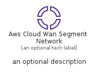
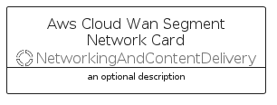
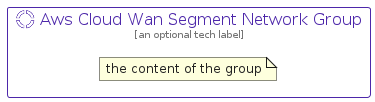

# AwsCloudWanSegmentNetwork


```text
aws-q2-2022/Resource/NetworkingAndContentDelivery/AwsCloudWanSegmentNetwork
```

```text
include('aws-q2-2022/Resource/NetworkingAndContentDelivery/AwsCloudWanSegmentNetwork')
```


| Illustration | AwsCloudWanSegmentNetwork | AwsCloudWanSegmentNetworkCard | AwsCloudWanSegmentNetworkGroup |
| :---: | :---: | :---: | :---: |
|  |  |  |  |


## AwsCloudWanSegmentNetwork

### Load remotely
```plantuml
@startuml
' configures the library
!global $LIB_BASE_LOCATION="https://raw.githubusercontent.com/tmorin/plantuml-libs/master/distribution"

' loads the library's bootstrap
!include $LIB_BASE_LOCATION/bootstrap.puml

' loads the package bootstrap
include('aws-q2-2022/bootstrap')

' loads the Item which embeds the element AwsCloudWanSegmentNetwork
include('aws-q2-2022/Resource/NetworkingAndContentDelivery/AwsCloudWanSegmentNetwork')

' renders the element
AwsCloudWanSegmentNetwork('AwsCloudWanSegmentNetwork', 'Aws Cloud Wan Segment Network', 'an optional tech label')
@enduml
```

### Load locally
```plantuml
@startuml
' configures the library
!global $INCLUSION_MODE="local"
!global $LIB_BASE_LOCATION="../../.."

' loads the library's bootstrap
!include $LIB_BASE_LOCATION/bootstrap.puml

' loads the package bootstrap
include('aws-q2-2022/bootstrap')

' loads the Item which embeds the element AwsCloudWanSegmentNetwork
include('aws-q2-2022/Resource/NetworkingAndContentDelivery/AwsCloudWanSegmentNetwork')

' renders the element
AwsCloudWanSegmentNetwork('AwsCloudWanSegmentNetwork', 'Aws Cloud Wan Segment Network', 'an optional tech label')
@enduml
```

## AwsCloudWanSegmentNetworkCard

### Load remotely
```plantuml
@startuml
' configures the library
!global $LIB_BASE_LOCATION="https://raw.githubusercontent.com/tmorin/plantuml-libs/master/distribution"

' loads the library's bootstrap
!include $LIB_BASE_LOCATION/bootstrap.puml

' loads the package bootstrap
include('aws-q2-2022/bootstrap')

' loads the Item which embeds the element AwsCloudWanSegmentNetworkCard
include('aws-q2-2022/Resource/NetworkingAndContentDelivery/AwsCloudWanSegmentNetwork')

' renders the element
AwsCloudWanSegmentNetworkCard('AwsCloudWanSegmentNetworkCard', 'Aws Cloud Wan Segment Network Card', 'an optional description')
@enduml
```

### Load locally
```plantuml
@startuml
' configures the library
!global $INCLUSION_MODE="local"
!global $LIB_BASE_LOCATION="../../.."

' loads the library's bootstrap
!include $LIB_BASE_LOCATION/bootstrap.puml

' loads the package bootstrap
include('aws-q2-2022/bootstrap')

' loads the Item which embeds the element AwsCloudWanSegmentNetworkCard
include('aws-q2-2022/Resource/NetworkingAndContentDelivery/AwsCloudWanSegmentNetwork')

' renders the element
AwsCloudWanSegmentNetworkCard('AwsCloudWanSegmentNetworkCard', 'Aws Cloud Wan Segment Network Card', 'an optional description')
@enduml
```

## AwsCloudWanSegmentNetworkGroup

### Load remotely
```plantuml
@startuml
' configures the library
!global $LIB_BASE_LOCATION="https://raw.githubusercontent.com/tmorin/plantuml-libs/master/distribution"

' loads the library's bootstrap
!include $LIB_BASE_LOCATION/bootstrap.puml

' loads the package bootstrap
include('aws-q2-2022/bootstrap')

' loads the Item which embeds the element AwsCloudWanSegmentNetworkGroup
include('aws-q2-2022/Resource/NetworkingAndContentDelivery/AwsCloudWanSegmentNetwork')

' renders the element
AwsCloudWanSegmentNetworkGroup('AwsCloudWanSegmentNetworkGroup', 'Aws Cloud Wan Segment Network Group', 'an optional tech label') {
    note as note
        the content of the group
    end note
}
@enduml
```

### Load locally
```plantuml
@startuml
' configures the library
!global $INCLUSION_MODE="local"
!global $LIB_BASE_LOCATION="../../.."

' loads the library's bootstrap
!include $LIB_BASE_LOCATION/bootstrap.puml

' loads the package bootstrap
include('aws-q2-2022/bootstrap')

' loads the Item which embeds the element AwsCloudWanSegmentNetworkGroup
include('aws-q2-2022/Resource/NetworkingAndContentDelivery/AwsCloudWanSegmentNetwork')

' renders the element
AwsCloudWanSegmentNetworkGroup('AwsCloudWanSegmentNetworkGroup', 'Aws Cloud Wan Segment Network Group', 'an optional tech label') {
    note as note
        the content of the group
    end note
}
@enduml
```

