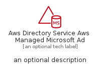
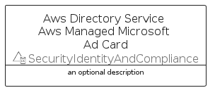
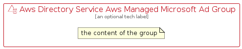

# AwsDirectoryServiceAwsManagedMicrosoftAd


```text
aws-q2-2022/Resource/SecurityIdentityAndCompliance/AwsDirectoryServiceAwsManagedMicrosoftAd
```

```text
include('aws-q2-2022/Resource/SecurityIdentityAndCompliance/AwsDirectoryServiceAwsManagedMicrosoftAd')
```


| Illustration | AwsDirectoryServiceAwsManagedMicrosoftAd | AwsDirectoryServiceAwsManagedMicrosoftAdCard | AwsDirectoryServiceAwsManagedMicrosoftAdGroup |
| :---: | :---: | :---: | :---: |
|  |  |  |  |


## AwsDirectoryServiceAwsManagedMicrosoftAd

### Load remotely
```plantuml
@startuml
' configures the library
!global $LIB_BASE_LOCATION="https://raw.githubusercontent.com/tmorin/plantuml-libs/master/distribution"

' loads the library's bootstrap
!include $LIB_BASE_LOCATION/bootstrap.puml

' loads the package bootstrap
include('aws-q2-2022/bootstrap')

' loads the Item which embeds the element AwsDirectoryServiceAwsManagedMicrosoftAd
include('aws-q2-2022/Resource/SecurityIdentityAndCompliance/AwsDirectoryServiceAwsManagedMicrosoftAd')

' renders the element
AwsDirectoryServiceAwsManagedMicrosoftAd('AwsDirectoryServiceAwsManagedMicrosoftAd', 'Aws Directory Service Aws Managed Microsoft Ad', 'an optional tech label')
@enduml
```

### Load locally
```plantuml
@startuml
' configures the library
!global $INCLUSION_MODE="local"
!global $LIB_BASE_LOCATION="../../.."

' loads the library's bootstrap
!include $LIB_BASE_LOCATION/bootstrap.puml

' loads the package bootstrap
include('aws-q2-2022/bootstrap')

' loads the Item which embeds the element AwsDirectoryServiceAwsManagedMicrosoftAd
include('aws-q2-2022/Resource/SecurityIdentityAndCompliance/AwsDirectoryServiceAwsManagedMicrosoftAd')

' renders the element
AwsDirectoryServiceAwsManagedMicrosoftAd('AwsDirectoryServiceAwsManagedMicrosoftAd', 'Aws Directory Service Aws Managed Microsoft Ad', 'an optional tech label')
@enduml
```

## AwsDirectoryServiceAwsManagedMicrosoftAdCard

### Load remotely
```plantuml
@startuml
' configures the library
!global $LIB_BASE_LOCATION="https://raw.githubusercontent.com/tmorin/plantuml-libs/master/distribution"

' loads the library's bootstrap
!include $LIB_BASE_LOCATION/bootstrap.puml

' loads the package bootstrap
include('aws-q2-2022/bootstrap')

' loads the Item which embeds the element AwsDirectoryServiceAwsManagedMicrosoftAdCard
include('aws-q2-2022/Resource/SecurityIdentityAndCompliance/AwsDirectoryServiceAwsManagedMicrosoftAd')

' renders the element
AwsDirectoryServiceAwsManagedMicrosoftAdCard('AwsDirectoryServiceAwsManagedMicrosoftAdCard', 'Aws Directory Service Aws Managed Microsoft Ad Card', 'an optional description')
@enduml
```

### Load locally
```plantuml
@startuml
' configures the library
!global $INCLUSION_MODE="local"
!global $LIB_BASE_LOCATION="../../.."

' loads the library's bootstrap
!include $LIB_BASE_LOCATION/bootstrap.puml

' loads the package bootstrap
include('aws-q2-2022/bootstrap')

' loads the Item which embeds the element AwsDirectoryServiceAwsManagedMicrosoftAdCard
include('aws-q2-2022/Resource/SecurityIdentityAndCompliance/AwsDirectoryServiceAwsManagedMicrosoftAd')

' renders the element
AwsDirectoryServiceAwsManagedMicrosoftAdCard('AwsDirectoryServiceAwsManagedMicrosoftAdCard', 'Aws Directory Service Aws Managed Microsoft Ad Card', 'an optional description')
@enduml
```

## AwsDirectoryServiceAwsManagedMicrosoftAdGroup

### Load remotely
```plantuml
@startuml
' configures the library
!global $LIB_BASE_LOCATION="https://raw.githubusercontent.com/tmorin/plantuml-libs/master/distribution"

' loads the library's bootstrap
!include $LIB_BASE_LOCATION/bootstrap.puml

' loads the package bootstrap
include('aws-q2-2022/bootstrap')

' loads the Item which embeds the element AwsDirectoryServiceAwsManagedMicrosoftAdGroup
include('aws-q2-2022/Resource/SecurityIdentityAndCompliance/AwsDirectoryServiceAwsManagedMicrosoftAd')

' renders the element
AwsDirectoryServiceAwsManagedMicrosoftAdGroup('AwsDirectoryServiceAwsManagedMicrosoftAdGroup', 'Aws Directory Service Aws Managed Microsoft Ad Group', 'an optional tech label') {
    note as note
        the content of the group
    end note
}
@enduml
```

### Load locally
```plantuml
@startuml
' configures the library
!global $INCLUSION_MODE="local"
!global $LIB_BASE_LOCATION="../../.."

' loads the library's bootstrap
!include $LIB_BASE_LOCATION/bootstrap.puml

' loads the package bootstrap
include('aws-q2-2022/bootstrap')

' loads the Item which embeds the element AwsDirectoryServiceAwsManagedMicrosoftAdGroup
include('aws-q2-2022/Resource/SecurityIdentityAndCompliance/AwsDirectoryServiceAwsManagedMicrosoftAd')

' renders the element
AwsDirectoryServiceAwsManagedMicrosoftAdGroup('AwsDirectoryServiceAwsManagedMicrosoftAdGroup', 'Aws Directory Service Aws Managed Microsoft Ad Group', 'an optional tech label') {
    note as note
        the content of the group
    end note
}
@enduml
```

