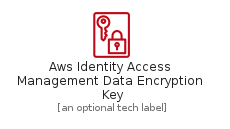
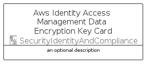
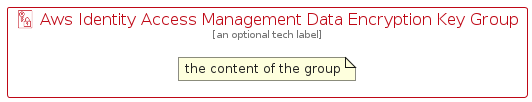

# AwsIdentityAccessManagementDataEncryptionKey


```text
aws-q2-2022/Resource/SecurityIdentityAndCompliance/AwsIdentityAccessManagementDataEncryptionKey
```

```text
include('aws-q2-2022/Resource/SecurityIdentityAndCompliance/AwsIdentityAccessManagementDataEncryptionKey')
```


| Illustration | AwsIdentityAccessManagementDataEncryptionKey | AwsIdentityAccessManagementDataEncryptionKeyCard | AwsIdentityAccessManagementDataEncryptionKeyGroup |
| :---: | :---: | :---: | :---: |
|  |  |  |  |


## AwsIdentityAccessManagementDataEncryptionKey

### Load remotely
```plantuml
@startuml
' configures the library
!global $LIB_BASE_LOCATION="https://raw.githubusercontent.com/tmorin/plantuml-libs/master/distribution"

' loads the library's bootstrap
!include $LIB_BASE_LOCATION/bootstrap.puml

' loads the package bootstrap
include('aws-q2-2022/bootstrap')

' loads the Item which embeds the element AwsIdentityAccessManagementDataEncryptionKey
include('aws-q2-2022/Resource/SecurityIdentityAndCompliance/AwsIdentityAccessManagementDataEncryptionKey')

' renders the element
AwsIdentityAccessManagementDataEncryptionKey('AwsIdentityAccessManagementDataEncryptionKey', 'Aws Identity Access Management Data Encryption Key', 'an optional tech label')
@enduml
```

### Load locally
```plantuml
@startuml
' configures the library
!global $INCLUSION_MODE="local"
!global $LIB_BASE_LOCATION="../../.."

' loads the library's bootstrap
!include $LIB_BASE_LOCATION/bootstrap.puml

' loads the package bootstrap
include('aws-q2-2022/bootstrap')

' loads the Item which embeds the element AwsIdentityAccessManagementDataEncryptionKey
include('aws-q2-2022/Resource/SecurityIdentityAndCompliance/AwsIdentityAccessManagementDataEncryptionKey')

' renders the element
AwsIdentityAccessManagementDataEncryptionKey('AwsIdentityAccessManagementDataEncryptionKey', 'Aws Identity Access Management Data Encryption Key', 'an optional tech label')
@enduml
```

## AwsIdentityAccessManagementDataEncryptionKeyCard

### Load remotely
```plantuml
@startuml
' configures the library
!global $LIB_BASE_LOCATION="https://raw.githubusercontent.com/tmorin/plantuml-libs/master/distribution"

' loads the library's bootstrap
!include $LIB_BASE_LOCATION/bootstrap.puml

' loads the package bootstrap
include('aws-q2-2022/bootstrap')

' loads the Item which embeds the element AwsIdentityAccessManagementDataEncryptionKeyCard
include('aws-q2-2022/Resource/SecurityIdentityAndCompliance/AwsIdentityAccessManagementDataEncryptionKey')

' renders the element
AwsIdentityAccessManagementDataEncryptionKeyCard('AwsIdentityAccessManagementDataEncryptionKeyCard', 'Aws Identity Access Management Data Encryption Key Card', 'an optional description')
@enduml
```

### Load locally
```plantuml
@startuml
' configures the library
!global $INCLUSION_MODE="local"
!global $LIB_BASE_LOCATION="../../.."

' loads the library's bootstrap
!include $LIB_BASE_LOCATION/bootstrap.puml

' loads the package bootstrap
include('aws-q2-2022/bootstrap')

' loads the Item which embeds the element AwsIdentityAccessManagementDataEncryptionKeyCard
include('aws-q2-2022/Resource/SecurityIdentityAndCompliance/AwsIdentityAccessManagementDataEncryptionKey')

' renders the element
AwsIdentityAccessManagementDataEncryptionKeyCard('AwsIdentityAccessManagementDataEncryptionKeyCard', 'Aws Identity Access Management Data Encryption Key Card', 'an optional description')
@enduml
```

## AwsIdentityAccessManagementDataEncryptionKeyGroup

### Load remotely
```plantuml
@startuml
' configures the library
!global $LIB_BASE_LOCATION="https://raw.githubusercontent.com/tmorin/plantuml-libs/master/distribution"

' loads the library's bootstrap
!include $LIB_BASE_LOCATION/bootstrap.puml

' loads the package bootstrap
include('aws-q2-2022/bootstrap')

' loads the Item which embeds the element AwsIdentityAccessManagementDataEncryptionKeyGroup
include('aws-q2-2022/Resource/SecurityIdentityAndCompliance/AwsIdentityAccessManagementDataEncryptionKey')

' renders the element
AwsIdentityAccessManagementDataEncryptionKeyGroup('AwsIdentityAccessManagementDataEncryptionKeyGroup', 'Aws Identity Access Management Data Encryption Key Group', 'an optional tech label') {
    note as note
        the content of the group
    end note
}
@enduml
```

### Load locally
```plantuml
@startuml
' configures the library
!global $INCLUSION_MODE="local"
!global $LIB_BASE_LOCATION="../../.."

' loads the library's bootstrap
!include $LIB_BASE_LOCATION/bootstrap.puml

' loads the package bootstrap
include('aws-q2-2022/bootstrap')

' loads the Item which embeds the element AwsIdentityAccessManagementDataEncryptionKeyGroup
include('aws-q2-2022/Resource/SecurityIdentityAndCompliance/AwsIdentityAccessManagementDataEncryptionKey')

' renders the element
AwsIdentityAccessManagementDataEncryptionKeyGroup('AwsIdentityAccessManagementDataEncryptionKeyGroup', 'Aws Identity Access Management Data Encryption Key Group', 'an optional tech label') {
    note as note
        the content of the group
    end note
}
@enduml
```

