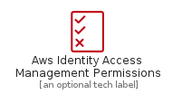
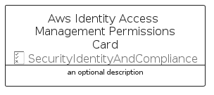

# AwsIdentityAccessManagementPermissions


```text
aws-q2-2022/Resource/SecurityIdentityAndCompliance/AwsIdentityAccessManagementPermissions
```

```text
include('aws-q2-2022/Resource/SecurityIdentityAndCompliance/AwsIdentityAccessManagementPermissions')
```


| Illustration | AwsIdentityAccessManagementPermissions | AwsIdentityAccessManagementPermissionsCard | AwsIdentityAccessManagementPermissionsGroup |
| :---: | :---: | :---: | :---: |
|  |  |  |  |


## AwsIdentityAccessManagementPermissions

### Load remotely
```plantuml
@startuml
' configures the library
!global $LIB_BASE_LOCATION="https://raw.githubusercontent.com/tmorin/plantuml-libs/master/distribution"

' loads the library's bootstrap
!include $LIB_BASE_LOCATION/bootstrap.puml

' loads the package bootstrap
include('aws-q2-2022/bootstrap')

' loads the Item which embeds the element AwsIdentityAccessManagementPermissions
include('aws-q2-2022/Resource/SecurityIdentityAndCompliance/AwsIdentityAccessManagementPermissions')

' renders the element
AwsIdentityAccessManagementPermissions('AwsIdentityAccessManagementPermissions', 'Aws Identity Access Management Permissions', 'an optional tech label')
@enduml
```

### Load locally
```plantuml
@startuml
' configures the library
!global $INCLUSION_MODE="local"
!global $LIB_BASE_LOCATION="../../.."

' loads the library's bootstrap
!include $LIB_BASE_LOCATION/bootstrap.puml

' loads the package bootstrap
include('aws-q2-2022/bootstrap')

' loads the Item which embeds the element AwsIdentityAccessManagementPermissions
include('aws-q2-2022/Resource/SecurityIdentityAndCompliance/AwsIdentityAccessManagementPermissions')

' renders the element
AwsIdentityAccessManagementPermissions('AwsIdentityAccessManagementPermissions', 'Aws Identity Access Management Permissions', 'an optional tech label')
@enduml
```

## AwsIdentityAccessManagementPermissionsCard

### Load remotely
```plantuml
@startuml
' configures the library
!global $LIB_BASE_LOCATION="https://raw.githubusercontent.com/tmorin/plantuml-libs/master/distribution"

' loads the library's bootstrap
!include $LIB_BASE_LOCATION/bootstrap.puml

' loads the package bootstrap
include('aws-q2-2022/bootstrap')

' loads the Item which embeds the element AwsIdentityAccessManagementPermissionsCard
include('aws-q2-2022/Resource/SecurityIdentityAndCompliance/AwsIdentityAccessManagementPermissions')

' renders the element
AwsIdentityAccessManagementPermissionsCard('AwsIdentityAccessManagementPermissionsCard', 'Aws Identity Access Management Permissions Card', 'an optional description')
@enduml
```

### Load locally
```plantuml
@startuml
' configures the library
!global $INCLUSION_MODE="local"
!global $LIB_BASE_LOCATION="../../.."

' loads the library's bootstrap
!include $LIB_BASE_LOCATION/bootstrap.puml

' loads the package bootstrap
include('aws-q2-2022/bootstrap')

' loads the Item which embeds the element AwsIdentityAccessManagementPermissionsCard
include('aws-q2-2022/Resource/SecurityIdentityAndCompliance/AwsIdentityAccessManagementPermissions')

' renders the element
AwsIdentityAccessManagementPermissionsCard('AwsIdentityAccessManagementPermissionsCard', 'Aws Identity Access Management Permissions Card', 'an optional description')
@enduml
```

## AwsIdentityAccessManagementPermissionsGroup

### Load remotely
```plantuml
@startuml
' configures the library
!global $LIB_BASE_LOCATION="https://raw.githubusercontent.com/tmorin/plantuml-libs/master/distribution"

' loads the library's bootstrap
!include $LIB_BASE_LOCATION/bootstrap.puml

' loads the package bootstrap
include('aws-q2-2022/bootstrap')

' loads the Item which embeds the element AwsIdentityAccessManagementPermissionsGroup
include('aws-q2-2022/Resource/SecurityIdentityAndCompliance/AwsIdentityAccessManagementPermissions')

' renders the element
AwsIdentityAccessManagementPermissionsGroup('AwsIdentityAccessManagementPermissionsGroup', 'Aws Identity Access Management Permissions Group', 'an optional tech label') {
    note as note
        the content of the group
    end note
}
@enduml
```

### Load locally
```plantuml
@startuml
' configures the library
!global $INCLUSION_MODE="local"
!global $LIB_BASE_LOCATION="../../.."

' loads the library's bootstrap
!include $LIB_BASE_LOCATION/bootstrap.puml

' loads the package bootstrap
include('aws-q2-2022/bootstrap')

' loads the Item which embeds the element AwsIdentityAccessManagementPermissionsGroup
include('aws-q2-2022/Resource/SecurityIdentityAndCompliance/AwsIdentityAccessManagementPermissions')

' renders the element
AwsIdentityAccessManagementPermissionsGroup('AwsIdentityAccessManagementPermissionsGroup', 'Aws Identity Access Management Permissions Group', 'an optional tech label') {
    note as note
        the content of the group
    end note
}
@enduml
```

