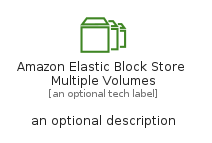
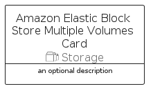

# AmazonElasticBlockStoreMultipleVolumes


```text
aws-q2-2022/Resource/Storage/AmazonElasticBlockStoreMultipleVolumes
```

```text
include('aws-q2-2022/Resource/Storage/AmazonElasticBlockStoreMultipleVolumes')
```


| Illustration | AmazonElasticBlockStoreMultipleVolumes | AmazonElasticBlockStoreMultipleVolumesCard | AmazonElasticBlockStoreMultipleVolumesGroup |
| :---: | :---: | :---: | :---: |
|  |  |  |  |


## AmazonElasticBlockStoreMultipleVolumes

### Load remotely
```plantuml
@startuml
' configures the library
!global $LIB_BASE_LOCATION="https://raw.githubusercontent.com/tmorin/plantuml-libs/master/distribution"

' loads the library's bootstrap
!include $LIB_BASE_LOCATION/bootstrap.puml

' loads the package bootstrap
include('aws-q2-2022/bootstrap')

' loads the Item which embeds the element AmazonElasticBlockStoreMultipleVolumes
include('aws-q2-2022/Resource/Storage/AmazonElasticBlockStoreMultipleVolumes')

' renders the element
AmazonElasticBlockStoreMultipleVolumes('AmazonElasticBlockStoreMultipleVolumes', 'Amazon Elastic Block Store Multiple Volumes', 'an optional tech label', 'an optional description')
@enduml
```

### Load locally
```plantuml
@startuml
' configures the library
!global $INCLUSION_MODE="local"
!global $LIB_BASE_LOCATION="../../.."

' loads the library's bootstrap
!include $LIB_BASE_LOCATION/bootstrap.puml

' loads the package bootstrap
include('aws-q2-2022/bootstrap')

' loads the Item which embeds the element AmazonElasticBlockStoreMultipleVolumes
include('aws-q2-2022/Resource/Storage/AmazonElasticBlockStoreMultipleVolumes')

' renders the element
AmazonElasticBlockStoreMultipleVolumes('AmazonElasticBlockStoreMultipleVolumes', 'Amazon Elastic Block Store Multiple Volumes', 'an optional tech label', 'an optional description')
@enduml
```

## AmazonElasticBlockStoreMultipleVolumesCard

### Load remotely
```plantuml
@startuml
' configures the library
!global $LIB_BASE_LOCATION="https://raw.githubusercontent.com/tmorin/plantuml-libs/master/distribution"

' loads the library's bootstrap
!include $LIB_BASE_LOCATION/bootstrap.puml

' loads the package bootstrap
include('aws-q2-2022/bootstrap')

' loads the Item which embeds the element AmazonElasticBlockStoreMultipleVolumesCard
include('aws-q2-2022/Resource/Storage/AmazonElasticBlockStoreMultipleVolumes')

' renders the element
AmazonElasticBlockStoreMultipleVolumesCard('AmazonElasticBlockStoreMultipleVolumesCard', 'Amazon Elastic Block Store Multiple Volumes Card', 'an optional description')
@enduml
```

### Load locally
```plantuml
@startuml
' configures the library
!global $INCLUSION_MODE="local"
!global $LIB_BASE_LOCATION="../../.."

' loads the library's bootstrap
!include $LIB_BASE_LOCATION/bootstrap.puml

' loads the package bootstrap
include('aws-q2-2022/bootstrap')

' loads the Item which embeds the element AmazonElasticBlockStoreMultipleVolumesCard
include('aws-q2-2022/Resource/Storage/AmazonElasticBlockStoreMultipleVolumes')

' renders the element
AmazonElasticBlockStoreMultipleVolumesCard('AmazonElasticBlockStoreMultipleVolumesCard', 'Amazon Elastic Block Store Multiple Volumes Card', 'an optional description')
@enduml
```

## AmazonElasticBlockStoreMultipleVolumesGroup

### Load remotely
```plantuml
@startuml
' configures the library
!global $LIB_BASE_LOCATION="https://raw.githubusercontent.com/tmorin/plantuml-libs/master/distribution"

' loads the library's bootstrap
!include $LIB_BASE_LOCATION/bootstrap.puml

' loads the package bootstrap
include('aws-q2-2022/bootstrap')

' loads the Item which embeds the element AmazonElasticBlockStoreMultipleVolumesGroup
include('aws-q2-2022/Resource/Storage/AmazonElasticBlockStoreMultipleVolumes')

' renders the element
AmazonElasticBlockStoreMultipleVolumesGroup('AmazonElasticBlockStoreMultipleVolumesGroup', 'Amazon Elastic Block Store Multiple Volumes Group', 'an optional tech label') {
    note as note
        the content of the group
    end note
}
@enduml
```

### Load locally
```plantuml
@startuml
' configures the library
!global $INCLUSION_MODE="local"
!global $LIB_BASE_LOCATION="../../.."

' loads the library's bootstrap
!include $LIB_BASE_LOCATION/bootstrap.puml

' loads the package bootstrap
include('aws-q2-2022/bootstrap')

' loads the Item which embeds the element AmazonElasticBlockStoreMultipleVolumesGroup
include('aws-q2-2022/Resource/Storage/AmazonElasticBlockStoreMultipleVolumes')

' renders the element
AmazonElasticBlockStoreMultipleVolumesGroup('AmazonElasticBlockStoreMultipleVolumesGroup', 'Amazon Elastic Block Store Multiple Volumes Group', 'an optional tech label') {
    note as note
        the content of the group
    end note
}
@enduml
```

