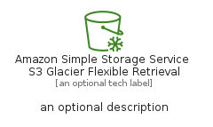
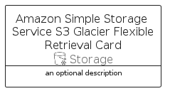

# AmazonSimpleStorageServiceS3GlacierFlexibleRetrieval


```text
aws-q2-2022/Resource/Storage/AmazonSimpleStorageServiceS3GlacierFlexibleRetrieval
```

```text
include('aws-q2-2022/Resource/Storage/AmazonSimpleStorageServiceS3GlacierFlexibleRetrieval')
```


| Illustration | AmazonSimpleStorageServiceS3GlacierFlexibleRetrieval | AmazonSimpleStorageServiceS3GlacierFlexibleRetrievalCard | AmazonSimpleStorageServiceS3GlacierFlexibleRetrievalGroup |
| :---: | :---: | :---: | :---: |
|  |  |  |  |


## AmazonSimpleStorageServiceS3GlacierFlexibleRetrieval

### Load remotely
```plantuml
@startuml
' configures the library
!global $LIB_BASE_LOCATION="https://raw.githubusercontent.com/tmorin/plantuml-libs/master/distribution"

' loads the library's bootstrap
!include $LIB_BASE_LOCATION/bootstrap.puml

' loads the package bootstrap
include('aws-q2-2022/bootstrap')

' loads the Item which embeds the element AmazonSimpleStorageServiceS3GlacierFlexibleRetrieval
include('aws-q2-2022/Resource/Storage/AmazonSimpleStorageServiceS3GlacierFlexibleRetrieval')

' renders the element
AmazonSimpleStorageServiceS3GlacierFlexibleRetrieval('AmazonSimpleStorageServiceS3GlacierFlexibleRetrieval', 'Amazon Simple Storage Service S3 Glacier Flexible Retrieval', 'an optional tech label')
@enduml
```

### Load locally
```plantuml
@startuml
' configures the library
!global $INCLUSION_MODE="local"
!global $LIB_BASE_LOCATION="../../.."

' loads the library's bootstrap
!include $LIB_BASE_LOCATION/bootstrap.puml

' loads the package bootstrap
include('aws-q2-2022/bootstrap')

' loads the Item which embeds the element AmazonSimpleStorageServiceS3GlacierFlexibleRetrieval
include('aws-q2-2022/Resource/Storage/AmazonSimpleStorageServiceS3GlacierFlexibleRetrieval')

' renders the element
AmazonSimpleStorageServiceS3GlacierFlexibleRetrieval('AmazonSimpleStorageServiceS3GlacierFlexibleRetrieval', 'Amazon Simple Storage Service S3 Glacier Flexible Retrieval', 'an optional tech label')
@enduml
```

## AmazonSimpleStorageServiceS3GlacierFlexibleRetrievalCard

### Load remotely
```plantuml
@startuml
' configures the library
!global $LIB_BASE_LOCATION="https://raw.githubusercontent.com/tmorin/plantuml-libs/master/distribution"

' loads the library's bootstrap
!include $LIB_BASE_LOCATION/bootstrap.puml

' loads the package bootstrap
include('aws-q2-2022/bootstrap')

' loads the Item which embeds the element AmazonSimpleStorageServiceS3GlacierFlexibleRetrievalCard
include('aws-q2-2022/Resource/Storage/AmazonSimpleStorageServiceS3GlacierFlexibleRetrieval')

' renders the element
AmazonSimpleStorageServiceS3GlacierFlexibleRetrievalCard('AmazonSimpleStorageServiceS3GlacierFlexibleRetrievalCard', 'Amazon Simple Storage Service S3 Glacier Flexible Retrieval Card', 'an optional description')
@enduml
```

### Load locally
```plantuml
@startuml
' configures the library
!global $INCLUSION_MODE="local"
!global $LIB_BASE_LOCATION="../../.."

' loads the library's bootstrap
!include $LIB_BASE_LOCATION/bootstrap.puml

' loads the package bootstrap
include('aws-q2-2022/bootstrap')

' loads the Item which embeds the element AmazonSimpleStorageServiceS3GlacierFlexibleRetrievalCard
include('aws-q2-2022/Resource/Storage/AmazonSimpleStorageServiceS3GlacierFlexibleRetrieval')

' renders the element
AmazonSimpleStorageServiceS3GlacierFlexibleRetrievalCard('AmazonSimpleStorageServiceS3GlacierFlexibleRetrievalCard', 'Amazon Simple Storage Service S3 Glacier Flexible Retrieval Card', 'an optional description')
@enduml
```

## AmazonSimpleStorageServiceS3GlacierFlexibleRetrievalGroup

### Load remotely
```plantuml
@startuml
' configures the library
!global $LIB_BASE_LOCATION="https://raw.githubusercontent.com/tmorin/plantuml-libs/master/distribution"

' loads the library's bootstrap
!include $LIB_BASE_LOCATION/bootstrap.puml

' loads the package bootstrap
include('aws-q2-2022/bootstrap')

' loads the Item which embeds the element AmazonSimpleStorageServiceS3GlacierFlexibleRetrievalGroup
include('aws-q2-2022/Resource/Storage/AmazonSimpleStorageServiceS3GlacierFlexibleRetrieval')

' renders the element
AmazonSimpleStorageServiceS3GlacierFlexibleRetrievalGroup('AmazonSimpleStorageServiceS3GlacierFlexibleRetrievalGroup', 'Amazon Simple Storage Service S3 Glacier Flexible Retrieval Group', 'an optional tech label') {
    note as note
        the content of the group
    end note
}
@enduml
```

### Load locally
```plantuml
@startuml
' configures the library
!global $INCLUSION_MODE="local"
!global $LIB_BASE_LOCATION="../../.."

' loads the library's bootstrap
!include $LIB_BASE_LOCATION/bootstrap.puml

' loads the package bootstrap
include('aws-q2-2022/bootstrap')

' loads the Item which embeds the element AmazonSimpleStorageServiceS3GlacierFlexibleRetrievalGroup
include('aws-q2-2022/Resource/Storage/AmazonSimpleStorageServiceS3GlacierFlexibleRetrieval')

' renders the element
AmazonSimpleStorageServiceS3GlacierFlexibleRetrievalGroup('AmazonSimpleStorageServiceS3GlacierFlexibleRetrievalGroup', 'Amazon Simple Storage Service S3 Glacier Flexible Retrieval Group', 'an optional tech label') {
    note as note
        the content of the group
    end note
}
@enduml
```

