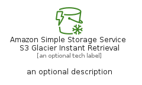
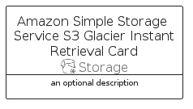

# AmazonSimpleStorageServiceS3GlacierInstantRetrieval


```text
aws-q2-2022/Resource/Storage/AmazonSimpleStorageServiceS3GlacierInstantRetrieval
```

```text
include('aws-q2-2022/Resource/Storage/AmazonSimpleStorageServiceS3GlacierInstantRetrieval')
```


| Illustration | AmazonSimpleStorageServiceS3GlacierInstantRetrieval | AmazonSimpleStorageServiceS3GlacierInstantRetrievalCard | AmazonSimpleStorageServiceS3GlacierInstantRetrievalGroup |
| :---: | :---: | :---: | :---: |
|  |  |  |  |


## AmazonSimpleStorageServiceS3GlacierInstantRetrieval

### Load remotely
```plantuml
@startuml
' configures the library
!global $LIB_BASE_LOCATION="https://raw.githubusercontent.com/tmorin/plantuml-libs/master/distribution"

' loads the library's bootstrap
!include $LIB_BASE_LOCATION/bootstrap.puml

' loads the package bootstrap
include('aws-q2-2022/bootstrap')

' loads the Item which embeds the element AmazonSimpleStorageServiceS3GlacierInstantRetrieval
include('aws-q2-2022/Resource/Storage/AmazonSimpleStorageServiceS3GlacierInstantRetrieval')

' renders the element
AmazonSimpleStorageServiceS3GlacierInstantRetrieval('AmazonSimpleStorageServiceS3GlacierInstantRetrieval', 'Amazon Simple Storage Service S3 Glacier Instant Retrieval', 'an optional tech label', 'an optional description')
@enduml
```

### Load locally
```plantuml
@startuml
' configures the library
!global $INCLUSION_MODE="local"
!global $LIB_BASE_LOCATION="../../.."

' loads the library's bootstrap
!include $LIB_BASE_LOCATION/bootstrap.puml

' loads the package bootstrap
include('aws-q2-2022/bootstrap')

' loads the Item which embeds the element AmazonSimpleStorageServiceS3GlacierInstantRetrieval
include('aws-q2-2022/Resource/Storage/AmazonSimpleStorageServiceS3GlacierInstantRetrieval')

' renders the element
AmazonSimpleStorageServiceS3GlacierInstantRetrieval('AmazonSimpleStorageServiceS3GlacierInstantRetrieval', 'Amazon Simple Storage Service S3 Glacier Instant Retrieval', 'an optional tech label', 'an optional description')
@enduml
```

## AmazonSimpleStorageServiceS3GlacierInstantRetrievalCard

### Load remotely
```plantuml
@startuml
' configures the library
!global $LIB_BASE_LOCATION="https://raw.githubusercontent.com/tmorin/plantuml-libs/master/distribution"

' loads the library's bootstrap
!include $LIB_BASE_LOCATION/bootstrap.puml

' loads the package bootstrap
include('aws-q2-2022/bootstrap')

' loads the Item which embeds the element AmazonSimpleStorageServiceS3GlacierInstantRetrievalCard
include('aws-q2-2022/Resource/Storage/AmazonSimpleStorageServiceS3GlacierInstantRetrieval')

' renders the element
AmazonSimpleStorageServiceS3GlacierInstantRetrievalCard('AmazonSimpleStorageServiceS3GlacierInstantRetrievalCard', 'Amazon Simple Storage Service S3 Glacier Instant Retrieval Card', 'an optional description')
@enduml
```

### Load locally
```plantuml
@startuml
' configures the library
!global $INCLUSION_MODE="local"
!global $LIB_BASE_LOCATION="../../.."

' loads the library's bootstrap
!include $LIB_BASE_LOCATION/bootstrap.puml

' loads the package bootstrap
include('aws-q2-2022/bootstrap')

' loads the Item which embeds the element AmazonSimpleStorageServiceS3GlacierInstantRetrievalCard
include('aws-q2-2022/Resource/Storage/AmazonSimpleStorageServiceS3GlacierInstantRetrieval')

' renders the element
AmazonSimpleStorageServiceS3GlacierInstantRetrievalCard('AmazonSimpleStorageServiceS3GlacierInstantRetrievalCard', 'Amazon Simple Storage Service S3 Glacier Instant Retrieval Card', 'an optional description')
@enduml
```

## AmazonSimpleStorageServiceS3GlacierInstantRetrievalGroup

### Load remotely
```plantuml
@startuml
' configures the library
!global $LIB_BASE_LOCATION="https://raw.githubusercontent.com/tmorin/plantuml-libs/master/distribution"

' loads the library's bootstrap
!include $LIB_BASE_LOCATION/bootstrap.puml

' loads the package bootstrap
include('aws-q2-2022/bootstrap')

' loads the Item which embeds the element AmazonSimpleStorageServiceS3GlacierInstantRetrievalGroup
include('aws-q2-2022/Resource/Storage/AmazonSimpleStorageServiceS3GlacierInstantRetrieval')

' renders the element
AmazonSimpleStorageServiceS3GlacierInstantRetrievalGroup('AmazonSimpleStorageServiceS3GlacierInstantRetrievalGroup', 'Amazon Simple Storage Service S3 Glacier Instant Retrieval Group', 'an optional tech label') {
    note as note
        the content of the group
    end note
}
@enduml
```

### Load locally
```plantuml
@startuml
' configures the library
!global $INCLUSION_MODE="local"
!global $LIB_BASE_LOCATION="../../.."

' loads the library's bootstrap
!include $LIB_BASE_LOCATION/bootstrap.puml

' loads the package bootstrap
include('aws-q2-2022/bootstrap')

' loads the Item which embeds the element AmazonSimpleStorageServiceS3GlacierInstantRetrievalGroup
include('aws-q2-2022/Resource/Storage/AmazonSimpleStorageServiceS3GlacierInstantRetrieval')

' renders the element
AmazonSimpleStorageServiceS3GlacierInstantRetrievalGroup('AmazonSimpleStorageServiceS3GlacierInstantRetrievalGroup', 'Amazon Simple Storage Service S3 Glacier Instant Retrieval Group', 'an optional tech label') {
    note as note
        the content of the group
    end note
}
@enduml
```

