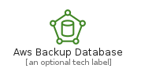
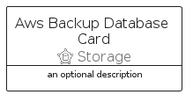
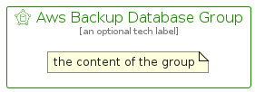

# AwsBackupDatabase


```text
aws-q2-2022/Resource/Storage/AwsBackupDatabase
```

```text
include('aws-q2-2022/Resource/Storage/AwsBackupDatabase')
```


| Illustration | AwsBackupDatabase | AwsBackupDatabaseCard | AwsBackupDatabaseGroup |
| :---: | :---: | :---: | :---: |
|  |  |  |  |


## AwsBackupDatabase

### Load remotely
```plantuml
@startuml
' configures the library
!global $LIB_BASE_LOCATION="https://raw.githubusercontent.com/tmorin/plantuml-libs/master/distribution"

' loads the library's bootstrap
!include $LIB_BASE_LOCATION/bootstrap.puml

' loads the package bootstrap
include('aws-q2-2022/bootstrap')

' loads the Item which embeds the element AwsBackupDatabase
include('aws-q2-2022/Resource/Storage/AwsBackupDatabase')

' renders the element
AwsBackupDatabase('AwsBackupDatabase', 'Aws Backup Database', 'an optional tech label', 'an optional description')
@enduml
```

### Load locally
```plantuml
@startuml
' configures the library
!global $INCLUSION_MODE="local"
!global $LIB_BASE_LOCATION="../../.."

' loads the library's bootstrap
!include $LIB_BASE_LOCATION/bootstrap.puml

' loads the package bootstrap
include('aws-q2-2022/bootstrap')

' loads the Item which embeds the element AwsBackupDatabase
include('aws-q2-2022/Resource/Storage/AwsBackupDatabase')

' renders the element
AwsBackupDatabase('AwsBackupDatabase', 'Aws Backup Database', 'an optional tech label', 'an optional description')
@enduml
```

## AwsBackupDatabaseCard

### Load remotely
```plantuml
@startuml
' configures the library
!global $LIB_BASE_LOCATION="https://raw.githubusercontent.com/tmorin/plantuml-libs/master/distribution"

' loads the library's bootstrap
!include $LIB_BASE_LOCATION/bootstrap.puml

' loads the package bootstrap
include('aws-q2-2022/bootstrap')

' loads the Item which embeds the element AwsBackupDatabaseCard
include('aws-q2-2022/Resource/Storage/AwsBackupDatabase')

' renders the element
AwsBackupDatabaseCard('AwsBackupDatabaseCard', 'Aws Backup Database Card', 'an optional description')
@enduml
```

### Load locally
```plantuml
@startuml
' configures the library
!global $INCLUSION_MODE="local"
!global $LIB_BASE_LOCATION="../../.."

' loads the library's bootstrap
!include $LIB_BASE_LOCATION/bootstrap.puml

' loads the package bootstrap
include('aws-q2-2022/bootstrap')

' loads the Item which embeds the element AwsBackupDatabaseCard
include('aws-q2-2022/Resource/Storage/AwsBackupDatabase')

' renders the element
AwsBackupDatabaseCard('AwsBackupDatabaseCard', 'Aws Backup Database Card', 'an optional description')
@enduml
```

## AwsBackupDatabaseGroup

### Load remotely
```plantuml
@startuml
' configures the library
!global $LIB_BASE_LOCATION="https://raw.githubusercontent.com/tmorin/plantuml-libs/master/distribution"

' loads the library's bootstrap
!include $LIB_BASE_LOCATION/bootstrap.puml

' loads the package bootstrap
include('aws-q2-2022/bootstrap')

' loads the Item which embeds the element AwsBackupDatabaseGroup
include('aws-q2-2022/Resource/Storage/AwsBackupDatabase')

' renders the element
AwsBackupDatabaseGroup('AwsBackupDatabaseGroup', 'Aws Backup Database Group', 'an optional tech label') {
    note as note
        the content of the group
    end note
}
@enduml
```

### Load locally
```plantuml
@startuml
' configures the library
!global $INCLUSION_MODE="local"
!global $LIB_BASE_LOCATION="../../.."

' loads the library's bootstrap
!include $LIB_BASE_LOCATION/bootstrap.puml

' loads the package bootstrap
include('aws-q2-2022/bootstrap')

' loads the Item which embeds the element AwsBackupDatabaseGroup
include('aws-q2-2022/Resource/Storage/AwsBackupDatabase')

' renders the element
AwsBackupDatabaseGroup('AwsBackupDatabaseGroup', 'Aws Backup Database Group', 'an optional tech label') {
    note as note
        the content of the group
    end note
}
@enduml
```

