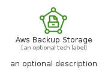
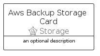
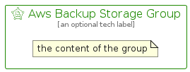

# AwsBackupStorage


```text
aws-q2-2022/Resource/Storage/AwsBackupStorage
```

```text
include('aws-q2-2022/Resource/Storage/AwsBackupStorage')
```


| Illustration | AwsBackupStorage | AwsBackupStorageCard | AwsBackupStorageGroup |
| :---: | :---: | :---: | :---: |
|  |  |  |  |


## AwsBackupStorage

### Load remotely
```plantuml
@startuml
' configures the library
!global $LIB_BASE_LOCATION="https://raw.githubusercontent.com/tmorin/plantuml-libs/master/distribution"

' loads the library's bootstrap
!include $LIB_BASE_LOCATION/bootstrap.puml

' loads the package bootstrap
include('aws-q2-2022/bootstrap')

' loads the Item which embeds the element AwsBackupStorage
include('aws-q2-2022/Resource/Storage/AwsBackupStorage')

' renders the element
AwsBackupStorage('AwsBackupStorage', 'Aws Backup Storage', 'an optional tech label', 'an optional description')
@enduml
```

### Load locally
```plantuml
@startuml
' configures the library
!global $INCLUSION_MODE="local"
!global $LIB_BASE_LOCATION="../../.."

' loads the library's bootstrap
!include $LIB_BASE_LOCATION/bootstrap.puml

' loads the package bootstrap
include('aws-q2-2022/bootstrap')

' loads the Item which embeds the element AwsBackupStorage
include('aws-q2-2022/Resource/Storage/AwsBackupStorage')

' renders the element
AwsBackupStorage('AwsBackupStorage', 'Aws Backup Storage', 'an optional tech label', 'an optional description')
@enduml
```

## AwsBackupStorageCard

### Load remotely
```plantuml
@startuml
' configures the library
!global $LIB_BASE_LOCATION="https://raw.githubusercontent.com/tmorin/plantuml-libs/master/distribution"

' loads the library's bootstrap
!include $LIB_BASE_LOCATION/bootstrap.puml

' loads the package bootstrap
include('aws-q2-2022/bootstrap')

' loads the Item which embeds the element AwsBackupStorageCard
include('aws-q2-2022/Resource/Storage/AwsBackupStorage')

' renders the element
AwsBackupStorageCard('AwsBackupStorageCard', 'Aws Backup Storage Card', 'an optional description')
@enduml
```

### Load locally
```plantuml
@startuml
' configures the library
!global $INCLUSION_MODE="local"
!global $LIB_BASE_LOCATION="../../.."

' loads the library's bootstrap
!include $LIB_BASE_LOCATION/bootstrap.puml

' loads the package bootstrap
include('aws-q2-2022/bootstrap')

' loads the Item which embeds the element AwsBackupStorageCard
include('aws-q2-2022/Resource/Storage/AwsBackupStorage')

' renders the element
AwsBackupStorageCard('AwsBackupStorageCard', 'Aws Backup Storage Card', 'an optional description')
@enduml
```

## AwsBackupStorageGroup

### Load remotely
```plantuml
@startuml
' configures the library
!global $LIB_BASE_LOCATION="https://raw.githubusercontent.com/tmorin/plantuml-libs/master/distribution"

' loads the library's bootstrap
!include $LIB_BASE_LOCATION/bootstrap.puml

' loads the package bootstrap
include('aws-q2-2022/bootstrap')

' loads the Item which embeds the element AwsBackupStorageGroup
include('aws-q2-2022/Resource/Storage/AwsBackupStorage')

' renders the element
AwsBackupStorageGroup('AwsBackupStorageGroup', 'Aws Backup Storage Group', 'an optional tech label') {
    note as note
        the content of the group
    end note
}
@enduml
```

### Load locally
```plantuml
@startuml
' configures the library
!global $INCLUSION_MODE="local"
!global $LIB_BASE_LOCATION="../../.."

' loads the library's bootstrap
!include $LIB_BASE_LOCATION/bootstrap.puml

' loads the package bootstrap
include('aws-q2-2022/bootstrap')

' loads the Item which embeds the element AwsBackupStorageGroup
include('aws-q2-2022/Resource/Storage/AwsBackupStorage')

' renders the element
AwsBackupStorageGroup('AwsBackupStorageGroup', 'Aws Backup Storage Group', 'an optional tech label') {
    note as note
        the content of the group
    end note
}
@enduml
```

