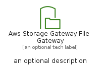
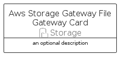
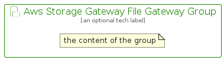

# AwsStorageGatewayFileGateway


```text
aws-q2-2022/Resource/Storage/AwsStorageGatewayFileGateway
```

```text
include('aws-q2-2022/Resource/Storage/AwsStorageGatewayFileGateway')
```


| Illustration | AwsStorageGatewayFileGateway | AwsStorageGatewayFileGatewayCard | AwsStorageGatewayFileGatewayGroup |
| :---: | :---: | :---: | :---: |
|  |  |  |  |


## AwsStorageGatewayFileGateway

### Load remotely
```plantuml
@startuml
' configures the library
!global $LIB_BASE_LOCATION="https://raw.githubusercontent.com/tmorin/plantuml-libs/master/distribution"

' loads the library's bootstrap
!include $LIB_BASE_LOCATION/bootstrap.puml

' loads the package bootstrap
include('aws-q2-2022/bootstrap')

' loads the Item which embeds the element AwsStorageGatewayFileGateway
include('aws-q2-2022/Resource/Storage/AwsStorageGatewayFileGateway')

' renders the element
AwsStorageGatewayFileGateway('AwsStorageGatewayFileGateway', 'Aws Storage Gateway File Gateway', 'an optional tech label', 'an optional description')
@enduml
```

### Load locally
```plantuml
@startuml
' configures the library
!global $INCLUSION_MODE="local"
!global $LIB_BASE_LOCATION="../../.."

' loads the library's bootstrap
!include $LIB_BASE_LOCATION/bootstrap.puml

' loads the package bootstrap
include('aws-q2-2022/bootstrap')

' loads the Item which embeds the element AwsStorageGatewayFileGateway
include('aws-q2-2022/Resource/Storage/AwsStorageGatewayFileGateway')

' renders the element
AwsStorageGatewayFileGateway('AwsStorageGatewayFileGateway', 'Aws Storage Gateway File Gateway', 'an optional tech label', 'an optional description')
@enduml
```

## AwsStorageGatewayFileGatewayCard

### Load remotely
```plantuml
@startuml
' configures the library
!global $LIB_BASE_LOCATION="https://raw.githubusercontent.com/tmorin/plantuml-libs/master/distribution"

' loads the library's bootstrap
!include $LIB_BASE_LOCATION/bootstrap.puml

' loads the package bootstrap
include('aws-q2-2022/bootstrap')

' loads the Item which embeds the element AwsStorageGatewayFileGatewayCard
include('aws-q2-2022/Resource/Storage/AwsStorageGatewayFileGateway')

' renders the element
AwsStorageGatewayFileGatewayCard('AwsStorageGatewayFileGatewayCard', 'Aws Storage Gateway File Gateway Card', 'an optional description')
@enduml
```

### Load locally
```plantuml
@startuml
' configures the library
!global $INCLUSION_MODE="local"
!global $LIB_BASE_LOCATION="../../.."

' loads the library's bootstrap
!include $LIB_BASE_LOCATION/bootstrap.puml

' loads the package bootstrap
include('aws-q2-2022/bootstrap')

' loads the Item which embeds the element AwsStorageGatewayFileGatewayCard
include('aws-q2-2022/Resource/Storage/AwsStorageGatewayFileGateway')

' renders the element
AwsStorageGatewayFileGatewayCard('AwsStorageGatewayFileGatewayCard', 'Aws Storage Gateway File Gateway Card', 'an optional description')
@enduml
```

## AwsStorageGatewayFileGatewayGroup

### Load remotely
```plantuml
@startuml
' configures the library
!global $LIB_BASE_LOCATION="https://raw.githubusercontent.com/tmorin/plantuml-libs/master/distribution"

' loads the library's bootstrap
!include $LIB_BASE_LOCATION/bootstrap.puml

' loads the package bootstrap
include('aws-q2-2022/bootstrap')

' loads the Item which embeds the element AwsStorageGatewayFileGatewayGroup
include('aws-q2-2022/Resource/Storage/AwsStorageGatewayFileGateway')

' renders the element
AwsStorageGatewayFileGatewayGroup('AwsStorageGatewayFileGatewayGroup', 'Aws Storage Gateway File Gateway Group', 'an optional tech label') {
    note as note
        the content of the group
    end note
}
@enduml
```

### Load locally
```plantuml
@startuml
' configures the library
!global $INCLUSION_MODE="local"
!global $LIB_BASE_LOCATION="../../.."

' loads the library's bootstrap
!include $LIB_BASE_LOCATION/bootstrap.puml

' loads the package bootstrap
include('aws-q2-2022/bootstrap')

' loads the Item which embeds the element AwsStorageGatewayFileGatewayGroup
include('aws-q2-2022/Resource/Storage/AwsStorageGatewayFileGateway')

' renders the element
AwsStorageGatewayFileGatewayGroup('AwsStorageGatewayFileGatewayGroup', 'Aws Storage Gateway File Gateway Group', 'an optional tech label') {
    note as note
        the content of the group
    end note
}
@enduml
```

