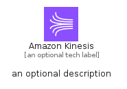
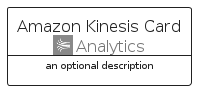

# AmazonKinesis


```text
aws-q2-2023/Architecture/Analytics/AmazonKinesis
```

```text
include('aws-q2-2023/Architecture/Analytics/AmazonKinesis')
```


| Illustration | AmazonKinesis | AmazonKinesisCard | AmazonKinesisGroup |
| :---: | :---: | :---: | :---: |
|  |  |  |  |


## Sprites
The item provides the following sriptes:

- `<$AmazonKinesisXs>`
- `<$AmazonKinesisSm>`
- `<$AmazonKinesisMd>`
- `<$AmazonKinesisLg>`


## AmazonKinesis

### Load remotely
```plantuml
@startuml
' configures the library
!global $LIB_BASE_LOCATION="https://raw.githubusercontent.com/tmorin/plantuml-libs/master/distribution"

' loads the library's bootstrap
!include $LIB_BASE_LOCATION/bootstrap.puml

' loads the package bootstrap
include('aws-q2-2023/bootstrap')

' loads the Item which embeds the element AmazonKinesis
include('aws-q2-2023/Architecture/Analytics/AmazonKinesis')

' renders the element
AmazonKinesis('AmazonKinesis', 'Amazon Kinesis', 'an optional tech label', 'an optional description')
@enduml
```

### Load locally
```plantuml
@startuml
' configures the library
!global $INCLUSION_MODE="local"
!global $LIB_BASE_LOCATION="../../.."

' loads the library's bootstrap
!include $LIB_BASE_LOCATION/bootstrap.puml

' loads the package bootstrap
include('aws-q2-2023/bootstrap')

' loads the Item which embeds the element AmazonKinesis
include('aws-q2-2023/Architecture/Analytics/AmazonKinesis')

' renders the element
AmazonKinesis('AmazonKinesis', 'Amazon Kinesis', 'an optional tech label', 'an optional description')
@enduml
```

## AmazonKinesisCard

### Load remotely
```plantuml
@startuml
' configures the library
!global $LIB_BASE_LOCATION="https://raw.githubusercontent.com/tmorin/plantuml-libs/master/distribution"

' loads the library's bootstrap
!include $LIB_BASE_LOCATION/bootstrap.puml

' loads the package bootstrap
include('aws-q2-2023/bootstrap')

' loads the Item which embeds the element AmazonKinesisCard
include('aws-q2-2023/Architecture/Analytics/AmazonKinesis')

' renders the element
AmazonKinesisCard('AmazonKinesisCard', 'Amazon Kinesis Card', 'an optional description')
@enduml
```

### Load locally
```plantuml
@startuml
' configures the library
!global $INCLUSION_MODE="local"
!global $LIB_BASE_LOCATION="../../.."

' loads the library's bootstrap
!include $LIB_BASE_LOCATION/bootstrap.puml

' loads the package bootstrap
include('aws-q2-2023/bootstrap')

' loads the Item which embeds the element AmazonKinesisCard
include('aws-q2-2023/Architecture/Analytics/AmazonKinesis')

' renders the element
AmazonKinesisCard('AmazonKinesisCard', 'Amazon Kinesis Card', 'an optional description')
@enduml
```

## AmazonKinesisGroup

### Load remotely
```plantuml
@startuml
' configures the library
!global $LIB_BASE_LOCATION="https://raw.githubusercontent.com/tmorin/plantuml-libs/master/distribution"

' loads the library's bootstrap
!include $LIB_BASE_LOCATION/bootstrap.puml

' loads the package bootstrap
include('aws-q2-2023/bootstrap')

' loads the Item which embeds the element AmazonKinesisGroup
include('aws-q2-2023/Architecture/Analytics/AmazonKinesis')

' renders the element
AmazonKinesisGroup('AmazonKinesisGroup', 'Amazon Kinesis Group', 'an optional tech label') {
    note as note
        the content of the group
    end note
}
@enduml
```

### Load locally
```plantuml
@startuml
' configures the library
!global $INCLUSION_MODE="local"
!global $LIB_BASE_LOCATION="../../.."

' loads the library's bootstrap
!include $LIB_BASE_LOCATION/bootstrap.puml

' loads the package bootstrap
include('aws-q2-2023/bootstrap')

' loads the Item which embeds the element AmazonKinesisGroup
include('aws-q2-2023/Architecture/Analytics/AmazonKinesis')

' renders the element
AmazonKinesisGroup('AmazonKinesisGroup', 'Amazon Kinesis Group', 'an optional tech label') {
    note as note
        the content of the group
    end note
}
@enduml
```

