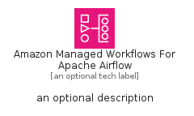

# AmazonManagedWorkflowsForApacheAirflow


```text
aws-q2-2023/Architecture/AppIntegration/AmazonManagedWorkflowsForApacheAirflow
```

```text
include('aws-q2-2023/Architecture/AppIntegration/AmazonManagedWorkflowsForApacheAirflow')
```


| Illustration | AmazonManagedWorkflowsForApacheAirflow | AmazonManagedWorkflowsForApacheAirflowCard | AmazonManagedWorkflowsForApacheAirflowGroup |
| :---: | :---: | :---: | :---: |
|  |  |  |  |


## Sprites
The item provides the following sriptes:

- `<$AmazonManagedWorkflowsForApacheAirflowXs>`
- `<$AmazonManagedWorkflowsForApacheAirflowSm>`
- `<$AmazonManagedWorkflowsForApacheAirflowMd>`
- `<$AmazonManagedWorkflowsForApacheAirflowLg>`


## AmazonManagedWorkflowsForApacheAirflow

### Load remotely
```plantuml
@startuml
' configures the library
!global $LIB_BASE_LOCATION="https://raw.githubusercontent.com/tmorin/plantuml-libs/master/distribution"

' loads the library's bootstrap
!include $LIB_BASE_LOCATION/bootstrap.puml

' loads the package bootstrap
include('aws-q2-2023/bootstrap')

' loads the Item which embeds the element AmazonManagedWorkflowsForApacheAirflow
include('aws-q2-2023/Architecture/AppIntegration/AmazonManagedWorkflowsForApacheAirflow')

' renders the element
AmazonManagedWorkflowsForApacheAirflow('AmazonManagedWorkflowsForApacheAirflow', 'Amazon Managed Workflows For Apache Airflow', 'an optional tech label', 'an optional description')
@enduml
```

### Load locally
```plantuml
@startuml
' configures the library
!global $INCLUSION_MODE="local"
!global $LIB_BASE_LOCATION="../../.."

' loads the library's bootstrap
!include $LIB_BASE_LOCATION/bootstrap.puml

' loads the package bootstrap
include('aws-q2-2023/bootstrap')

' loads the Item which embeds the element AmazonManagedWorkflowsForApacheAirflow
include('aws-q2-2023/Architecture/AppIntegration/AmazonManagedWorkflowsForApacheAirflow')

' renders the element
AmazonManagedWorkflowsForApacheAirflow('AmazonManagedWorkflowsForApacheAirflow', 'Amazon Managed Workflows For Apache Airflow', 'an optional tech label', 'an optional description')
@enduml
```

## AmazonManagedWorkflowsForApacheAirflowCard

### Load remotely
```plantuml
@startuml
' configures the library
!global $LIB_BASE_LOCATION="https://raw.githubusercontent.com/tmorin/plantuml-libs/master/distribution"

' loads the library's bootstrap
!include $LIB_BASE_LOCATION/bootstrap.puml

' loads the package bootstrap
include('aws-q2-2023/bootstrap')

' loads the Item which embeds the element AmazonManagedWorkflowsForApacheAirflowCard
include('aws-q2-2023/Architecture/AppIntegration/AmazonManagedWorkflowsForApacheAirflow')

' renders the element
AmazonManagedWorkflowsForApacheAirflowCard('AmazonManagedWorkflowsForApacheAirflowCard', 'Amazon Managed Workflows For Apache Airflow Card', 'an optional description')
@enduml
```

### Load locally
```plantuml
@startuml
' configures the library
!global $INCLUSION_MODE="local"
!global $LIB_BASE_LOCATION="../../.."

' loads the library's bootstrap
!include $LIB_BASE_LOCATION/bootstrap.puml

' loads the package bootstrap
include('aws-q2-2023/bootstrap')

' loads the Item which embeds the element AmazonManagedWorkflowsForApacheAirflowCard
include('aws-q2-2023/Architecture/AppIntegration/AmazonManagedWorkflowsForApacheAirflow')

' renders the element
AmazonManagedWorkflowsForApacheAirflowCard('AmazonManagedWorkflowsForApacheAirflowCard', 'Amazon Managed Workflows For Apache Airflow Card', 'an optional description')
@enduml
```

## AmazonManagedWorkflowsForApacheAirflowGroup

### Load remotely
```plantuml
@startuml
' configures the library
!global $LIB_BASE_LOCATION="https://raw.githubusercontent.com/tmorin/plantuml-libs/master/distribution"

' loads the library's bootstrap
!include $LIB_BASE_LOCATION/bootstrap.puml

' loads the package bootstrap
include('aws-q2-2023/bootstrap')

' loads the Item which embeds the element AmazonManagedWorkflowsForApacheAirflowGroup
include('aws-q2-2023/Architecture/AppIntegration/AmazonManagedWorkflowsForApacheAirflow')

' renders the element
AmazonManagedWorkflowsForApacheAirflowGroup('AmazonManagedWorkflowsForApacheAirflowGroup', 'Amazon Managed Workflows For Apache Airflow Group', 'an optional tech label') {
    note as note
        the content of the group
    end note
}
@enduml
```

### Load locally
```plantuml
@startuml
' configures the library
!global $INCLUSION_MODE="local"
!global $LIB_BASE_LOCATION="../../.."

' loads the library's bootstrap
!include $LIB_BASE_LOCATION/bootstrap.puml

' loads the package bootstrap
include('aws-q2-2023/bootstrap')

' loads the Item which embeds the element AmazonManagedWorkflowsForApacheAirflowGroup
include('aws-q2-2023/Architecture/AppIntegration/AmazonManagedWorkflowsForApacheAirflow')

' renders the element
AmazonManagedWorkflowsForApacheAirflowGroup('AmazonManagedWorkflowsForApacheAirflowGroup', 'Amazon Managed Workflows For Apache Airflow Group', 'an optional tech label') {
    note as note
        the content of the group
    end note
}
@enduml
```

