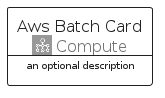

# AwsBatch


```text
aws-q2-2023/Architecture/Compute/AwsBatch
```

```text
include('aws-q2-2023/Architecture/Compute/AwsBatch')
```


| Illustration | AwsBatch | AwsBatchCard | AwsBatchGroup |
| :---: | :---: | :---: | :---: |
|  |  |  |  |


## Sprites
The item provides the following sriptes:

- `<$AwsBatchXs>`
- `<$AwsBatchSm>`
- `<$AwsBatchMd>`
- `<$AwsBatchLg>`


## AwsBatch

### Load remotely
```plantuml
@startuml
' configures the library
!global $LIB_BASE_LOCATION="https://raw.githubusercontent.com/tmorin/plantuml-libs/master/distribution"

' loads the library's bootstrap
!include $LIB_BASE_LOCATION/bootstrap.puml

' loads the package bootstrap
include('aws-q2-2023/bootstrap')

' loads the Item which embeds the element AwsBatch
include('aws-q2-2023/Architecture/Compute/AwsBatch')

' renders the element
AwsBatch('AwsBatch', 'Aws Batch', 'an optional tech label', 'an optional description')
@enduml
```

### Load locally
```plantuml
@startuml
' configures the library
!global $INCLUSION_MODE="local"
!global $LIB_BASE_LOCATION="../../.."

' loads the library's bootstrap
!include $LIB_BASE_LOCATION/bootstrap.puml

' loads the package bootstrap
include('aws-q2-2023/bootstrap')

' loads the Item which embeds the element AwsBatch
include('aws-q2-2023/Architecture/Compute/AwsBatch')

' renders the element
AwsBatch('AwsBatch', 'Aws Batch', 'an optional tech label', 'an optional description')
@enduml
```

## AwsBatchCard

### Load remotely
```plantuml
@startuml
' configures the library
!global $LIB_BASE_LOCATION="https://raw.githubusercontent.com/tmorin/plantuml-libs/master/distribution"

' loads the library's bootstrap
!include $LIB_BASE_LOCATION/bootstrap.puml

' loads the package bootstrap
include('aws-q2-2023/bootstrap')

' loads the Item which embeds the element AwsBatchCard
include('aws-q2-2023/Architecture/Compute/AwsBatch')

' renders the element
AwsBatchCard('AwsBatchCard', 'Aws Batch Card', 'an optional description')
@enduml
```

### Load locally
```plantuml
@startuml
' configures the library
!global $INCLUSION_MODE="local"
!global $LIB_BASE_LOCATION="../../.."

' loads the library's bootstrap
!include $LIB_BASE_LOCATION/bootstrap.puml

' loads the package bootstrap
include('aws-q2-2023/bootstrap')

' loads the Item which embeds the element AwsBatchCard
include('aws-q2-2023/Architecture/Compute/AwsBatch')

' renders the element
AwsBatchCard('AwsBatchCard', 'Aws Batch Card', 'an optional description')
@enduml
```

## AwsBatchGroup

### Load remotely
```plantuml
@startuml
' configures the library
!global $LIB_BASE_LOCATION="https://raw.githubusercontent.com/tmorin/plantuml-libs/master/distribution"

' loads the library's bootstrap
!include $LIB_BASE_LOCATION/bootstrap.puml

' loads the package bootstrap
include('aws-q2-2023/bootstrap')

' loads the Item which embeds the element AwsBatchGroup
include('aws-q2-2023/Architecture/Compute/AwsBatch')

' renders the element
AwsBatchGroup('AwsBatchGroup', 'Aws Batch Group', 'an optional tech label') {
    note as note
        the content of the group
    end note
}
@enduml
```

### Load locally
```plantuml
@startuml
' configures the library
!global $INCLUSION_MODE="local"
!global $LIB_BASE_LOCATION="../../.."

' loads the library's bootstrap
!include $LIB_BASE_LOCATION/bootstrap.puml

' loads the package bootstrap
include('aws-q2-2023/bootstrap')

' loads the Item which embeds the element AwsBatchGroup
include('aws-q2-2023/Architecture/Compute/AwsBatch')

' renders the element
AwsBatchGroup('AwsBatchGroup', 'Aws Batch Group', 'an optional tech label') {
    note as note
        the content of the group
    end note
}
@enduml
```

