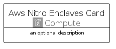

# AwsNitroEnclaves


```text
aws-q2-2023/Architecture/Compute/AwsNitroEnclaves
```

```text
include('aws-q2-2023/Architecture/Compute/AwsNitroEnclaves')
```


| Illustration | AwsNitroEnclaves | AwsNitroEnclavesCard | AwsNitroEnclavesGroup |
| :---: | :---: | :---: | :---: |
|  |  |  |  |


## Sprites
The item provides the following sriptes:

- `<$AwsNitroEnclavesXs>`
- `<$AwsNitroEnclavesSm>`
- `<$AwsNitroEnclavesMd>`
- `<$AwsNitroEnclavesLg>`


## AwsNitroEnclaves

### Load remotely
```plantuml
@startuml
' configures the library
!global $LIB_BASE_LOCATION="https://raw.githubusercontent.com/tmorin/plantuml-libs/master/distribution"

' loads the library's bootstrap
!include $LIB_BASE_LOCATION/bootstrap.puml

' loads the package bootstrap
include('aws-q2-2023/bootstrap')

' loads the Item which embeds the element AwsNitroEnclaves
include('aws-q2-2023/Architecture/Compute/AwsNitroEnclaves')

' renders the element
AwsNitroEnclaves('AwsNitroEnclaves', 'Aws Nitro Enclaves', 'an optional tech label', 'an optional description')
@enduml
```

### Load locally
```plantuml
@startuml
' configures the library
!global $INCLUSION_MODE="local"
!global $LIB_BASE_LOCATION="../../.."

' loads the library's bootstrap
!include $LIB_BASE_LOCATION/bootstrap.puml

' loads the package bootstrap
include('aws-q2-2023/bootstrap')

' loads the Item which embeds the element AwsNitroEnclaves
include('aws-q2-2023/Architecture/Compute/AwsNitroEnclaves')

' renders the element
AwsNitroEnclaves('AwsNitroEnclaves', 'Aws Nitro Enclaves', 'an optional tech label', 'an optional description')
@enduml
```

## AwsNitroEnclavesCard

### Load remotely
```plantuml
@startuml
' configures the library
!global $LIB_BASE_LOCATION="https://raw.githubusercontent.com/tmorin/plantuml-libs/master/distribution"

' loads the library's bootstrap
!include $LIB_BASE_LOCATION/bootstrap.puml

' loads the package bootstrap
include('aws-q2-2023/bootstrap')

' loads the Item which embeds the element AwsNitroEnclavesCard
include('aws-q2-2023/Architecture/Compute/AwsNitroEnclaves')

' renders the element
AwsNitroEnclavesCard('AwsNitroEnclavesCard', 'Aws Nitro Enclaves Card', 'an optional description')
@enduml
```

### Load locally
```plantuml
@startuml
' configures the library
!global $INCLUSION_MODE="local"
!global $LIB_BASE_LOCATION="../../.."

' loads the library's bootstrap
!include $LIB_BASE_LOCATION/bootstrap.puml

' loads the package bootstrap
include('aws-q2-2023/bootstrap')

' loads the Item which embeds the element AwsNitroEnclavesCard
include('aws-q2-2023/Architecture/Compute/AwsNitroEnclaves')

' renders the element
AwsNitroEnclavesCard('AwsNitroEnclavesCard', 'Aws Nitro Enclaves Card', 'an optional description')
@enduml
```

## AwsNitroEnclavesGroup

### Load remotely
```plantuml
@startuml
' configures the library
!global $LIB_BASE_LOCATION="https://raw.githubusercontent.com/tmorin/plantuml-libs/master/distribution"

' loads the library's bootstrap
!include $LIB_BASE_LOCATION/bootstrap.puml

' loads the package bootstrap
include('aws-q2-2023/bootstrap')

' loads the Item which embeds the element AwsNitroEnclavesGroup
include('aws-q2-2023/Architecture/Compute/AwsNitroEnclaves')

' renders the element
AwsNitroEnclavesGroup('AwsNitroEnclavesGroup', 'Aws Nitro Enclaves Group', 'an optional tech label') {
    note as note
        the content of the group
    end note
}
@enduml
```

### Load locally
```plantuml
@startuml
' configures the library
!global $INCLUSION_MODE="local"
!global $LIB_BASE_LOCATION="../../.."

' loads the library's bootstrap
!include $LIB_BASE_LOCATION/bootstrap.puml

' loads the package bootstrap
include('aws-q2-2023/bootstrap')

' loads the Item which embeds the element AwsNitroEnclavesGroup
include('aws-q2-2023/Architecture/Compute/AwsNitroEnclaves')

' renders the element
AwsNitroEnclavesGroup('AwsNitroEnclavesGroup', 'Aws Nitro Enclaves Group', 'an optional tech label') {
    note as note
        the content of the group
    end note
}
@enduml
```

