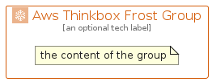

# AwsThinkboxFrost


```text
aws-q2-2023/Architecture/Compute/AwsThinkboxFrost
```

```text
include('aws-q2-2023/Architecture/Compute/AwsThinkboxFrost')
```


| Illustration | AwsThinkboxFrost | AwsThinkboxFrostCard | AwsThinkboxFrostGroup |
| :---: | :---: | :---: | :---: |
|  |  |  |  |


## Sprites
The item provides the following sriptes:

- `<$AwsThinkboxFrostXs>`
- `<$AwsThinkboxFrostSm>`
- `<$AwsThinkboxFrostMd>`
- `<$AwsThinkboxFrostLg>`


## AwsThinkboxFrost

### Load remotely
```plantuml
@startuml
' configures the library
!global $LIB_BASE_LOCATION="https://raw.githubusercontent.com/tmorin/plantuml-libs/master/distribution"

' loads the library's bootstrap
!include $LIB_BASE_LOCATION/bootstrap.puml

' loads the package bootstrap
include('aws-q2-2023/bootstrap')

' loads the Item which embeds the element AwsThinkboxFrost
include('aws-q2-2023/Architecture/Compute/AwsThinkboxFrost')

' renders the element
AwsThinkboxFrost('AwsThinkboxFrost', 'Aws Thinkbox Frost', 'an optional tech label', 'an optional description')
@enduml
```

### Load locally
```plantuml
@startuml
' configures the library
!global $INCLUSION_MODE="local"
!global $LIB_BASE_LOCATION="../../.."

' loads the library's bootstrap
!include $LIB_BASE_LOCATION/bootstrap.puml

' loads the package bootstrap
include('aws-q2-2023/bootstrap')

' loads the Item which embeds the element AwsThinkboxFrost
include('aws-q2-2023/Architecture/Compute/AwsThinkboxFrost')

' renders the element
AwsThinkboxFrost('AwsThinkboxFrost', 'Aws Thinkbox Frost', 'an optional tech label', 'an optional description')
@enduml
```

## AwsThinkboxFrostCard

### Load remotely
```plantuml
@startuml
' configures the library
!global $LIB_BASE_LOCATION="https://raw.githubusercontent.com/tmorin/plantuml-libs/master/distribution"

' loads the library's bootstrap
!include $LIB_BASE_LOCATION/bootstrap.puml

' loads the package bootstrap
include('aws-q2-2023/bootstrap')

' loads the Item which embeds the element AwsThinkboxFrostCard
include('aws-q2-2023/Architecture/Compute/AwsThinkboxFrost')

' renders the element
AwsThinkboxFrostCard('AwsThinkboxFrostCard', 'Aws Thinkbox Frost Card', 'an optional description')
@enduml
```

### Load locally
```plantuml
@startuml
' configures the library
!global $INCLUSION_MODE="local"
!global $LIB_BASE_LOCATION="../../.."

' loads the library's bootstrap
!include $LIB_BASE_LOCATION/bootstrap.puml

' loads the package bootstrap
include('aws-q2-2023/bootstrap')

' loads the Item which embeds the element AwsThinkboxFrostCard
include('aws-q2-2023/Architecture/Compute/AwsThinkboxFrost')

' renders the element
AwsThinkboxFrostCard('AwsThinkboxFrostCard', 'Aws Thinkbox Frost Card', 'an optional description')
@enduml
```

## AwsThinkboxFrostGroup

### Load remotely
```plantuml
@startuml
' configures the library
!global $LIB_BASE_LOCATION="https://raw.githubusercontent.com/tmorin/plantuml-libs/master/distribution"

' loads the library's bootstrap
!include $LIB_BASE_LOCATION/bootstrap.puml

' loads the package bootstrap
include('aws-q2-2023/bootstrap')

' loads the Item which embeds the element AwsThinkboxFrostGroup
include('aws-q2-2023/Architecture/Compute/AwsThinkboxFrost')

' renders the element
AwsThinkboxFrostGroup('AwsThinkboxFrostGroup', 'Aws Thinkbox Frost Group', 'an optional tech label') {
    note as note
        the content of the group
    end note
}
@enduml
```

### Load locally
```plantuml
@startuml
' configures the library
!global $INCLUSION_MODE="local"
!global $LIB_BASE_LOCATION="../../.."

' loads the library's bootstrap
!include $LIB_BASE_LOCATION/bootstrap.puml

' loads the package bootstrap
include('aws-q2-2023/bootstrap')

' loads the Item which embeds the element AwsThinkboxFrostGroup
include('aws-q2-2023/Architecture/Compute/AwsThinkboxFrost')

' renders the element
AwsThinkboxFrostGroup('AwsThinkboxFrostGroup', 'Aws Thinkbox Frost Group', 'an optional tech label') {
    note as note
        the content of the group
    end note
}
@enduml
```

