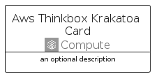

# AwsThinkboxKrakatoa


```text
aws-q2-2023/Architecture/Compute/AwsThinkboxKrakatoa
```

```text
include('aws-q2-2023/Architecture/Compute/AwsThinkboxKrakatoa')
```


| Illustration | AwsThinkboxKrakatoa | AwsThinkboxKrakatoaCard | AwsThinkboxKrakatoaGroup |
| :---: | :---: | :---: | :---: |
|  |  |  |  |


## Sprites
The item provides the following sriptes:

- `<$AwsThinkboxKrakatoaXs>`
- `<$AwsThinkboxKrakatoaSm>`
- `<$AwsThinkboxKrakatoaMd>`
- `<$AwsThinkboxKrakatoaLg>`


## AwsThinkboxKrakatoa

### Load remotely
```plantuml
@startuml
' configures the library
!global $LIB_BASE_LOCATION="https://raw.githubusercontent.com/tmorin/plantuml-libs/master/distribution"

' loads the library's bootstrap
!include $LIB_BASE_LOCATION/bootstrap.puml

' loads the package bootstrap
include('aws-q2-2023/bootstrap')

' loads the Item which embeds the element AwsThinkboxKrakatoa
include('aws-q2-2023/Architecture/Compute/AwsThinkboxKrakatoa')

' renders the element
AwsThinkboxKrakatoa('AwsThinkboxKrakatoa', 'Aws Thinkbox Krakatoa', 'an optional tech label', 'an optional description')
@enduml
```

### Load locally
```plantuml
@startuml
' configures the library
!global $INCLUSION_MODE="local"
!global $LIB_BASE_LOCATION="../../.."

' loads the library's bootstrap
!include $LIB_BASE_LOCATION/bootstrap.puml

' loads the package bootstrap
include('aws-q2-2023/bootstrap')

' loads the Item which embeds the element AwsThinkboxKrakatoa
include('aws-q2-2023/Architecture/Compute/AwsThinkboxKrakatoa')

' renders the element
AwsThinkboxKrakatoa('AwsThinkboxKrakatoa', 'Aws Thinkbox Krakatoa', 'an optional tech label', 'an optional description')
@enduml
```

## AwsThinkboxKrakatoaCard

### Load remotely
```plantuml
@startuml
' configures the library
!global $LIB_BASE_LOCATION="https://raw.githubusercontent.com/tmorin/plantuml-libs/master/distribution"

' loads the library's bootstrap
!include $LIB_BASE_LOCATION/bootstrap.puml

' loads the package bootstrap
include('aws-q2-2023/bootstrap')

' loads the Item which embeds the element AwsThinkboxKrakatoaCard
include('aws-q2-2023/Architecture/Compute/AwsThinkboxKrakatoa')

' renders the element
AwsThinkboxKrakatoaCard('AwsThinkboxKrakatoaCard', 'Aws Thinkbox Krakatoa Card', 'an optional description')
@enduml
```

### Load locally
```plantuml
@startuml
' configures the library
!global $INCLUSION_MODE="local"
!global $LIB_BASE_LOCATION="../../.."

' loads the library's bootstrap
!include $LIB_BASE_LOCATION/bootstrap.puml

' loads the package bootstrap
include('aws-q2-2023/bootstrap')

' loads the Item which embeds the element AwsThinkboxKrakatoaCard
include('aws-q2-2023/Architecture/Compute/AwsThinkboxKrakatoa')

' renders the element
AwsThinkboxKrakatoaCard('AwsThinkboxKrakatoaCard', 'Aws Thinkbox Krakatoa Card', 'an optional description')
@enduml
```

## AwsThinkboxKrakatoaGroup

### Load remotely
```plantuml
@startuml
' configures the library
!global $LIB_BASE_LOCATION="https://raw.githubusercontent.com/tmorin/plantuml-libs/master/distribution"

' loads the library's bootstrap
!include $LIB_BASE_LOCATION/bootstrap.puml

' loads the package bootstrap
include('aws-q2-2023/bootstrap')

' loads the Item which embeds the element AwsThinkboxKrakatoaGroup
include('aws-q2-2023/Architecture/Compute/AwsThinkboxKrakatoa')

' renders the element
AwsThinkboxKrakatoaGroup('AwsThinkboxKrakatoaGroup', 'Aws Thinkbox Krakatoa Group', 'an optional tech label') {
    note as note
        the content of the group
    end note
}
@enduml
```

### Load locally
```plantuml
@startuml
' configures the library
!global $INCLUSION_MODE="local"
!global $LIB_BASE_LOCATION="../../.."

' loads the library's bootstrap
!include $LIB_BASE_LOCATION/bootstrap.puml

' loads the package bootstrap
include('aws-q2-2023/bootstrap')

' loads the Item which embeds the element AwsThinkboxKrakatoaGroup
include('aws-q2-2023/Architecture/Compute/AwsThinkboxKrakatoa')

' renders the element
AwsThinkboxKrakatoaGroup('AwsThinkboxKrakatoaGroup', 'Aws Thinkbox Krakatoa Group', 'an optional tech label') {
    note as note
        the content of the group
    end note
}
@enduml
```

