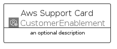

# AwsSupport


```text
aws-q2-2023/Architecture/CustomerEnablement/AwsSupport
```

```text
include('aws-q2-2023/Architecture/CustomerEnablement/AwsSupport')
```


| Illustration | AwsSupport | AwsSupportCard | AwsSupportGroup |
| :---: | :---: | :---: | :---: |
|  |  |  |  |


## Sprites
The item provides the following sriptes:

- `<$AwsSupportXs>`
- `<$AwsSupportSm>`
- `<$AwsSupportMd>`
- `<$AwsSupportLg>`


## AwsSupport

### Load remotely
```plantuml
@startuml
' configures the library
!global $LIB_BASE_LOCATION="https://raw.githubusercontent.com/tmorin/plantuml-libs/master/distribution"

' loads the library's bootstrap
!include $LIB_BASE_LOCATION/bootstrap.puml

' loads the package bootstrap
include('aws-q2-2023/bootstrap')

' loads the Item which embeds the element AwsSupport
include('aws-q2-2023/Architecture/CustomerEnablement/AwsSupport')

' renders the element
AwsSupport('AwsSupport', 'Aws Support', 'an optional tech label', 'an optional description')
@enduml
```

### Load locally
```plantuml
@startuml
' configures the library
!global $INCLUSION_MODE="local"
!global $LIB_BASE_LOCATION="../../.."

' loads the library's bootstrap
!include $LIB_BASE_LOCATION/bootstrap.puml

' loads the package bootstrap
include('aws-q2-2023/bootstrap')

' loads the Item which embeds the element AwsSupport
include('aws-q2-2023/Architecture/CustomerEnablement/AwsSupport')

' renders the element
AwsSupport('AwsSupport', 'Aws Support', 'an optional tech label', 'an optional description')
@enduml
```

## AwsSupportCard

### Load remotely
```plantuml
@startuml
' configures the library
!global $LIB_BASE_LOCATION="https://raw.githubusercontent.com/tmorin/plantuml-libs/master/distribution"

' loads the library's bootstrap
!include $LIB_BASE_LOCATION/bootstrap.puml

' loads the package bootstrap
include('aws-q2-2023/bootstrap')

' loads the Item which embeds the element AwsSupportCard
include('aws-q2-2023/Architecture/CustomerEnablement/AwsSupport')

' renders the element
AwsSupportCard('AwsSupportCard', 'Aws Support Card', 'an optional description')
@enduml
```

### Load locally
```plantuml
@startuml
' configures the library
!global $INCLUSION_MODE="local"
!global $LIB_BASE_LOCATION="../../.."

' loads the library's bootstrap
!include $LIB_BASE_LOCATION/bootstrap.puml

' loads the package bootstrap
include('aws-q2-2023/bootstrap')

' loads the Item which embeds the element AwsSupportCard
include('aws-q2-2023/Architecture/CustomerEnablement/AwsSupport')

' renders the element
AwsSupportCard('AwsSupportCard', 'Aws Support Card', 'an optional description')
@enduml
```

## AwsSupportGroup

### Load remotely
```plantuml
@startuml
' configures the library
!global $LIB_BASE_LOCATION="https://raw.githubusercontent.com/tmorin/plantuml-libs/master/distribution"

' loads the library's bootstrap
!include $LIB_BASE_LOCATION/bootstrap.puml

' loads the package bootstrap
include('aws-q2-2023/bootstrap')

' loads the Item which embeds the element AwsSupportGroup
include('aws-q2-2023/Architecture/CustomerEnablement/AwsSupport')

' renders the element
AwsSupportGroup('AwsSupportGroup', 'Aws Support Group', 'an optional tech label') {
    note as note
        the content of the group
    end note
}
@enduml
```

### Load locally
```plantuml
@startuml
' configures the library
!global $INCLUSION_MODE="local"
!global $LIB_BASE_LOCATION="../../.."

' loads the library's bootstrap
!include $LIB_BASE_LOCATION/bootstrap.puml

' loads the package bootstrap
include('aws-q2-2023/bootstrap')

' loads the Item which embeds the element AwsSupportGroup
include('aws-q2-2023/Architecture/CustomerEnablement/AwsSupport')

' renders the element
AwsSupportGroup('AwsSupportGroup', 'Aws Support Group', 'an optional tech label') {
    note as note
        the content of the group
    end note
}
@enduml
```

