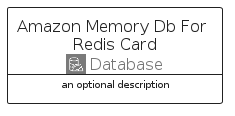
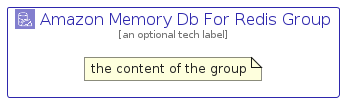

# AmazonMemoryDbForRedis


```text
aws-q2-2023/Architecture/Database/AmazonMemoryDbForRedis
```

```text
include('aws-q2-2023/Architecture/Database/AmazonMemoryDbForRedis')
```


| Illustration | AmazonMemoryDbForRedis | AmazonMemoryDbForRedisCard | AmazonMemoryDbForRedisGroup |
| :---: | :---: | :---: | :---: |
|  |  |  |  |


## Sprites
The item provides the following sriptes:

- `<$AmazonMemoryDbForRedisXs>`
- `<$AmazonMemoryDbForRedisSm>`
- `<$AmazonMemoryDbForRedisMd>`
- `<$AmazonMemoryDbForRedisLg>`


## AmazonMemoryDbForRedis

### Load remotely
```plantuml
@startuml
' configures the library
!global $LIB_BASE_LOCATION="https://raw.githubusercontent.com/tmorin/plantuml-libs/master/distribution"

' loads the library's bootstrap
!include $LIB_BASE_LOCATION/bootstrap.puml

' loads the package bootstrap
include('aws-q2-2023/bootstrap')

' loads the Item which embeds the element AmazonMemoryDbForRedis
include('aws-q2-2023/Architecture/Database/AmazonMemoryDbForRedis')

' renders the element
AmazonMemoryDbForRedis('AmazonMemoryDbForRedis', 'Amazon Memory Db For Redis', 'an optional tech label', 'an optional description')
@enduml
```

### Load locally
```plantuml
@startuml
' configures the library
!global $INCLUSION_MODE="local"
!global $LIB_BASE_LOCATION="../../.."

' loads the library's bootstrap
!include $LIB_BASE_LOCATION/bootstrap.puml

' loads the package bootstrap
include('aws-q2-2023/bootstrap')

' loads the Item which embeds the element AmazonMemoryDbForRedis
include('aws-q2-2023/Architecture/Database/AmazonMemoryDbForRedis')

' renders the element
AmazonMemoryDbForRedis('AmazonMemoryDbForRedis', 'Amazon Memory Db For Redis', 'an optional tech label', 'an optional description')
@enduml
```

## AmazonMemoryDbForRedisCard

### Load remotely
```plantuml
@startuml
' configures the library
!global $LIB_BASE_LOCATION="https://raw.githubusercontent.com/tmorin/plantuml-libs/master/distribution"

' loads the library's bootstrap
!include $LIB_BASE_LOCATION/bootstrap.puml

' loads the package bootstrap
include('aws-q2-2023/bootstrap')

' loads the Item which embeds the element AmazonMemoryDbForRedisCard
include('aws-q2-2023/Architecture/Database/AmazonMemoryDbForRedis')

' renders the element
AmazonMemoryDbForRedisCard('AmazonMemoryDbForRedisCard', 'Amazon Memory Db For Redis Card', 'an optional description')
@enduml
```

### Load locally
```plantuml
@startuml
' configures the library
!global $INCLUSION_MODE="local"
!global $LIB_BASE_LOCATION="../../.."

' loads the library's bootstrap
!include $LIB_BASE_LOCATION/bootstrap.puml

' loads the package bootstrap
include('aws-q2-2023/bootstrap')

' loads the Item which embeds the element AmazonMemoryDbForRedisCard
include('aws-q2-2023/Architecture/Database/AmazonMemoryDbForRedis')

' renders the element
AmazonMemoryDbForRedisCard('AmazonMemoryDbForRedisCard', 'Amazon Memory Db For Redis Card', 'an optional description')
@enduml
```

## AmazonMemoryDbForRedisGroup

### Load remotely
```plantuml
@startuml
' configures the library
!global $LIB_BASE_LOCATION="https://raw.githubusercontent.com/tmorin/plantuml-libs/master/distribution"

' loads the library's bootstrap
!include $LIB_BASE_LOCATION/bootstrap.puml

' loads the package bootstrap
include('aws-q2-2023/bootstrap')

' loads the Item which embeds the element AmazonMemoryDbForRedisGroup
include('aws-q2-2023/Architecture/Database/AmazonMemoryDbForRedis')

' renders the element
AmazonMemoryDbForRedisGroup('AmazonMemoryDbForRedisGroup', 'Amazon Memory Db For Redis Group', 'an optional tech label') {
    note as note
        the content of the group
    end note
}
@enduml
```

### Load locally
```plantuml
@startuml
' configures the library
!global $INCLUSION_MODE="local"
!global $LIB_BASE_LOCATION="../../.."

' loads the library's bootstrap
!include $LIB_BASE_LOCATION/bootstrap.puml

' loads the package bootstrap
include('aws-q2-2023/bootstrap')

' loads the Item which embeds the element AmazonMemoryDbForRedisGroup
include('aws-q2-2023/Architecture/Database/AmazonMemoryDbForRedis')

' renders the element
AmazonMemoryDbForRedisGroup('AmazonMemoryDbForRedisGroup', 'Amazon Memory Db For Redis Group', 'an optional tech label') {
    note as note
        the content of the group
    end note
}
@enduml
```

