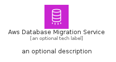
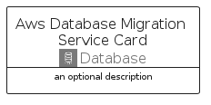

# AwsDatabaseMigrationService


```text
aws-q2-2023/Architecture/Database/AwsDatabaseMigrationService
```

```text
include('aws-q2-2023/Architecture/Database/AwsDatabaseMigrationService')
```


| Illustration | AwsDatabaseMigrationService | AwsDatabaseMigrationServiceCard | AwsDatabaseMigrationServiceGroup |
| :---: | :---: | :---: | :---: |
|  |  |  |  |


## Sprites
The item provides the following sriptes:

- `<$AwsDatabaseMigrationServiceXs>`
- `<$AwsDatabaseMigrationServiceSm>`
- `<$AwsDatabaseMigrationServiceMd>`
- `<$AwsDatabaseMigrationServiceLg>`


## AwsDatabaseMigrationService

### Load remotely
```plantuml
@startuml
' configures the library
!global $LIB_BASE_LOCATION="https://raw.githubusercontent.com/tmorin/plantuml-libs/master/distribution"

' loads the library's bootstrap
!include $LIB_BASE_LOCATION/bootstrap.puml

' loads the package bootstrap
include('aws-q2-2023/bootstrap')

' loads the Item which embeds the element AwsDatabaseMigrationService
include('aws-q2-2023/Architecture/Database/AwsDatabaseMigrationService')

' renders the element
AwsDatabaseMigrationService('AwsDatabaseMigrationService', 'Aws Database Migration Service', 'an optional tech label', 'an optional description')
@enduml
```

### Load locally
```plantuml
@startuml
' configures the library
!global $INCLUSION_MODE="local"
!global $LIB_BASE_LOCATION="../../.."

' loads the library's bootstrap
!include $LIB_BASE_LOCATION/bootstrap.puml

' loads the package bootstrap
include('aws-q2-2023/bootstrap')

' loads the Item which embeds the element AwsDatabaseMigrationService
include('aws-q2-2023/Architecture/Database/AwsDatabaseMigrationService')

' renders the element
AwsDatabaseMigrationService('AwsDatabaseMigrationService', 'Aws Database Migration Service', 'an optional tech label', 'an optional description')
@enduml
```

## AwsDatabaseMigrationServiceCard

### Load remotely
```plantuml
@startuml
' configures the library
!global $LIB_BASE_LOCATION="https://raw.githubusercontent.com/tmorin/plantuml-libs/master/distribution"

' loads the library's bootstrap
!include $LIB_BASE_LOCATION/bootstrap.puml

' loads the package bootstrap
include('aws-q2-2023/bootstrap')

' loads the Item which embeds the element AwsDatabaseMigrationServiceCard
include('aws-q2-2023/Architecture/Database/AwsDatabaseMigrationService')

' renders the element
AwsDatabaseMigrationServiceCard('AwsDatabaseMigrationServiceCard', 'Aws Database Migration Service Card', 'an optional description')
@enduml
```

### Load locally
```plantuml
@startuml
' configures the library
!global $INCLUSION_MODE="local"
!global $LIB_BASE_LOCATION="../../.."

' loads the library's bootstrap
!include $LIB_BASE_LOCATION/bootstrap.puml

' loads the package bootstrap
include('aws-q2-2023/bootstrap')

' loads the Item which embeds the element AwsDatabaseMigrationServiceCard
include('aws-q2-2023/Architecture/Database/AwsDatabaseMigrationService')

' renders the element
AwsDatabaseMigrationServiceCard('AwsDatabaseMigrationServiceCard', 'Aws Database Migration Service Card', 'an optional description')
@enduml
```

## AwsDatabaseMigrationServiceGroup

### Load remotely
```plantuml
@startuml
' configures the library
!global $LIB_BASE_LOCATION="https://raw.githubusercontent.com/tmorin/plantuml-libs/master/distribution"

' loads the library's bootstrap
!include $LIB_BASE_LOCATION/bootstrap.puml

' loads the package bootstrap
include('aws-q2-2023/bootstrap')

' loads the Item which embeds the element AwsDatabaseMigrationServiceGroup
include('aws-q2-2023/Architecture/Database/AwsDatabaseMigrationService')

' renders the element
AwsDatabaseMigrationServiceGroup('AwsDatabaseMigrationServiceGroup', 'Aws Database Migration Service Group', 'an optional tech label') {
    note as note
        the content of the group
    end note
}
@enduml
```

### Load locally
```plantuml
@startuml
' configures the library
!global $INCLUSION_MODE="local"
!global $LIB_BASE_LOCATION="../../.."

' loads the library's bootstrap
!include $LIB_BASE_LOCATION/bootstrap.puml

' loads the package bootstrap
include('aws-q2-2023/bootstrap')

' loads the Item which embeds the element AwsDatabaseMigrationServiceGroup
include('aws-q2-2023/Architecture/Database/AwsDatabaseMigrationService')

' renders the element
AwsDatabaseMigrationServiceGroup('AwsDatabaseMigrationServiceGroup', 'Aws Database Migration Service Group', 'an optional tech label') {
    note as note
        the content of the group
    end note
}
@enduml
```

