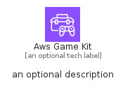
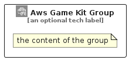

# AwsGameKit


```text
aws-q2-2023/Architecture/Games/AwsGameKit
```

```text
include('aws-q2-2023/Architecture/Games/AwsGameKit')
```


| Illustration | AwsGameKit | AwsGameKitCard | AwsGameKitGroup |
| :---: | :---: | :---: | :---: |
|  |  |  |  |


## Sprites
The item provides the following sriptes:

- `<$AwsGameKitXs>`
- `<$AwsGameKitSm>`
- `<$AwsGameKitMd>`
- `<$AwsGameKitLg>`


## AwsGameKit

### Load remotely
```plantuml
@startuml
' configures the library
!global $LIB_BASE_LOCATION="https://raw.githubusercontent.com/tmorin/plantuml-libs/master/distribution"

' loads the library's bootstrap
!include $LIB_BASE_LOCATION/bootstrap.puml

' loads the package bootstrap
include('aws-q2-2023/bootstrap')

' loads the Item which embeds the element AwsGameKit
include('aws-q2-2023/Architecture/Games/AwsGameKit')

' renders the element
AwsGameKit('AwsGameKit', 'Aws Game Kit', 'an optional tech label', 'an optional description')
@enduml
```

### Load locally
```plantuml
@startuml
' configures the library
!global $INCLUSION_MODE="local"
!global $LIB_BASE_LOCATION="../../.."

' loads the library's bootstrap
!include $LIB_BASE_LOCATION/bootstrap.puml

' loads the package bootstrap
include('aws-q2-2023/bootstrap')

' loads the Item which embeds the element AwsGameKit
include('aws-q2-2023/Architecture/Games/AwsGameKit')

' renders the element
AwsGameKit('AwsGameKit', 'Aws Game Kit', 'an optional tech label', 'an optional description')
@enduml
```

## AwsGameKitCard

### Load remotely
```plantuml
@startuml
' configures the library
!global $LIB_BASE_LOCATION="https://raw.githubusercontent.com/tmorin/plantuml-libs/master/distribution"

' loads the library's bootstrap
!include $LIB_BASE_LOCATION/bootstrap.puml

' loads the package bootstrap
include('aws-q2-2023/bootstrap')

' loads the Item which embeds the element AwsGameKitCard
include('aws-q2-2023/Architecture/Games/AwsGameKit')

' renders the element
AwsGameKitCard('AwsGameKitCard', 'Aws Game Kit Card', 'an optional description')
@enduml
```

### Load locally
```plantuml
@startuml
' configures the library
!global $INCLUSION_MODE="local"
!global $LIB_BASE_LOCATION="../../.."

' loads the library's bootstrap
!include $LIB_BASE_LOCATION/bootstrap.puml

' loads the package bootstrap
include('aws-q2-2023/bootstrap')

' loads the Item which embeds the element AwsGameKitCard
include('aws-q2-2023/Architecture/Games/AwsGameKit')

' renders the element
AwsGameKitCard('AwsGameKitCard', 'Aws Game Kit Card', 'an optional description')
@enduml
```

## AwsGameKitGroup

### Load remotely
```plantuml
@startuml
' configures the library
!global $LIB_BASE_LOCATION="https://raw.githubusercontent.com/tmorin/plantuml-libs/master/distribution"

' loads the library's bootstrap
!include $LIB_BASE_LOCATION/bootstrap.puml

' loads the package bootstrap
include('aws-q2-2023/bootstrap')

' loads the Item which embeds the element AwsGameKitGroup
include('aws-q2-2023/Architecture/Games/AwsGameKit')

' renders the element
AwsGameKitGroup('AwsGameKitGroup', 'Aws Game Kit Group', 'an optional tech label') {
    note as note
        the content of the group
    end note
}
@enduml
```

### Load locally
```plantuml
@startuml
' configures the library
!global $INCLUSION_MODE="local"
!global $LIB_BASE_LOCATION="../../.."

' loads the library's bootstrap
!include $LIB_BASE_LOCATION/bootstrap.puml

' loads the package bootstrap
include('aws-q2-2023/bootstrap')

' loads the Item which embeds the element AwsGameKitGroup
include('aws-q2-2023/Architecture/Games/AwsGameKit')

' renders the element
AwsGameKitGroup('AwsGameKitGroup', 'Aws Game Kit Group', 'an optional tech label') {
    note as note
        the content of the group
    end note
}
@enduml
```

